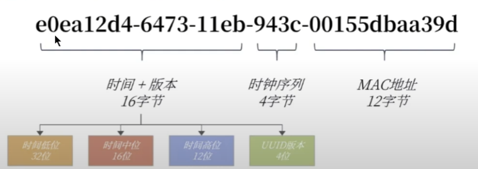
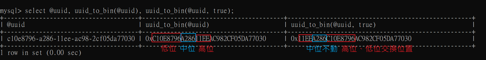

# uuid

## uuid 的組成

由32個字串組成，其中又切分為 8-4-4-4-12 個字串，包含4個`-`符號後，為36個字串。

* 前16個字串 : 時間 + UUID版本，`低位在前，高位在後`

    * 時間戳低位，表示相對於高位的奈秒數。    

    * 時間戳高位，表示自 UUID 制定時間點以來的秒數。


* 中4個字串 : 時鐘序列

    * 是一個自增的計數器，保證同一毫秒生成的UUID不會有衝突

* 後12個字串 : MAC地址，沒有MAC地址可能隨機生成。

    

<br/>

<br/>

## MySQL 中的 UUID

由於傳統 UUID 並不是遞增的，而是隨機的，這樣導致如果使用 UUID 作為主鍵時，會導致頁分裂(Page Splitting)，[連結](../../SQL相關/進階2_索引結構/08_索引使用原則.md#5-不建議用無順序的值作為索引重要)

因此 MySQL 8.0 後，做了優化，將 `uuid 中的時間低位、高位位置對調，讓 uuid 可變為遞增`，這樣就可以作為自增主鍵。

<br/>

<br/>

## 生成 uuid

使用 `uuid_to_bin` 函數可將uuid轉為二進制(binary)，可以使用參數讓 uuid 轉成遞增字串，這樣就可以做為主鍵使用。
```sql
-- 建立uuid變數
SET @uuid = UUID();

-- 使用第2個參數 true，代表將時間戳低位、高位調換位置
select @uuid, uuid_to_bin(@uuid), uuid_to_bin(@uuid, true);
```

