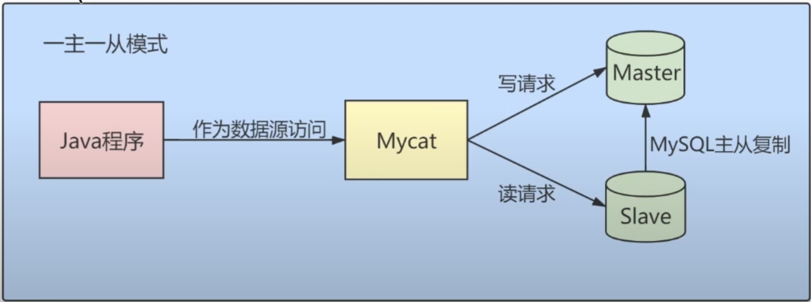
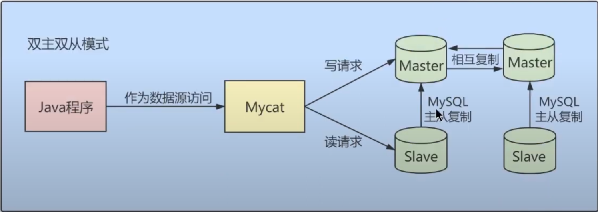
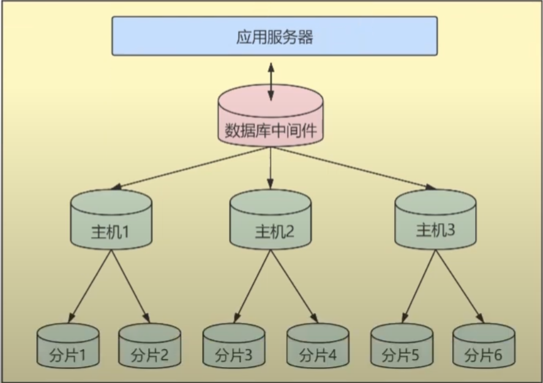
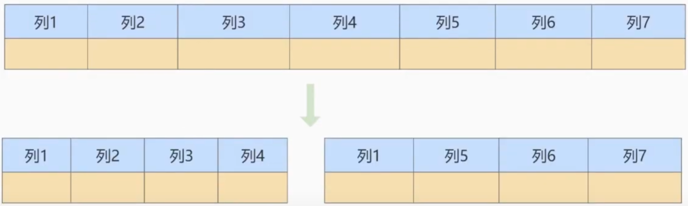

# 資料庫結構優化

## 拆分表，冷熱數據分離

將一張表拆成常使用和不常使用的欄位，分成兩張表，主鍵在新表還需要再建立一次。

優點: 

1. 減少IO，保證熱數據在記憶體中緩存的命中率。

2. 更有效率的利用緩存，避免載入無用的冷數據。

 

 

## 增加中間表
對需要經常聯合查詢的表，建立中間表提高查詢效率。

優點: 

1. 從聯合查詢改為對中間表的查詢，提高查詢效率。

缺點:

1. 更新時，也要一併更新此表。

 

 

## 增加冗餘欄位

反正規化，將原本應該聯合查詢的方式改成查冗餘欄位，提高查詢效率。

 

 

## 優化數據類型

* 可以使用儲存類型小的優先，例如 int(4) 可以符合業務需求，就不要使用 int(8)。

* 對於自然數(只有正整數，非負整數)的數據類型來說，可以使用無符號`unsigned`類型來儲存，例如 tinyint 儲存範圍來說，`有符號-128~127`，無符號`0~255`。

* 避免使用 `TEXT`、`BLOB` 類型，當這種數據載入到記憶體中會很慢，如果依定要使用，則建議把 TEXT、BLOB 欄位分離到單獨的資料表中；或是查詢時避免使用 select * ，有需要再單獨查詢此欄位。

* 避免使用 ENUM 類型，修改 ENUM 值需要使用 ALTER 語句；而且 ENUM 類型使用 ORDER BY 時效率低，需要額外操作，可使用 TINYINT 來替代 ENUM。

* 使用 TIMESTAMP 儲存時間，TIMESTAMP 使用 `4 Byte` 儲存；DATETIME 使用 `8 Byte` 儲存。

* 使用 DECIMAL 代替 FLOAT、DOUBLE

    * 非精準浮點數: FLOAT、DOUBLE

    * 精準浮點數: DECIMAL 

 

 

## 大表優化

當一張資料表紀錄數過大，CRUD性能會明顯下降，可採用以下策略

`限定查詢範圍`

* 禁止使用不帶任何限制的查詢語句，須加上where條件，尤其是歷史數據。

`讀寫分離`

* 可使用`一主一從模式`、`雙主從模式`；Master負責寫，Slave負責讀。

* 一主一從模式

    

* 雙主從模式，以防Master互相備援

    

 

`垂直拆分`

* 當數據量達到千萬級別以上，有時會把資料庫切成多份，放到不同的資料庫中，減少對單一服務器的訪問壓力。

    

* 當資料表的欄位過多，可以將冷熱欄位分表儲存，優點是單表數據量變小，使可載入的資料筆數增加，減少IO；但拆成多表可能會使用過多JOIN，需小心使用。

    

 

`水平拆分`

* 例如將過多的數據，依照時間分表，適合用在日誌表。

 

 