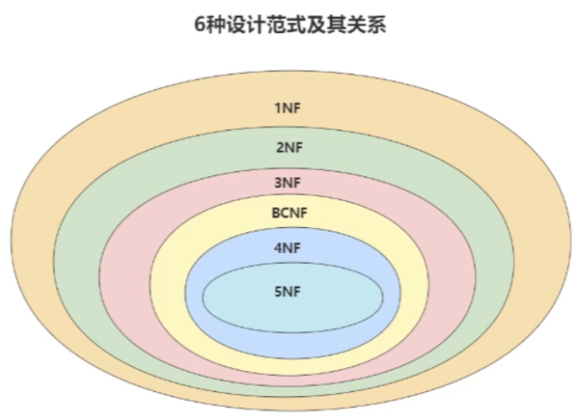
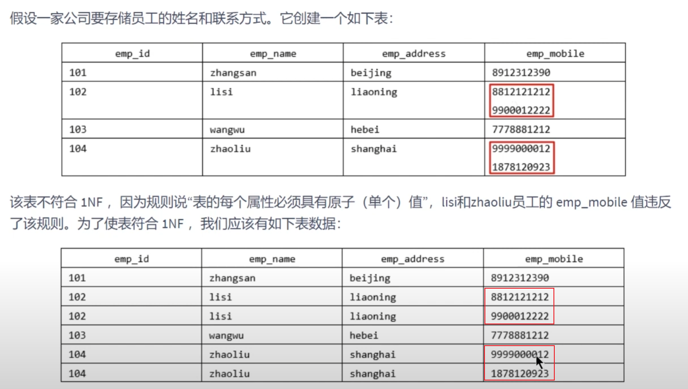
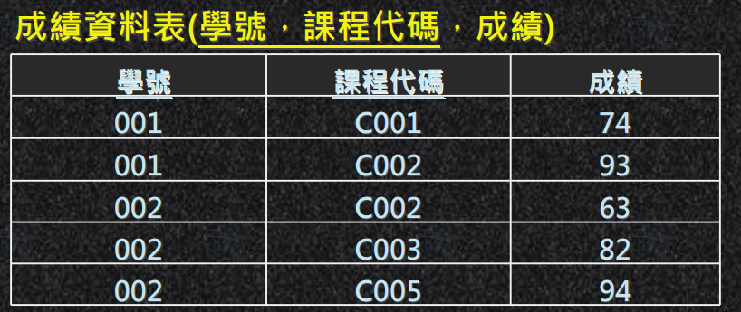

# 正規化 Normal Form (NF)

## 概述
* 在關係型資料庫中，關於資料表設計的基本原則，規則就稱為`正規化 Normal Form (NF)`。

* 目的 : 透過分解表中的數據，減少數據冗餘(重複性)，提高數據的一致性和完整性。

* 關係型資料庫中，有6種常見的正規化，依照級別，`由低到高`。

    1. 第一正規化(1NF)

    2. 第二正規化(2NF)

    3. 第三正規化(3NF)

    4. Boyee-Codd正規化(BCNF)

    5. 第四正規化(4NF)

    6. 第五正規化(5NF，又稱完美正規化)

* 正規化越高級別，冗餘度就越低，而且`高階正規化一定符合低階正規化的要求`；舉例，3NF一定符合2NF規則。

    

    <br/>

* 在實際情況，通常只會用到第一、二、三正規化，BCNF視情況；有時為了提高查詢性能，有時還需要`反正規化`。

<br/>

<br/>

## 結論

1. 1NF，確保每個欄位的`原子性`，消除非基元性的資料。

2. 2NF，確保每個欄位和主鍵`完全依賴`，消除部分依賴。

3. 3NF，確保每個欄位和主鍵`直接依賴`，消除遞移相依。

4. BCNF，修正3NF，消除其它功能相依性所引起的異常。

<br/>

<br/>

## 第一正規化
1. 目的 : 為了確保資料表中每個欄位的值必須有`原子性`，不可再將欄位的值再拆分，基本上任何Schema的設計都會滿足第一 正規化的要求，不會再將欄位拆分。

2. 規則 : 

    * 每一個欄位只能有一個基元值 (Atomic Value) 即單一值，意思是欄位不可再分割成其他資料。

    * 沒有任何兩筆以上的資料完全重複。

    * 資料表中需有主鍵 (唯一值)，其他所有欄位都相依於主鍵。

3. 舉例，不符合1NF

    * 一個欄位，不應該存兩個手機號碼，應該要拆分為兩筆資料。

        

        <br/>

    * 一個欄位的資料太多，應拆分為粒度較小的欄位

        

        <br/>
    
    * 欄位的原子性是`主觀的`，依照業務需求去理解，如下，地址是否需要拆分為更小的欄位，得依照需求決定。

        

    

<br/>

<br/>

## 第二正規化

1. 目的 : 消除部分相依（Partial Dependency）問題，通常`主鍵有多個欄位`時會發生`部分相依`。

2. 規則 : 

    * 滿足 1NF。

    * 所有非主鍵欄位，都必須`完全依賴主鍵，不能只依賴主鍵的一部分`。

3. 舉例 : 

    * 舉例1，符合2NF

        *  成績表(學號、課程號、成績)，(學號、課程號)為主鍵，(學號、課程號)可以決定成績，但是學號不能決定成績，課程號也不能決定成績，所以 `(學號、課程號) -> 成績`，就是完全依賴關係。

    * 舉例2，不符合2NF

        * 比賽表(`球員編號`、姓名、年齡、`比賽編號`、比賽時間、比賽場地)，主鍵為 (球員編號、比賽編號)，這時的關係為

            ```
            (球員編號、比賽編號) -> (姓名、年齡、比賽時間、比賽場地)
            ```

        * 這張資料表產生了`部分相依`，也就是某些欄位只依賴主鍵的一部分 (只知道球員編號就知道姓名、年齡，不需要知道比賽編號)

            ```
            (球員編號) -> (姓名、年齡)

            (比賽編號) -> (比賽時間、比賽場地)
            ```

        * 解決方式是拆成三張表，球員表、比賽表、多對多表

4. 解決方式:

    * 檢查是否存在`部分相依`（可從多個欄位組成的主鍵開始檢查）。
    * 將`部分相依`的欄位分割出去，另外組成新的資料表。


<br/>

<br/>

## 第三正規化

1. 目的 : 確保資料表中的每一個非主鍵欄位都和主鍵直接關聯，即`非主鍵欄位不能依賴其他非主鍵欄位`。


2. 規則 : 

    * 符合 1NF、2NF

    * 非主鍵欄位之間沒有存在`遞移相依`的關係，也就是與`主鍵`無關的相依性。

        * 遞移相依 : X依賴Y，Y依賴Z 所以Y間接依賴Z

3. 舉例

    * 舉例1，符合3NF

        * 部門資訊(部門編號、部門名稱、部門簡介)

        * 員工資訊(員工編號、姓名、部門編號)

            ```
            部門編號 -> 部門名稱、部門簡介

            員工編號 -> 姓名、部門編號
            ```

        * 兩表中，每個欄位皆只依賴該表的主鍵

    
    * 舉例2，不符合3NF

        * 部門資訊(部門編號、部門名稱、部門簡介)

        * 員工資訊(員工編號、姓名、部門編號、`部門簡介`)

        * 員工資訊中，部門簡介依賴部門編號，故違反3NF


4. 解決方式:

    * 檢查是否存在`遞移相依`的欄位。
    * 將`遞移相依`的欄位分割出去，另外組成新的資料表。


<br/>

<br/>

## BCNF正規化

1. 目的 : 

    * 如果資料表示`單一欄位`主鍵，則符合3NF、亦符合BCNF。

    * 如果資料表是`多欄位`主鍵，再執行此正規化。

2. 規則 : 

    * 3NF的改良式 (必須滿足3NF)。

    * 主鍵中的各欄位(單獨看)不可以相依於其他非主鍵的欄位。

3. 舉例，符合BCNF

    * 成績表(學號、課程代碼、成績)，主鍵是 (學號、課程代碼)

        


    * 依賴關係，成績資料表符合BCNF。

        1. `成績`欄位相依於 (學號、課程代碼) 欄位。

        2. `課程代碼`欄位，並沒有相依於`成績`欄位。

        3. `學號`欄位而言，也沒有相依於`成績`欄位。

    <br/>

4. 解決方式 : 

    * 確認由多個欄位組成的主鍵是否有其他欄位相依於主鍵中的每個欄位。


<br/>

<br/>

## References

> 完整PPT http://debussy.im.nuu.edu.tw/sjchen/Database/Final/Ch05.pdf