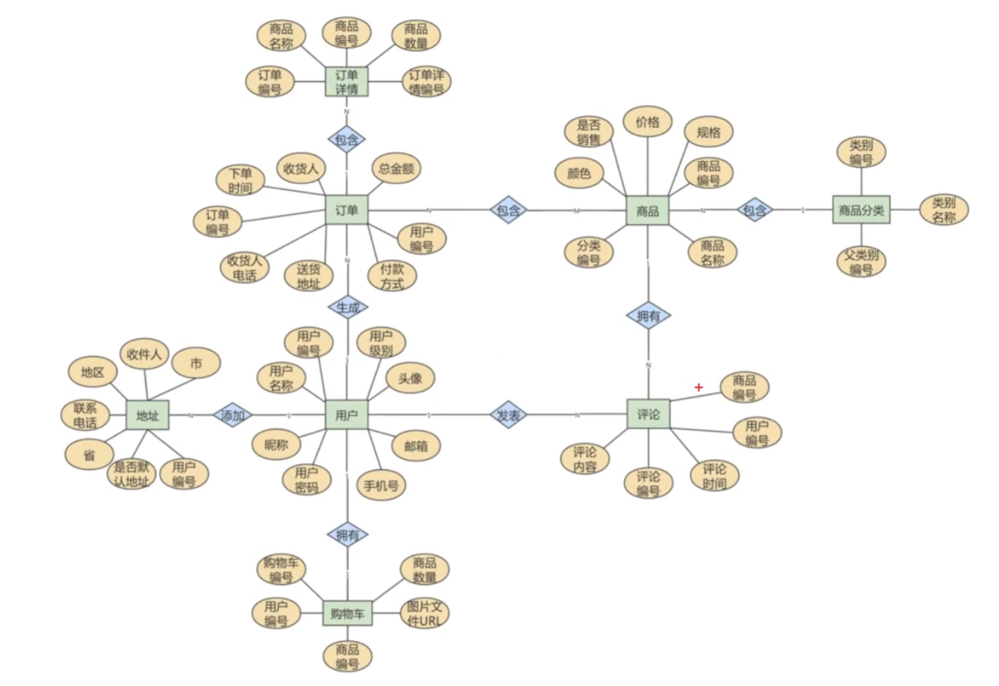

# ERD

## 概述
* 實體，以`矩形`表示，可以看做是資料庫物件，分類包含

    * 強實體 : 不依賴其他實體
    
    * 弱實體 : 依賴其他實體

* 屬性，以`橢圓形`表示，指實體的特性。

    * 與實體的比較 : 

        1. 實體可以獨立存在，屬性不行
        
        2. 屬性無法包含其他屬性。

* 關係，以`菱形`表示，指兩實體之間的關係。

    * 關係類型 : 

        1. 一對一

        2. 一對多

        3. 多對多

 

 