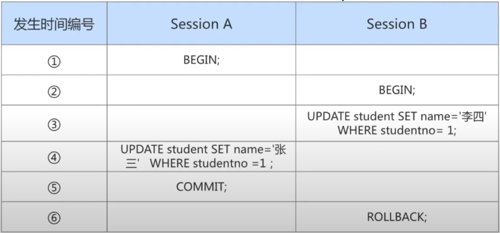
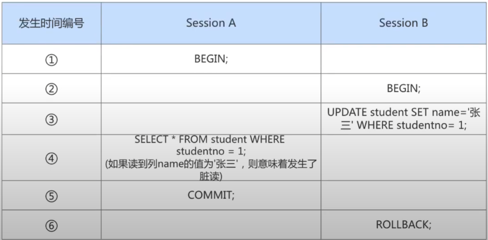
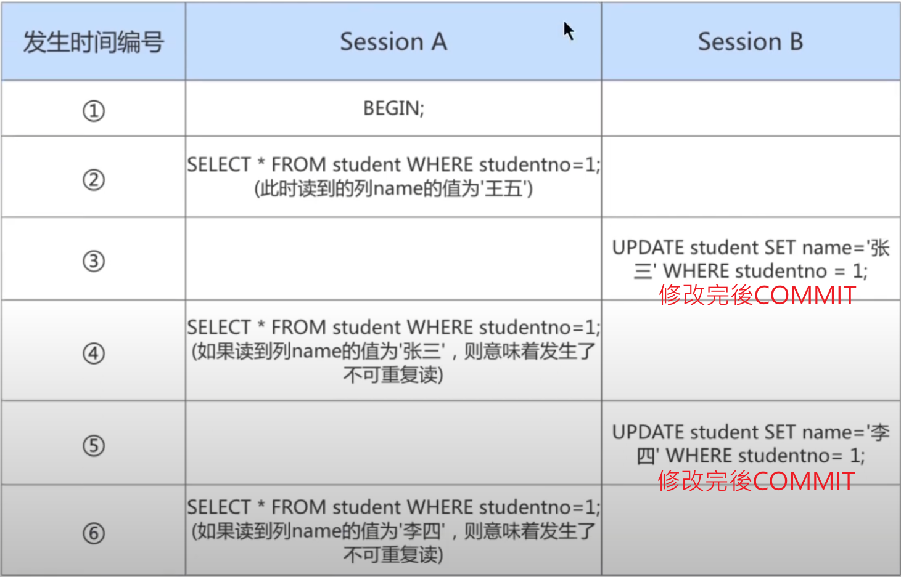
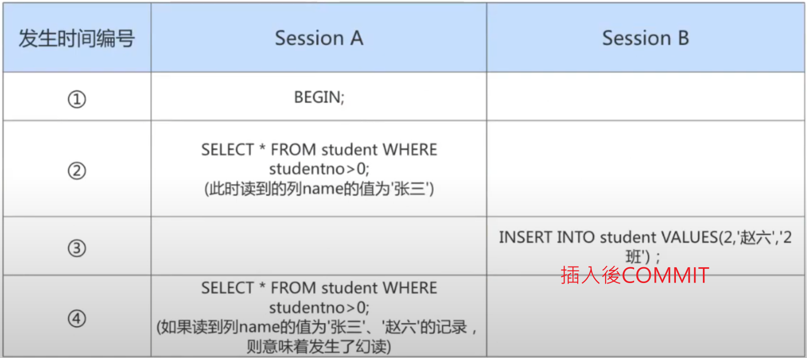

# 隔離級別

## 概述
MySQL 是一個 Server/Client 架構，當每個用戶連接上，可產生一個 Session。

當多個 Session 對同一張表、同一筆數據進行修改，會產生併發的問題，因此針對事務來說，當一個事務正在執行時，其他事務應進行`排隊`，等待執行事務完成後，才能進行其他事務的執行，但是排隊機制對於`性能影響太大`，因此需要有`隔離級別`，在性能和併發處理上需要達到平衡。

<br/>

<br/>

## 數據併發的問題

以下都是用 Session A 、 Session B 來代表不同的事務。

1. 髒寫 (Dirty Write)

    * Session A 修改了另一個`未提交`事務 Session B `修改過`的數據，就是產生了髒寫。

        

    <br/>

2. 髒讀 (Dirty Read)

    * Session A 讀取了另一個已經被 Session B 更新但還沒有被提交的欄位，若此時 Session B 回滾，Session A 讀取的內容就是`臨時且無效的`。

        

    <br/>


3. 不可重複讀 (Non-Repeatable Read)

    * Session A 讀取一個欄位，然後 Session B `修改`了此欄位。之後 Session A 再讀取時會發現欄位的值前後不同。

        

    <br/>

4. 幻讀 (Phantom)

    * Session A 從一張表中`讀取`了一個欄位，然後 Session B 在該表中`插入`了一些新的數據。之後 Session `再次讀取`同一張表，就會多出幾行，就意味著產生幻讀。

        

    * 幻讀的定義是，事務按照某條件多次讀取時，`後面讀取時讀到了前面沒讀到的紀錄`。

    * 注意，若 Session B 並不是插入數據，而是刪除數據，這種情況不歸類在幻讀。

    * 和`不可重複讀`的差別是，一個是 Session B 修改欄位，一個是插入數據。


<br/>

<br/>

## 隔離級別的種類

針對上述因為併發產生的問題，也需要有輕重緩急之分，所以問題的嚴重性為以下

```
髒寫 > 髒讀 > 不可重複讀 > 幻讀
```

如果為了解決所有併發的問題，將隔離級別拉到最高，那性能勢必會差，所以需要達成平衡。

以下有4種隔離級別 (以下4種都解決了髒寫的問題): 

`未提交讀 READ UNCOMMITTED`

* 所有事務都可以看到其他未提交事務的執行結果。

* 不能避免髒讀、不可重複讀、幻讀。

<br/>

`提交讀 READ COMMITTED`

* 一個事務只能看見已經提交事務所做的執行結果。

* 這個級別是大多數DBMS預設的級別，但不是 MySQL 預設的級別。

* 可避免髒讀，但不能避免不可重複讀、幻讀。

<br/>

`可重複讀 REPEATABLE READ`

* 事務A在讀到一筆數據後，事務B修改了該筆數據，此時事務A再次讀取，還是讀到與先前相同的內容。

* 可避免髒讀、不可重複讀，但不能避免幻讀(例外: MySQL的這個級別使用MVCC解決`部分幻讀問題`，但不能完全解決)。

* 為 MySQL 預設的隔離級別。

<br/>

`可序列化 SERIALIZABLE`

* 事務A在執行期間，禁止其他事務對該表執行插入、更新、刪除等操作。

* 確保一個事務可以從一張表中，讀取相同的資料。

* 所有併發問題都可避免，可避免髒讀、不可重複讀、幻讀；但性能非常低。

* 此隔離級別下，會隱式的添加行鎖(X排他鎖)，當本事務完成後，才會解開鎖，這樣就可以成功的阻塞其他會擾亂業務的事務。

<br/>


|隔離級別|髒讀可能性|不可重複讀可能性|幻讀可能性|加鎖讀|
|--|--|--|--|--|
|READ UNCOMMITTED|O|O|O|X|
|READ COMMITTED|X|O|O|X|
|REPEATABLE READ|X|X|O|X|
|SERIALIZABLE|X|X|X|O|

<br/>

`注意` : 以上標準是基於 SQL 標準下的，對於 MySQL InnoDB 在 `可重複讀 REPEATABLE READ` 級別就使用 MVCC 解決了幻讀問題，因此需要特別注意。

<br/>

<br/>

## 查看隔離級別

MySQL 5.7.20 之後查看
```sql
show variables like '%transaction_isolation%';

select @@transaction_isolation;
```

MySQL 5.7.20 之前查看
```sql
show variables like '%tx_isolation%';
```


<br/>

<br/>

## 設定隔離級別

```sql
SET [GLOBAL | SESSION] TRANSACTION ISOLATION LEVEL 隔離級別;
```

其中隔離級別替換成以下，記得加單引號 `''`

* READ UNCOMMITTED 或是 READ-UNCOMMITTED
* READ COMMITTED 或是 READ-COMMITTED
* REPEATABLE READ 或是 REPEATABLE-READ
* SERIALIZABLE

<br/>

注意 : 

* 使用 `GLOBAL 級別`，對當前 SESSION 不起作用，需要新開一個 SESSION才會生效，才能讓事務設置生效。

* 使用 `SESSION 級別`，不用重啟 SESSION，可以當前 SESSION 後續的事務設置生效，但只限定於此 SESSION。

<br/>

<br/>