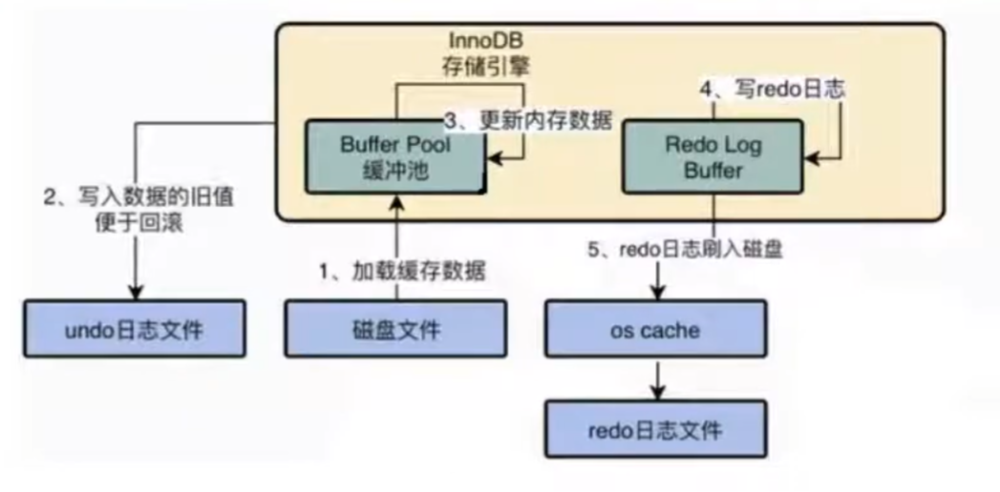

# Redo Undo 日誌

## ACID 實現機制

事務有4種特性，ACID，實現機制如下

* 原子性 (Atomicity)、一致性 (Consistency)、持久性 (Durability) : 

    * Redo Log，提供再寫入操作，目的是在發生崩潰或其他意外關機時提供重新應用更改的方法，用來保證事務的`持久性`。

    * Undo Log，提供回滾到某個紀錄，用來保證事務的`原子性`、`一致性`。

* 隔離性 (Isolation) : 

    * 由鎖機制實現。


<br/>

<br/>

## 概述

* Redo、Undo 並非是對方的逆流程；兩者皆是一種`恢復操作`。

* Redo Log:

    * 是存儲引擎(InnoDB)生成的日誌，紀錄的是`物理級別`上的頁修改操作
    
    * 例如記錄頁號、偏移量、寫入的數據。

* Undo Log:

    * 是存儲引擎(InnoDB)生成的日誌，紀錄的是`邏輯操作`(SQL語句)日誌。
    
    * 主要用於`事務的回滾`和`一致性非鎖定讀`(回滾行記錄到某種特定的版本，MVCC)。
    
    * 例如對一張表進行 Insert 操作，那 Undo Log 就會記錄一筆與之相反的 Delete 操作。

* InnoDB 的更新操作採用的是 Write Ahead Log (`預先日誌持久化`)策略，即`先寫入日誌，再將數據寫入硬碟`。

    


<br/>

<br/>

## Redo Log

### InnoDB 讀取、修改機制
InnoDB 引擎是以`頁`為單位來管理儲存空間的，在讀取頁之前，需要把硬碟上的`頁`載入到記憶體中的 Buffer Pool，才能訪問；而所有的`更新操作`都是先更新此緩衝池中的數據，然後緩衝池中的`髒頁`會以一定的頻率被刷新到硬碟中。

這樣的機制會對事務產生一個問題，由於緩衝池是以一定頻率回寫到硬碟中，萬一在事務Commit後，等待回寫硬碟前當機了，這時在記憶體中的事務就沒了，不能保證`持久性`。

解決方式 : 是將操作日誌記錄在 `Redo Log`，Redo Log 是保存在硬碟中的 (檔案空間小)，儲存速度至少比回寫硬碟(檔案檔案大，至少1頁16KB) 要快的多。

<br/>

### Redo Log 優點
1. Redo Log 降低了回寫硬碟的頻率；由於是直接儲存 Log 到硬碟中，可確保不用為了持久性而不斷的回寫。

2. Redo Log 占用的硬碟空間非常小。

3. 在執行事務時，每執行一條語句，就可能產生多筆 Redo Log，這些日誌是依照`產生的順序寫入硬碟的`，也就是使用`順序IO`(sequential write)，效率比隨機快。

4. 事務執行過程中，Redo Log 不會斷記錄

    * Redo Log 是`存儲引擎層`產生的；事務執行時，每執行一次SQL，就會產生一筆(多筆) Redo Log，依照順序，不間斷的寫入到硬碟中。

    * Bin Log 是`服務層`產生的，事務執行時，不會產生 Bin Log，而是直到事務提交後，才會一次性的把多筆 Bin Log 寫入到硬碟中。


<br/>

<br/>

### Redo Log 檔案位置

檔案位置儲存在此預設路徑
```sh
# Linux
cd /var/lib/mysql

# Windows
cd C:\ProgramData\MySQL\MySQL Server 8.0\Data
```

此路徑下會有2個檔案，已經先將硬碟容量先分配好給這兩個檔案。

* `ib_logfile0`

* `ib_logfile1`

    


<br/>

<br/>

### Redo Log 的流程 


`注意` : Redo Log 的建立機制流程，也是有使用到記憶體的，這塊記憶體名稱叫做 `Redo Log Buffer`。

<br/>

0. 第0步 : 在事務中更新數據(尚未提交)。

1. 第1步 : 當更新的數據不存在於 Buffer Pool 中時，會先將原始數據從硬碟中載入到記憶體的 Buffer Pool 中，並修改 Pool 中的數據。

2. 第2步 : 生成一筆 Redo Log，並寫入到 Redo Log Buffer，記錄數據被修改後的值。

3. 第3步 : 當事務 Commit 時，將 Redo Log Buffer 中的內容寫入硬碟中的 Redo Log File，此檔案是採用順序寫入的方式；只要這個步驟成功，就能保證事務的持久性。

4. 第4步 : 定期將 Buffer Pool 中修改的數據，回寫到硬碟。


以下是 Redo Log Buffer 的架構圖


<br/>

<br/>

### 參數 innodb_flush_log_at_trx_commit

此參數是上上圖的`第3步`，即事務 Commit 後，寫入 Log File 的機制。

以下是詳細步驟


Redo Log Buffer 在回寫至 Redo Log File 中間其實還有一個步驟，會將 Log Buffer 中的記錄先交給 OS Buffer(Page Cache)，這個記憶體快取是由 OS 控管，OS 可以調用 fsync() 方法，將這些數據持久化進 Log File 中。


<br/>

`innodb_flush_log_at_trx_commit` 此參數控制 commit 提交事務時，如何將 Redo Log Buffer 中的日誌回寫到 Redo Log File 中。

以下有三種策略


<br/>

`設置為 0` : 

* 提交事務時，不會主動把 Log Buffer 寫進 Page Cache，而是每秒由一個 InnoDB 的 Thread，將 Log Buffer 載入給 OS Buffer，再寫入 Log File。

* 當設定為0，該模式性能最高，但不太安全，若 mysqld 崩潰會導致上一秒鐘所有事務資料遺失 (因為 mysqld 掛掉導致 Log Buffer 消失，之後的 OS Buffer、Log File 都不會有數據)。


`設置為 1` : 

* 提交事務時，都會把 Log Buffer 的資料主動載入給 OS Buffer，再主動調用 fsync()，寫入到 Log File 中；此為`系統預設值`。

* 當設定為1，該模式是最安全的，但也是最慢的一種方式。

* 一般還是建議使用預設值，雖然 OS 當機機率理論上小於資料庫當機的機率，但是既然使用了事務，還是要確保數據的安全性。

`設置為 2` : 

* 提交事務時，都會把 Log Buffer 的資料主動載入給 OS Buffer，但不會主動調用 fsync()，會等每秒調用 fsync() 一併寫入 Log File。

* 當設定為2，該模式性能較1快，較取值為0情況下更安全，只有在作業系統崩潰的情況下，上一秒鐘所有事務資料才可能遺失 (mysqld 崩潰無所謂，因為數據都已經主動丟給 OS Buffer 了)。

<br/>

### InnoDB Redo Log 後台線程

* 此線程的名稱為 [Log flusher](https://dev.mysql.com/doc/dev/mysql-server/latest/PAGE_INNODB_REDO_LOG_THREADS.html)

* 此 Thread，每隔 `1秒`，就會把 Redo Log Buffer 中的內容寫到文件系統緩存(Page Cache，即 OS Buffer)，然後調用 fsync() 寫入到 Log File。

    

<br/>

* 有一種特殊情況，當一個尚未 Commit 的事務中，已執行 SQL 的 Log Buffer 日誌 (每執行一個 SQL，就有相對應的日誌在 Log Buffer 產生)，還是會每1秒被此線程寫入到 Log File 中；即`尚未Commit的事務中，已執行過的SQL，都會有 Redo Log`。

* 此線程與 `innodb_flush_log_at_trx_commit` 設置是同時作用的，此線程是不間斷的被動執行，而 innodb_flush_log_at_trx_commit 是設定主動寫入的方式。


<br/>


<br/>

<br/>

### 參數 innodb_log_buffer_size

後台線程，每 1 秒會進行一次 `Log Buffer --> OS Buffer --> Log File` 操作，而當 Log Buffer 占用的記憶體空間達到 `innodb_log_buffer_size` 的一半時，會主動進行上述的回寫動作。

`innodb_log_buffer_size` 預設是 16 MB。

<br/>

<br/>

### 補充一些底層概念

`Mini-Transaction`

* MySQL 把底層頁面中的一次原子訪問的過程稱為一個 Mini-Transaction，簡稱 `mtr`；例如對某個索引的B+ Tree中，插入一筆記錄的過程就是一個 Mini-Transaction。

* 一個 mtr 可以包含一組 Redo Log，在進行崩潰恢復時，這一組 Redo Log 將作為一個不可分割的整體。

    

    例如語句一 `update user set flag = 1 where id > 50`； id > 50 的記錄可能有非常多筆，每一筆就是一個 mtr。