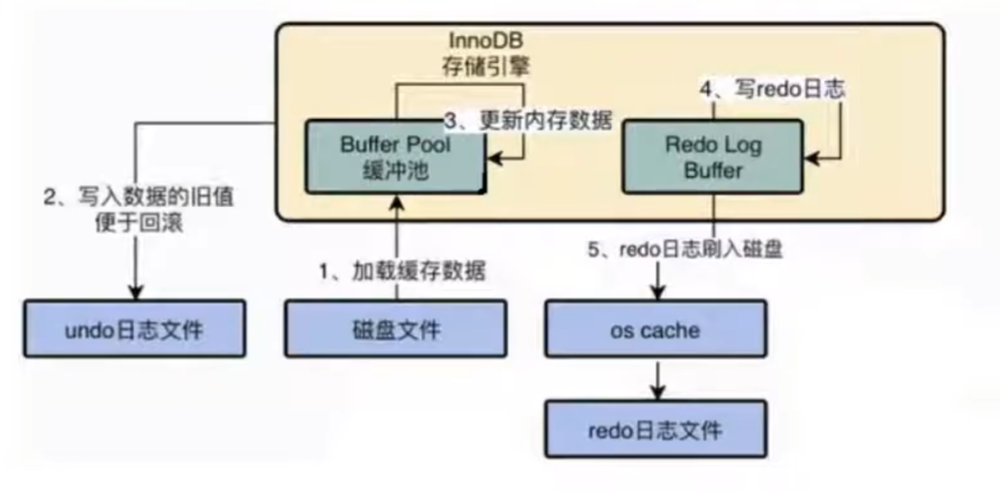
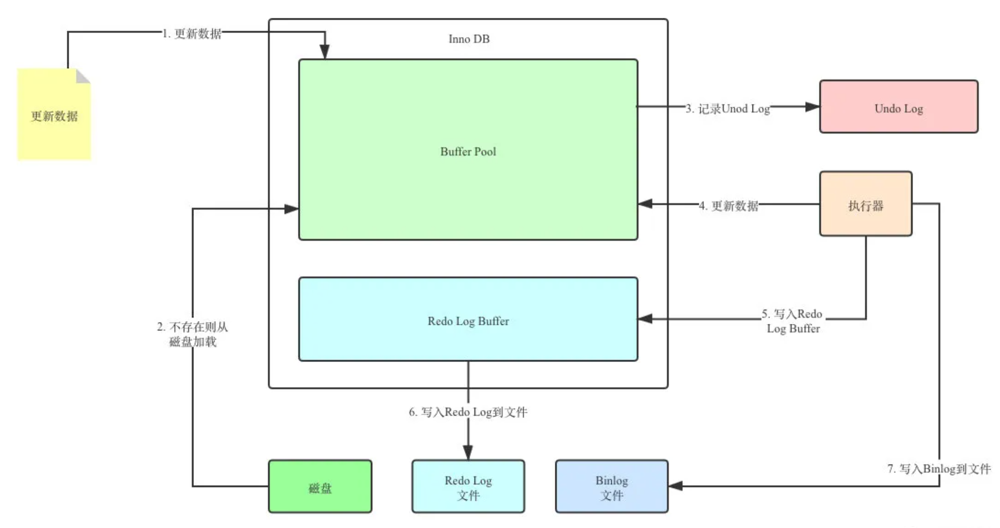

# Undo Undo 日誌

## 概述

* Redo Log 是保證事務的持久性；而 `Undo Log`保證事務的`原子性`。

    * 使用情境1 : 事務執行過程中出現錯誤，mysqld Process 錯誤、OS 錯誤、斷電導致的錯誤。

    * 使用情境2 : 當事務執行過程中，輸入 Rollback 時。

    * 使用情境3 : MVCC 底層實作。

* 在事務中，更新數據的前置操作就是先寫入一個 Undo Log。

* 同一張架構圖，先產生 Undo Log，儲存更新前的數據，再去 Buffer Pool 中更新數據。

    

    <br/>

    

    <br/>

    <br/>

* Undo Log 也會產生自己的 Redo Log； Undo Log 也需要持久性的保護。

<br/>

<br/>

## Undo Log 作用

### 作用1 : 回滾數據

Undo Log 可以將數據恢復至事務 Commit 前的狀態；但是無法將 `硬碟物理上` 恢復。

* 例如: 已 insert 的數據，在回滾時，無法連同該物理上的數據頁也一併刪除，只是將此數據頁中的數據刪除而已。

<br/>

### 作用2 : MVCC (多版本並發控制)

在 InnoDB 存儲引擎中的 MVCC 實現是透過 Undo 來完成的。當用戶讀取一筆記錄時，若該記錄已經被其他事務占用，當前事務可以通過 Undo Log 讀取之前版本的資訊，以此實現非鎖定讀取。

<br/>

<br/>

## Undo Log 類型

在 InnoDB 存儲引擎中，Undo Log 分為

`Insert Undo Log`

* 指在 insert 操作中所產生的 Undo Log；因為 insert 操作記錄，只對事務本身可見，對其他事務不可見(事務隔離性要求)，故該 Undo Log 可以在事務提交後`直接刪除`，不需要進行 purge 操作。

    * 補充 : `Purge 線程`是一個在背景執行的線程，用途是當事務A在提交後，事務A 的 Undo Log 不會馬上進行刪除，因為有可能其他事務需要透過 Undo Log 得到之前的紀錄，因此事務A在提交後會將 `Undo Log 放入一個 Linked List 中`，而 Purge 線程會去判斷這些在 Linked List 中的 Undo Log 是否可以刪除。


`Update Undo Log`

* 指在 update 和 delete 操作所產生的 Undo Log；該 Undo Log 可能需要提供 MVCC 機制，因此不能在事務提交時就進行刪除；提交後 Undo Log 會放入 Undo Log `Linked List` 中，等待 Purge 線程進行最後的刪除。

<br/>

<br/>

## Undo Log 生命週期

以下是事務在執行時，Undo Log + Redo Log 的過程

舉例，執行一個事務，A = 1，B = 2；將 A 改成 3，B 改成 4。

```
1. start transaction。
2. 記錄 A = 1 到 Undo Log。
3. update A = 3。
4. 記錄 A = 3 到 Redo Log。
5. 記錄 B = 2 到 Undo Log。
6. update B = 4。
7. 記錄 B = 4 到 Redo Log。
8. 將 Redo Log 刷新到 Redo Log File(硬碟)。
9. Commit。
```

在步驟 1 ~ 8，不管在哪一個步驟系統當機，事務未提交，該事務不會對硬碟上的數據做任何影響。

在步驟 8 ~ 9 之間當機，恢復之後可以選擇 `Rollback` 或 `Commit`，因為此時 Redo Log 已經持久化。

步驟 9 之後當機，記憶體中變更的數據若還來不及寫進硬碟，系統恢復後，可以依據 Redo Log 把數據寫回硬碟。