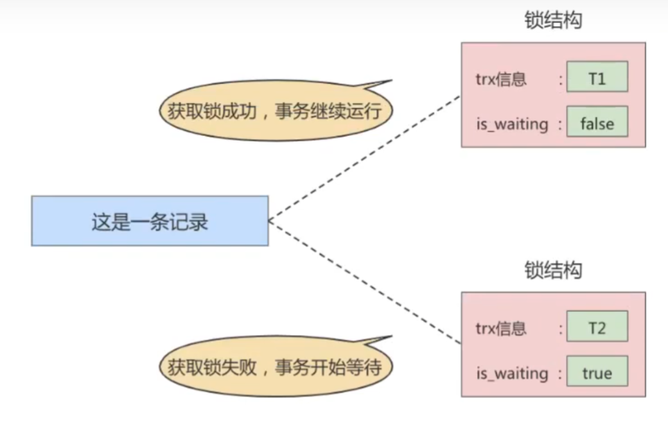

# 鎖

## 概述

* 鎖是多進程、多線程`併發訪問某一資源`的機制；可確保數據`最多只能有一個線程`能訪問，並保證數據的完整性和一致性。

 

 

## 併發事務訪問相同記錄 舉例情況

### 讀-讀情況
不同事務讀取相同記錄，不會引起併發上的問題，所以允許此情況發生。

 

 

### 寫-寫情況

不同事物對相同記錄進行修改。

這種情況會發生`髒寫`問題，也就是寫入到其他事務中尚未提交的數據，任何一種隔離級別都不允許此種情況發生。

鎖的解決方式就是讓不同事務`排隊執行`操作同一筆數據。

以下是當事務想要修改數據時，會產生的鎖結構，`一個事務會產生一個鎖結構`，鎖結構中記錄了

* 哪個事務(trx信息)

* 是否需要等待(is_waiting)

    

    當事務 T1 提交後，就會把鎖結構釋放，然後會看是否有在等待的鎖結構，發現事務 T2 正在等待，此時會把 T2 鎖結構的 is_waiting 改為 false，然後`把事務 T2 對應的線程喚醒`，使其繼續執行。

 

 

### 讀-寫情況

不管是`讀-寫`還是`寫-讀`，此種情況有可能會發生

* 髒讀
* 不可重複讀
* 幻讀

各種資料庫對 `SQL標準` 的實作可能都不同，例如 MySQL 在 `REPEATABLE READ` 隔離級別上就已經解決了幻讀問題 (原本SQL標準應該只能解決髒讀和不可重複讀，但 `MySQL 使用 MVCC 解決了幻讀問題`)。

`讀-寫`的重點是，可讓讀操作獲取歷史版本數據，但必須讓寫操作獲取最新版本的數據。

 

 

## 併發的解決方案

`如何解決髒讀、不可重複讀、幻讀?`

* 讀操作使用 MVCC(多版本併發控制)；寫操作使用鎖。

    * 所謂的 MVCC，就是生成一個 ReadView，通過 ReadView 找到符合條件的記錄版本 (歷史版本使用 Undo Log 構建)，查詢語句只能讀到`已提交事務所做的更改`，而在 ReadView 之前未提交的事務是讀不到的。

    * 寫操作一定是針對`最新版本的紀錄`，和`讀記錄的歷史版`本沒有衝突，也就是採用 MVCC 時，`讀-寫`操作不衝突。

* 讀和寫操作都使用`鎖`

    * 有些業務情境下，讀操作也是要讀取最新的紀錄；例如銀行存款，多個事務併發時，不可能讀取舊記錄。

    * 成本較高，此方式就要和`寫-寫`操作時相同，多個事務必須要使用鎖，排隊執行。