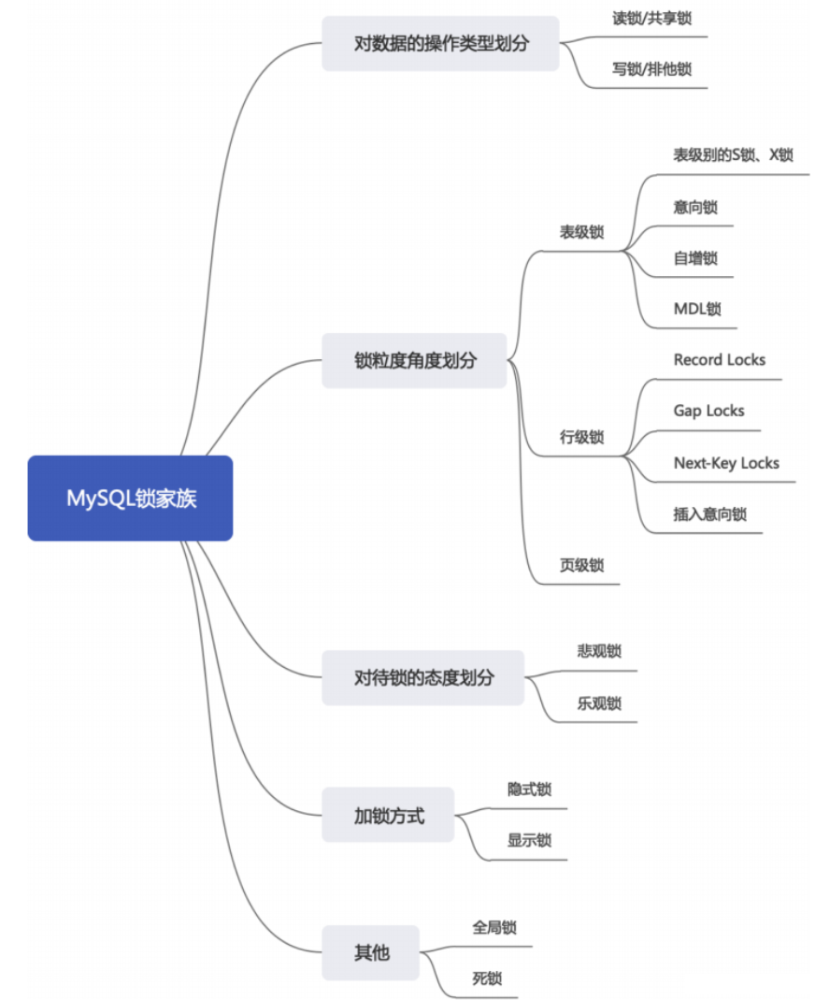
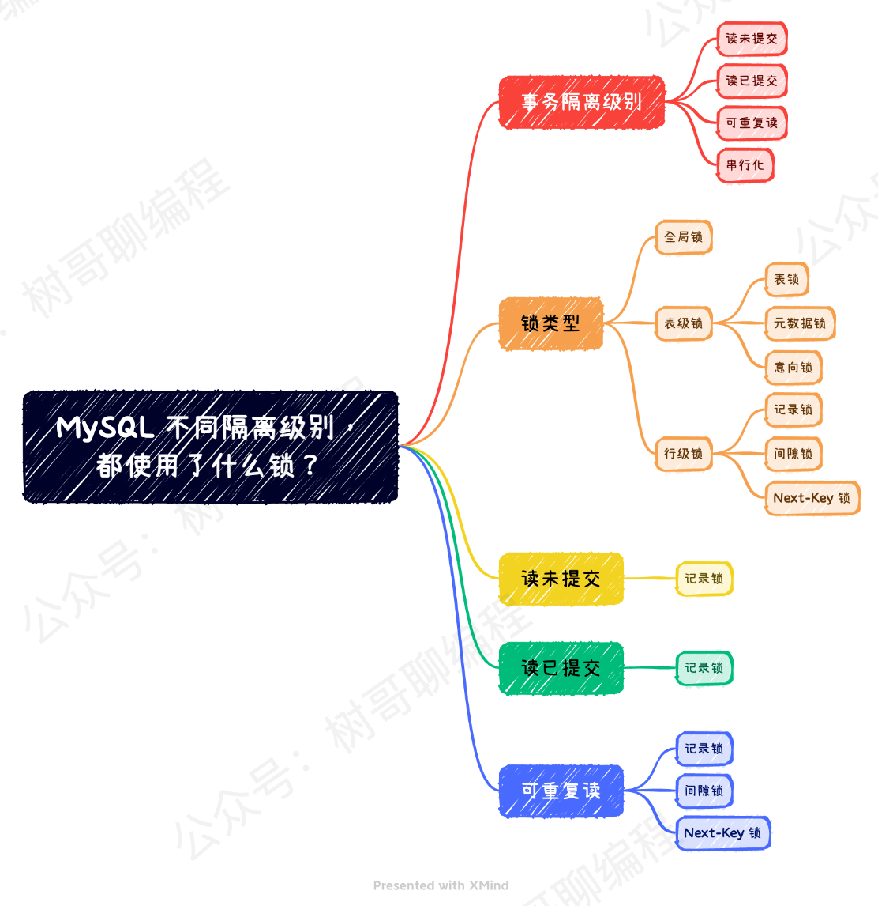
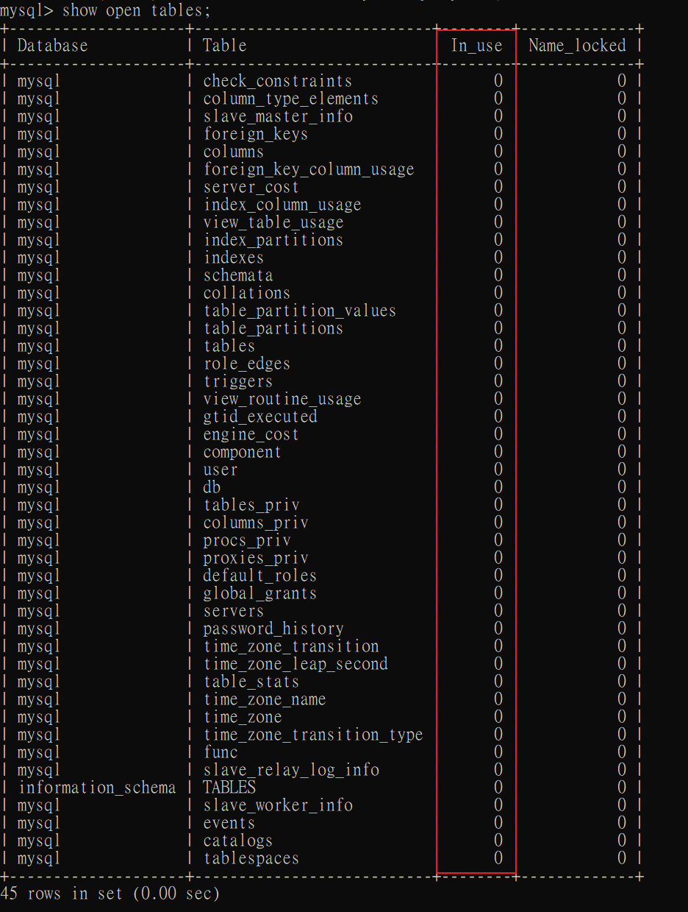
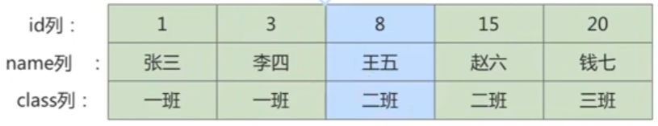
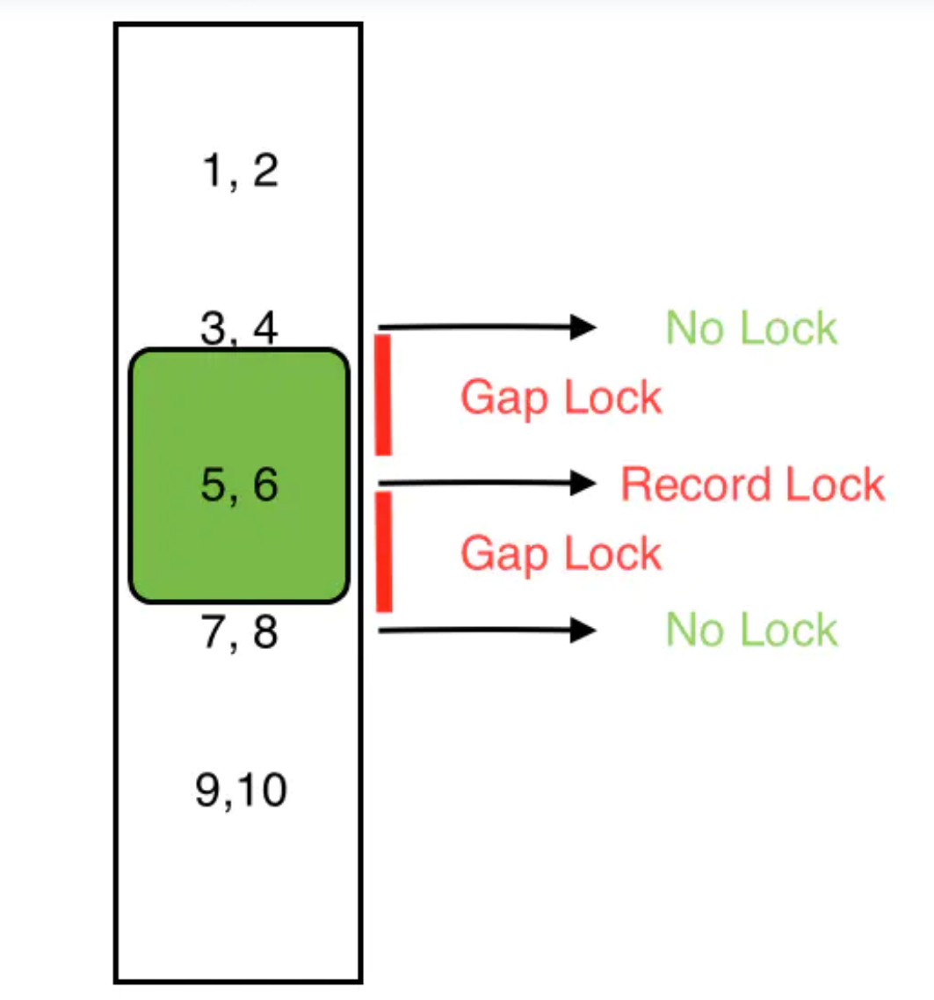

# 鎖種類

## 依照不同功能分類



<br/>

## 依照不同隔離級別分類




<br/>

<br/>

## 概述

1. 鎖解決的問題 : 用於防止併發操作引起的資源衝突。
2. 鎖的粒度(範圍)越小，記憶體成本越大 (行級鎖記憶體成本高於表級鎖)。

<br/>

<br/>

## 依照數據的兼容性劃分 : 共享鎖 / 排他鎖

* Shared Locks (S)，又稱`共享鎖`，與`讀鎖`功能相近。

    1. 針對同一份數據，多個事務的讀操作可以同時進行而不會受影響。

    2. InnoDB 中，讀鎖可以是行鎖，也可以是表鎖。

    3. 規則
        * 持有讀鎖可以讀表不能寫表
        * 允許多個線程持有讀鎖
        * 其他線程就算沒有加上讀鎖，也可以讀表
        * 其他線程想給表上寫鎖會被卡住，直到鎖釋放
        * Mysql 語法為 
        
            ```sql
            SELECT ... LOCK IN SHARE MODE;

            -- 8.0 新增語法
            SELECT ... FOR SHARE;
            ```
            

* Exclusive Locks (X)，又稱`排他鎖`，與`寫鎖`功能相近。

    1. 針對同一份數據，當一個寫操作還沒有完成之前，會阻斷其他寫鎖和讀鎖；這樣就可以確保在同一時間，只能有一個事務能執行寫入，並防止其他用戶讀取正在寫入的同一資源。

    2. InnoDB 中，寫鎖可以是行鎖，也可以是表鎖。
    
    3. 規則
        * 持有寫鎖的線程可以讀也可以寫
        * 只有持有寫鎖的線程才可以訪問，其他線程會被卡住等待鎖釋放
        * 其他線程想加鎖都會被卡住，直到鎖釋放
        * Mysql 語法為

            ```sql
            SELECT ... FOR UPDATE;
            ```
            

* Update Locks (U)
    * 目的是避免 Dead lock，是一個過渡的狀態，讓其他的Session在 Shared Lock 狀態等待。

    * 更新資料時，步驟如下。

        `Shared Lock => Update Lock => Exclusive Lock`

        Shared Lock : 查詢更新的資料。

        Update Lock : 更新前把資料改成 Update Lock。

        Exclusive Lock : 確定要更新當下改成 Exclusive Lock。
    
    * 關鍵在於`Shared Lock不互斥，Update Lock互斥`: 先拿到 Update Lock 的 Session 可以避免其他 Session 拿 Update Lock，只能留在 Shared Lock 等待。


* 8.0 新語法

    * 共享鎖、排他鎖都可以通過添加 `NOWAIT`、`SKIP LOCKED` 語法，能夠立即返回，不必等待。

    * 如果查詢的行已經加鎖

        * `NOWAIT` 會立即返回，並報錯

        * `SKIP LOCKED` 會立即返回，只是返回的結果中不包含被鎖定的行。


        ```sql
        -- 用法1
        SELECT ... FOR UPDATE NOWAIT;

        -- 用法2
        SELECT ... FOR UPDATE SKIP LOCKED;
        ```


<br/>

<br/>

## 依照數據的粒度劃分 : 表級鎖 / 頁級鎖 / 行級鎖

為了盡可能的提高資料庫的併發度，每次鎖定的資料範圍越小越好，但是範圍越小，管理上越困難，越耗資源 (獲取鎖、檢查、釋放鎖等步驟)，因此產生了`鎖顆粒度 Lock granularity` 的概念。

以下是依照粒度分類的鎖種類 : 

### `表鎖 Table Lock`

1. InnoDB 表鎖有以下種類

    * 表級S鎖、X鎖

    * 意向鎖 Intent Locks

    * 自增鎖 Auto-Inc Locks

    * 元數據鎖 Meta Data Locks

2. 會鎖定整張表，不依賴存儲引擎(不管是什麼種類的存儲引擎，對於鎖表的策略都是一樣的)。

3. 資源開銷最小，併發效率低；由於是將整張表鎖住，可以很好的避免死鎖問題。

4. MyISAM 只有表鎖；InndoDB 有提供表鎖、頁鎖、行鎖。

5. 一般情況，不會使用 InnoDB 提供的表級別的`S鎖`和`X鎖`，因為有粒度更小的鎖可以使用；只有MyISAM才會使用表級鎖 (因為MyISAM只有表級鎖)。

6. 使用語法

    * 加鎖

        ```sql
        -- InnoDB存儲引擎對表 t1 增加表級別的S鎖
        LOCK TABLES t1 READ;

        -- InnoDB存儲引擎對表 t1 增加表級別的X鎖
        LOCK TABLES t1 WRITE;
        ```

        <br/>

    * 查看

        ```sql
        -- 查看所有表
        show open tables;

        -- 查看有鎖的表
        show open tables where in_use > 0;
        ```

        

        <br/>

    * 釋放所有鎖
        
        ```sql
        unlock tables;
        ```

7. `Intent Locks (I)`，是一種表級鎖

    * 意向鎖解決的痛點 : 
    
        `加表鎖`的過程中，會檢查每行是否已經有`行鎖`，確認沒有行鎖才會加上表鎖 (如果不確認直接加表鎖的話，會和原有的行鎖造成死鎖)，但如果數據庫中的數據有海量時，遍歷會造成性能下降。

        因此增加了意向鎖的概念，在加`行鎖`之前先加表級的`意向鎖`，其它事務能以較小的代價得知資料表有行正在被鎖定。
        
    * InnoDB 允許表級鎖和行級鎖共存；意向鎖是一種`表級別`的鎖，所以意向鎖與`行級別`的鎖並沒有競爭關係。

    * 任意 IS/IX 鎖之間都是兼容的，因為它們只是表示想要對表加鎖，而不是真正加鎖。

    * 意向鎖是由SQL引擎自己維護的，用戶無法手動操作意向鎖，所以還是依照原本的加鎖語法。

        ```sql
        -- 讀鎖
        SELECT ... LOCK IN SHARE MODE;

        -- 寫鎖
        SELECT ... FOR UPDATE;
        ```

    * `意向鎖`的存在代表`此表中有行鎖的存在或即將有行鎖存在`。

    <br/>

8. `表鎖`的衝突表，表格中的4種鎖都以表鎖來討論(不包含行鎖)。
    
    ||X|IX|S|IS|
    |:--:|:--:|:--:|:--:|:--:|
    |X|`衝突`|`衝突`|`衝突`|`衝突`|
    |IX|`衝突`|相容|`衝突`|相容|
    |S|`衝突`|`衝突`|相容|相容|
    |IS|`衝突`|相容|相容|相容|

    <br/>

    補充 

    1. `寫鎖(X)`如果是表鎖，表示獨佔整個表，因此與任何鎖都衝突，但如果是行鎖，就不會和表級別的IX鎖衝突，否則資料表無法同時update不同行的資料，資料表要能夠同時可以修改不同行的資料(上面的表格中，X指的是表級X鎖)。

    2. IX，IS是表級鎖，不會和行級的X，S鎖發生衝突。只會和表級的X，S發生衝突。
    3. IX 和 IX 只要表示修改不同行，就不會衝突，IS 與 IX 同理，不同行就不衝突。
    4. S 和 IS 表示共享鎖，彼此皆不會衝突。
    5. S 和 IX 衝突原因是，此表已經有S鎖，就不能再加上行級 X 鎖。

    <br/>

    <br/>

9. Auto-Inc Lock 自增鎖，是一種表級鎖

    * 目的 : 當多個事務對同一張表 insert 一筆新的數據，需要確保 Auto_increment PK 的值不能重複。

    * 當一個事務在持有 Auto-Inc Lock 時，其他事務的 insert 語句都要被阻塞。


10. Meta Data Lock 元數據鎖，是一種表級鎖

    * 目的 : 當一個事務對一張表做 DDL 修改表結構時，另一個事務對表做 DML，會導致 DML 事務拿到的資料會跟表結構對不上。

    * 元數據鎖不需手動使用，而是系統自動加上的，可確保 DML 和 DDL 操作之間數據一致性問題。

    * 當一張表做 CRUD 時，會加上 `MDL 讀鎖`； 當要對表做 DML 時，會加上 `MDL 寫鎖`；`MDL讀鎖之間不互斥`； `MDL讀鎖和MDL寫鎖互斥`。


<br/>

<br/>

### `行鎖 Row Lock`

1. `行鎖有可能會導致死鎖問題`；表鎖不會產生死鎖問題。

2. 由於隔離級別 `REPEATABLE READ` 尚未解決幻讀問題；InnoDB 使用了兩種方式在此級別就解決了幻讀問題

    * MVCC

    * 加鎖；使用的鎖就是行鎖 (Gap Locks、Next-Key Locks、Insert Intention Locks)


2. InnoDB 行鎖有以下種類

    * 紀錄鎖 Record Locks

    * 間隙鎖 Gap Locks

    * 鄰鍵鎖 Next-Key Locks

    * 插入意向鎖 Insert Intention Locks


3. 記錄鎖 Record Locks，是一種行鎖

    * 就是一般的行鎖，就是將鎖加在一筆紀錄上，對周圍的數據沒有影響。

    * 記錄鎖也是有分為`S鎖`和`X鎖`。


4. 間隙鎖 Gap Locks，是一種行鎖

    * 目的 : 為了防止幻讀所產生的新記錄；間隙鎖的做法是在限制的範圍內(索引)，禁止插入數據。

    * 間隙鎖加在不存在的空閒空間，可以是兩個索引記錄之間，也可能是第一個索引記錄之前或最後一個索引之後的空間。

        

        如果對 id = 5 使用間隙鎖，當要插入 `3 < id < 8` ，用 `(3,8)` 數學符號表示，這個範圍(間隙)內的數據，全部都會被擋下。

        

    * 間隙鎖之間是互相不衝突的，唯一作用就是防止其他事務插入；`但是間隙鎖之間有可能會導致死鎖問題`。

    * 間隙鎖同樣是使用 for share 和 for update 來上鎖，只是指定的 id 還尚未存在。

        ```sql
        -- 參考上圖

        -- 事務1，(當 id = 25 的記錄不存在)
        begin;
        select * from students where id = 25 lock in share mode;

        -- 事務2，(id > 20 的插入數據都會被擋下)
        insert into students(id, name, class) values (25, 'Amy', '三班');
        ```


        <br/>

5. 鄰鍵鎖 Next-Key Locks

    * 目的 : 確保查詢結果的一致性，同時防止在事務執行期間有新數據插入 (間隙鎖的作用)，並確保每次查詢都看到一致的快照 (行鎖的作用)。

    * `Next-Key Locks = Record Locks + Gap Locks`

        

        如果對 id = 5 使用鄰鍵鎖，當要插入 `3 < id <= 8`，用 `(3,8]` 數學符號表示，這個範圍(間隙)內的數據，全部都會被擋下。


    * 事務隔離級別在 `REPEATABLE READ` 使用的鎖，InnoDB 預設使用的鎖就是 Next-Key Locks。

6. 插入意向鎖 Insert Intention Locks

    * 目的 : 當一個事務要插入一筆數據時，需要考慮是否該索引有被其他事務加了 Gap Locks (或 Next-Key Locks)，如果有的話，插入操作會需要等 Gap Locks 釋放才能進行；InnoDB 規定在等待的事務，也需要在記憶體中生成一個鎖結構，表明有事務想在某個`間隙`中`插入`新紀錄；`目的是減少等待時間`。

    * 當多個事務在同一個 Gap 中，插入位置(索引)不同時，事務間就不需要互相等待。

    * 插入意向鎖是一種`特殊的 Gap Lock`；非意向鎖。

    * 插入意向鎖之間互不排斥，即使多個事務在同一個 Gap 插入多筆事務，只要`記錄本身的索引`不衝突，那事務之間就不會出現等待。

    * 隔離級別在 `REPEATABLE READ`。

    * 舉例1

        ```sql
        -- 索引為 id 欄位

        -- 事務1，尚未提交
        begin;
        insert into user(id, username) values(90, 'Amy');

        -- 事務2
        begin;
        insert into user(id, username) values(91, 'Jack');
        ```

        此時事務2也可以正常執行，沒有發生阻塞，說明`兩個插入意向鎖只要索引不衝突，就可以共存`。

    * 舉例2

        ```sql
        -- 索引為 id 欄位

        -- 事務1，加上間隙鎖
        begin;
        select * from user where id > 100 for update;

        -- 事務2
        begin;
        insert into user(id, username) values (101, 'Amy');
        ```
        
        當事務1加上間隙鎖後，事務2要插入數據，就會被阻塞，原因是`插入意向鎖和間隙鎖是互斥的`，需要等事務1間隙鎖釋放，事務2才能執行插入。

<br/>

<br/>

## 依照鎖的態度劃分 : 樂觀鎖 / 悲觀鎖

### `樂觀鎖 Optimistic Lock`
1. 常應用在`讀多寫少`的情境，並不會在資料庫中真的使用加鎖語法。

2. 實作方式是使用 `version欄位` 或 `timestamp`，version 欄位表示數據被修改的次數，當數據被修改時，version 值會加1。

3. 更新資料的步驟: 

    1. 先查要檢查的資料

        ```sql
        -- version 抓取商品數量、version次數
        SELECT num,version FROM `MyDB`.`items` where id = 1;
        ```
    2. 更新時需一併帶上將version條件帶上

        ```sql
        UPDATE `MyDB`.`items` 
        SET 
            num = num -1 ,          -- 商品數量減1
            version = version + 1   -- 修改次數加1
        WHERE id = 1 and version = 0; -- 條件需要帶上步驟1查詢到的version值
        ```


    3. 若步驟2中的 WHERE 條件都符合，才會進行更新，這樣做的好處是: `能避免因使用悲觀鎖而導致吞吐量下降`(因為有鎖，後面的指令都會等待)的問題。


4. 比較適合讀取操作比較頻繁的場景，如果出現大量的寫入操作，數據發生衝突的可能性就會增大，爲了保證數據的一致性，應用層需要不斷的重新獲取數據，這樣會增加大量的查詢操作，降低了系統的吞吐量。

5. 優點 : 因為沒有加鎖，只有在更新資料時才會做驗證，不會有因為使用鎖導致吞吐量下降的問題。

6. 缺點 : 樂觀鎖是人為實現的，所以如果換一個業務場景可能會不適用，甚至可能因為其他的 SQL command 導致錯誤。

<br/>

<br/>

### `悲觀鎖 Pessimistic Lock`
1. 常應用在`寫多讀少`的情境，會使用資料庫中加鎖的語法，需要確保資料的正確性。

2. 它認為 Table 裡面的 data 非常不安全，無時無刻都在變動，當一個 SQL command 獲得悲觀鎖後，其他的 SQL command 無法對這個 data 進行修改，直到悲觀鎖被釋放後才能執行。

3. 資料表中用 Synchronized 實現的鎖均為悲觀鎖 (ex：行鎖，表鎖，讀鎖，寫鎖)。

4. 優點 : 使用資料庫 `Transaction` 機制強迫執行順序，保證資料正確。

5. 缺點 : 由於加上鎖的機制，會導致其他功能需等待，造成系統吞吐量下降。

6. 更新的步驟為

    1. 對要做更新的資料加上 `Update Locks (U)` 悲觀鎖

        ```sql
        -- 開啟 Transaction 手動提交，不然會自動提交
        begin;

        -- 加上悲觀鎖
        SELECT num FROM `MyDB`.`items` WHERE id = 1 for update;
        ```
    
    2. 更新加了悲觀鎖的資料

        ```sql
        -- 數量減1
        UPDATE `MyDB`.`items` SET num = num -1 WHERE id = 1;

        -- 提交
        commit;
        ```
    
    3. 提交後，其他更新的動作才能使用


* 注意 : 使用排他鎖(X)時，`select ... for update` 語句執行過程中，會將所有掃描的行都鎖上，因此在 MySQL 中`使用悲觀鎖必須確定要命中索引`，而不是掃描全表，否則會把整張表鎖住。

<br/>

<br/>


## References

> 鎖的解釋1 https://hackmd.io/@gysdnow/H1RJgsk5L

> 鎖的解釋2 https://blog.twjoin.com/%E9%8E%96-lock-%E7%9A%84%E4%BB%8B%E7%B4%B9%E8%88%87%E6%AD%BB%E9%8E%96%E5%88%86%E6%9E%90-19833c18baab

> update lock 目的 https://ithelp.ithome.com.tw/articles/10254610#update-lock-%E5%AD%98%E5%9C%A8%E7%9A%84%E6%84%8F%E7%BE%A9

> 意向鎖的作用 https://www.zhihu.com/question/51513268

> 意向鎖的兼容性 https://juejin.cn/post/7167957408583516173

> 只有 REPEATABLE READ 隔離級別才使用到間隙鎖和 Next-Key鎖 https://cloud.tencent.com/developer/article/2134875