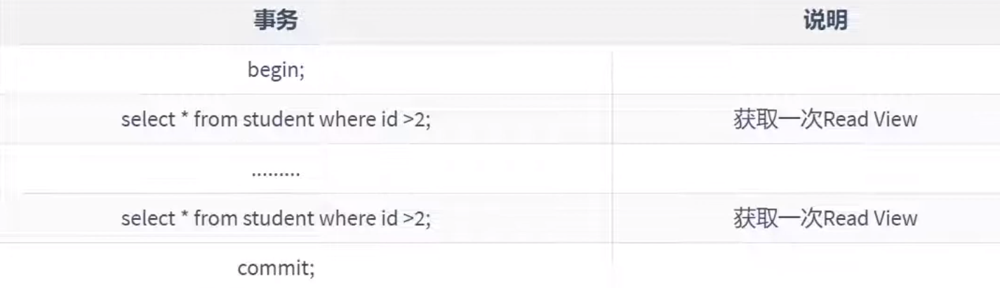
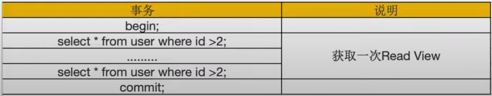

# MVCC

## 概述

* MVCC，Multiversion Concurrency Control，多版本併發控制。

* 是通過數據行的多個版本管理，來實現資料庫的`併發控制`。

* 這個技術使得 InnoDB 的事務隔離級別下執行 `一致性讀(快照讀)` 操作有了保證；簡單說，就是為了查詢一些正在被另一個事務更新的行，並且可以查到被修改前的值，這樣做就不用等待另一個事務釋放鎖，`解決了併發性的阻塞問題`。

* MVCC 只會用在 `READ COMMITTED` 和 `REPEATABLE READ` 隔離級別。

    * `READ UNCOMMITTED` 會讀到別的事務中的數據，不會用到 MVCC 中 Undo Log 中的數據。

    * `SERIALIZABLE` 情況下都是直接上鎖，並排隊修改數據，也用不到 MVCC。

* MVCC屬於較底層的實作原理，實際開發上較少碰到底層的 MVCC 問題，多半只是去了解不同層級的隔離級別設定。

* [併發問題的筆記中](5_鎖概述.md#併發的解決方案)有提到，`解決髒讀`、`不可重複讀`、`幻讀`，其中一種解決方案 : 


    * 讀操作使用 MVCC，寫操作使用鎖。


* MVCC 沒有正式的標準，在不同的 DBMS 中，MVCC 的實作方式可能是不同的，這邊都以 InnoDB 中的 MVCC 為例。

* MVCC 的實現，依賴於

    1. 隱藏欄位

        * 這邊指的是在`行紀錄`中，有包含3個隱藏欄位(`row_id`、`trx_id`、`roll_pointer`)

        * trx_id : 每一個事務對某條叢集索引紀錄進行改動時，都會把該事務的`事務id`賦值給`trx_id`隱藏欄位；這欄位主要是紀錄最近一次更新此`行紀錄`的事務。

        * roll_pointer : 每次對某條叢集鎖引紀錄進行改動時，都會把舊版本寫入到 `Undo Log` 中，然後這個隱藏欄位就相當於一個指針，可以找到該紀錄修改前的資訊。

    2. Undo Log

    3. Read View

        * [參考下方解釋](#read-view)

<br/>

<br/>

## 快照讀 / 當前讀

MVCC 在 InnoDB 中的實現主要是為了提高資料庫併發功能，用更好的方式去處理`讀-寫衝突`:

* 讀操作 : 
    
    * 是使用 `快照讀`(即舊版本的數據)。

    * 由於`快照讀`是使用讀取舊版本的數據，因此在隔離級別上在 `可重複讀 REPEATABLE READ` 級別時，可解決多併發阻塞時的問題。

* 寫(包括增刪改)操作 : 

    * 是使用 `當前讀`(即最新版本的數據)。

    * `當前讀`實際上是一種加鎖的操作，是悲觀鎖的實作。

<br/>

<br/>

### 快照讀 (一致性讀) Consistent Read

快照讀又稱`一致性讀`，讀取的是快照數據；`不加鎖的簡單 SELECT 語句都屬於快照讀`，例如

```sql
SELECT * FROM player WHERE ... 
```

之所以使用快照讀，是基於高併發情況考慮，為了避免加鎖操作(降低了開銷)。

既然是多版本，所以快照讀可能讀到的不一定是`最新版本`，有可能是歷史版本。

快照讀的隔離級別不是 `SERIALIZABLE`，`SERIALIZABLE級別下的快照讀會退化成當前讀`。


<br/>

<br/>

### 當前讀 Locking Read

當前讀讀取的是數據的最新版本，`讀取時還要保證其他事務不能修改當前紀錄，因此會對讀取的紀錄加鎖`。

加鎖的 SELECT，或對數據進行增刪改都會使用`當前讀`，例如:

```sql
SELECT * FROM student LOCK IN SHARE MODE; --  共享鎖

SELECT * FROM student FOR UPDATE; -- 排他鎖

INSERT INTO student VALUES ... -- 排他鎖

DELETE FROM student WHERE ... -- 排他鎖

UPDATE student SET ... -- 排他鎖
```

<br/>

<br/>

## ReadView 讀視圖

* ReadView (讀視圖) 是InnoDB中實作MVCC的關鍵元件之一。

* ReadView 和 事務之間，是一對一的關係。

* 在 MVCC 機制中，多個事務對同一個`行紀錄`進行更新會產生多個`歷史快照`，這些歷史快照會保留在 Undo Log 中，如果一個事務想要查詢這個行紀錄，需要讀取哪一個版本的行紀錄，就是一個問題，因此就需要 Read View 來解決這個問題。

* ReadView 就是一個事務在使用 MVCC 機制進行快照讀操作時產生的`讀視圖`，當事務啟動時，會生成資料庫系統當前的一個快照，InnoDB 為每個事務建立了一個陣列，用來記錄並維護系統當前`活躍事務的ID` (活躍指的是啟動了但還沒提交)。

<br/>

<br/>


## MVCC 操作流程

1. 首先獲取事務本身的版本號，也就是 Transaction ID

2. 獲取 ReadView。

3. 查詢得到數據，然後與 ReadView 中的事務版本號進行比較。

4. 如果不符合 ReadView 規則，就需要從 Undo Log 中獲取歷史快照。

5. 最後返回符合規則的數據。

<br/>

> 詳細參考資料 https://www.youtube.com/watch?v=tQyUDXT4jUk&list=PLmOn9nNkQxJFi4x7rZ5wpUKts3u7cDx21&index=184&ab_channel=%E5%B0%9A%E7%A1%85%E8%B0%B7IT%E5%9F%B9%E8%AE%AD%E5%AD%A6%E6%A0%A1

<br/>

<br/>

## 舉例說明

MVCC 只能在 READ COMMITTED 和 REPEATABLE READ 兩種隔離級別下使用，以下為舉例。

### READ COMMITTED 隔離級別下

在一個事務中，每次獲取數據前都生成一個 ReadView。



<br/>

<br/>

### REPEATABLE READ 隔離級別下

在一個事務中，只在第一次獲取數據前生成一次 ReadView，而後所有的 SELECT 獲取的數據，都會重複使用這個 ReadView。



<br/>

<br/>
