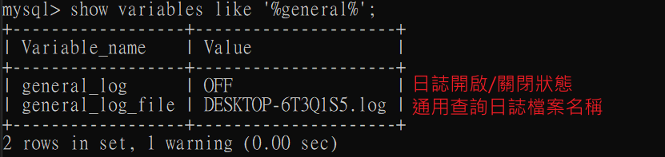

## 通用查詢日誌使用

### 查看當前狀態

```sql
show variables like '%general_log%';
```



<br/>

<br/>

### 啟動日誌

永久性方式，在 my.cnf 或 my.ini 配置

```sh
[mysqld]
general_log=ON
general_log_file=[path/[filename]] # 日誌檔案鎖在目錄路徑，filename 為日誌檔案名稱
```

臨時性方式

```sql
-- 開啟通用查詢日誌
SET GLOBAL general_log=ON;

-- 設置日誌檔案位置
SET GLOBAL general_log_file='path/filename';

-- 關閉通用查詢日誌
SET GLOBAL general_log=OFF;
```

<br/>

<br/>


## 錯誤日誌使用

### 啟動錯誤日誌
預設是打開的，且無法關閉
```sh
[mysqld]
log-error=[path/[filename]] # path為日誌檔案所在的目錄，filename 為檔案名稱
```

<br/>

<br/>

### 查看錯誤日誌

```sql
show variables like '%log_err%';
```

<br/>

<br/>

