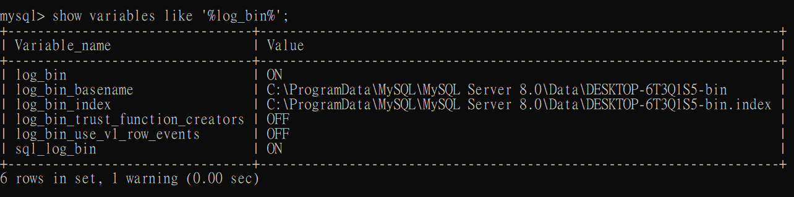
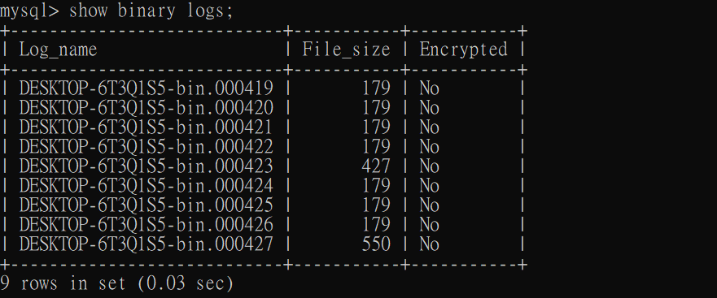
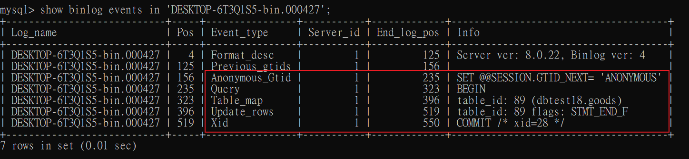
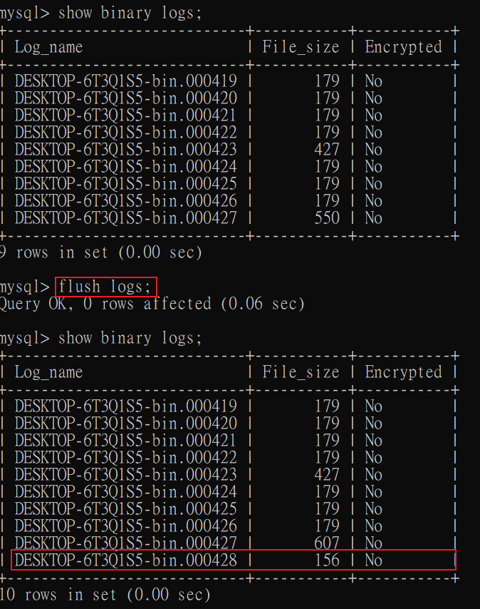
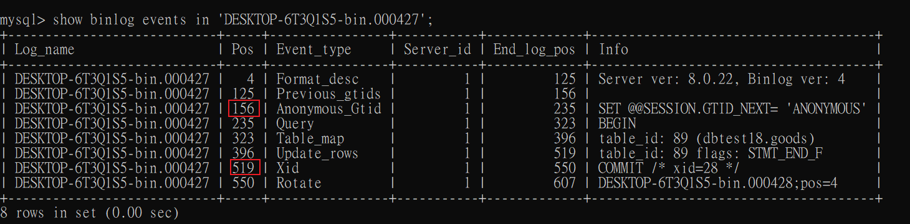

## 二進制日誌使用

* 二進制日誌不會記錄查詢語句的Log，只會記錄`增刪改`。

* 使用的主要場景:

    1. `數據恢復`，如果 MySQL 意外停止，可以通過二進制文件來查看用戶執行了那些操作，對服務器做了哪些修改，然後根據二進制文件來恢復資料庫。

    2. `數據複製`，由於日誌的延續性和時效性，master 把二進制文件傳遞給 slave 來達到主從式架構中數據一致的目的。

        * 不管是 MySQL 的 `數據備份`、`主-備`、`主-主`、`主-從`，都會使用到 BinLog。


* 二進制日誌和和數據檔案最好不要儲存在同一個目錄下，分散風險。

<br/>

<br/>

### 查看日誌配置

```sql
show variables like '%log_bin%';
```



<br/>

* `log_bin_basename` : binlog 儲存目錄
* `log_bin_index` : 實際 binlog 檔案
* `log_bin_trust_function_creators` : 是否信任自定義的function、SP，預設是OFF，若需要自定義function、SP，需要打開，否則報錯。

    * 預設是OFF的原因是，當`主從`架構時，master中有一個函數為 `now()`，當 master 傳遞 binlog 讓 slave 更新數據時，slave 節點使用 `now()` 函數時，會產生時間差，導致數據不一致。

    * 當有 master-slave，如確保不會有數據不一致問題，再開啟此變數。

<br/>

<br/>

### 查看當前 binlog

binlog 只要重新啟動服務器時，就會產生一個新的 binlog 檔案，並且有`後綴流水號`。

查看所有的 binlog
```sql
show binary logs;
```




<br/>

<br/>

### 查看日誌項內容

因為是二進制，所以會需要用到工具


```sh
# shell指令 需要寫完整路徑

# linux
mysqlbinlog -v '/var/lib/mysql/DESKTOP-6T3Q1S5-bin.000427'

# windows
mysqlbinlog -v "C:\ProgramData\MySQL\MySQL Server 8.0\Data\DESKTOP-6T3Q1S5-bin.000427"
```

<br/>

使用上述查詢會比較亂，可以使用`以事件為單位`的查詢方式

```sql
-- 進入 mysql 後

-- 查看所有 binlog 事件
show binlog events in 'DESKTOP-6T3Q1S5-bin.000427';

-- 只查 Pos 從 519 開始之後的事件
show binlog events in 'DESKTOP-6T3Q1S5-bin.000427' from 519;

-- 也可以使用 limit 語句限制查詢行數
show binlog events in 'DESKTOP-6T3Q1S5-bin.000427' limit 0,100;
```



每一個 update 語句，會產生 5 個事件，紅框中為一個 update 語句

* `Anonymous_Gtid 事件` : Gtid
* `Query 事件` : 負責 Begin 一個事務
* `Table_map 事件` :  負責映射需要的表
* `Update_rows 事件` : 負責寫入數據
* `Xid 事件` : 負責結束事務


<br/>

<br/>

### binlog 的數據恢復

舉例，當需要使用 binlog 來恢復不小心刪除的數據

1. 首先，先產生一個全新的 binlog 檔案，原因是恢復數據時(將delete的數據重新insert回去)，同樣也會在舊的 binlog 中產生記錄，這樣會比較亂，所以乾脆將`恢復數據`的日誌寫在新的檔案中。

    ```sql
    -- 查看binlog檔案
    show binary logs;

    -- 產生一個新的檔案
    flush logs;
    ```

    

    <br/>

2. 查看 binlog 中的 event，需要把整組的 Pos 都找出來(土法煉鋼比對)

    ```sql
    show binlog events in 'DESKTOP-6T3Q1S5-bin.000427';
    ```

    

    找到 Pos 範圍後，恢復指令如下

    ```sh
    # shell
    /usr/bin/mysqlbinlog --start-position=156 --stop-position=519 --database=dev123 /var/lib/mysql/binlog/DESKTOP-6T3Q1S5-bin.000428 | /usr/bin/mysql -uroot -proot -v dev123
    ```


* `注意` : 此方法只適用在少量數據，雖然可無損恢復數據，但是數據如果是大量的情況下，通常會改用`主從式架構`，甚至是`一主多從架構`，把二進制檔案的內容通過中繼日誌，同步到 slave 服務器中。 

<br/>

<br/>

### Binlog 和 Redo Log 比較

* Redo Log 

    * 是`物理日誌`，是真實記錄硬碟上的數據。

    * 屬於 InnoDB 存儲引擎層產生的日誌。

    * 讓 InnoDB 擁有崩潰恢復的能力。


* BibLog 

    * 是`邏輯日誌`，舉例，在 `ID為2這行的A欄位加上1`，類似 git 上每次 commit 的修改。

    * 屬於 Service 層產生的日誌。

    * 保證了 MySQL 叢集架構下的數據一致性。

<br/>

<br/>

## Reference

> Binlog 日誌參數 https://www.youtube.com/watch?v=_F4yx4Q66Uw&list=PLmOn9nNkQxJFi4x7rZ5wpUKts3u7cDx21&index=189&ab_channel=%E5%B0%9A%E7%A1%85%E8%B0%B7IT%E5%9F%B9%E8%AE%AD%E5%AD%A6%E6%A0%A1

> Binlog 寫入機制 https://www.youtube.com/watch?v=_KxESuBWiLw&list=PLmOn9nNkQxJFi4x7rZ5wpUKts3u7cDx21&index=190&ab_channel=%E5%B0%9A%E7%A1%85%E8%B0%B7IT%E5%9F%B9%E8%AE%AD%E5%AD%A6%E6%A0%A1