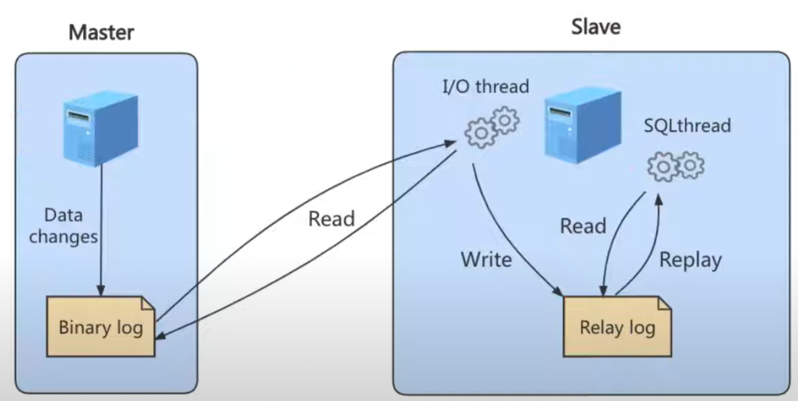
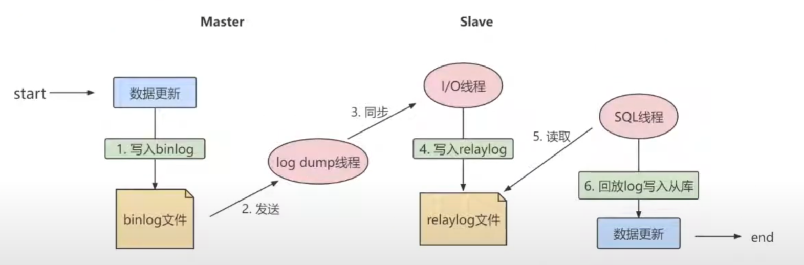

## 概述

`中繼日誌只會在主從服務器架構中存在`。 

當主從式架構下，主節點在修改數據後，同步到從級節點的大致步驟如下:

1. Master 修改數據後，將相關更動記錄在 binlog 中。

2. Slave 透過網路獲取 Master 中的 binlog 數據，並寫入在 Slave 中的 Relay Log 中，即`中繼日誌`。

3. Slave 再透過 Relay Log 將數據更新至 Slave 的資料表上。 

    

     

    此架構中共有3個線程

    * `主級資料庫的二進制轉儲線程 Binlog dump thread` : 當 Master 被 Slave 線程連接後，Master 可以將二進制日誌發送給 Slave，

    * `從級資料庫的 I/O 線程` : 當 Master 發送 binlog 給 slave 時，需要有一個線程去接收這個 binlog，就是此線程，接收後，會將 binlog 更新的部分複製到 Relay Log 中。

    * `從級資料庫的 SQL 線程` : 會讀取從級資料庫的 Relay Log，並執行此日誌中的事件(event)，將從庫中的數據與主庫保持一致。

        

 

 