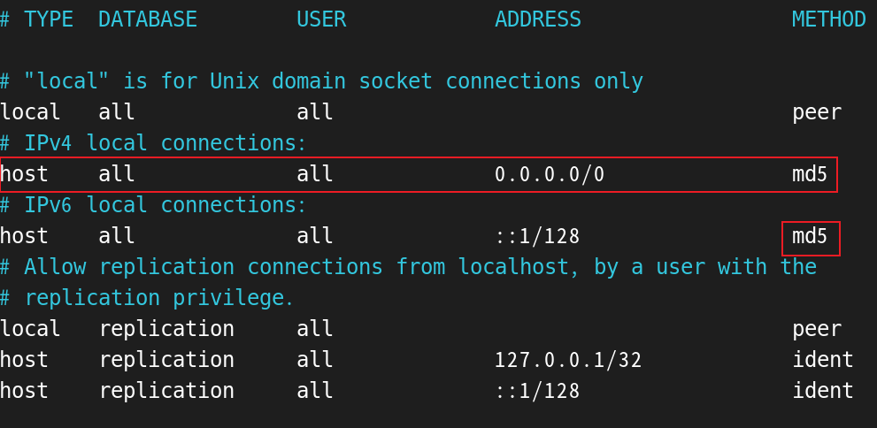

## 安裝步驟

sonarqube 安裝，需要2個資料庫

1. RDS，需要自行安裝，官方推薦 postgreSQL。

2. Elasticsearch，下載的專案已經內建，不用再自行安裝。


<br/>

<br/>

---

1. 安裝 java

    ```sh
    dnf install -y java-17-openjdk-devel
    ```

2. 下載 SonarQube

    * 去官方網站下載，壓縮檔為 unzip

    * 使用 ftp 放到 /opt 下

    * 解壓縮

        ```sh
        unzip sonarqube-12.10.xxxxxx.zip -d /opt/
        ```

3. 創建 SonarQube 用戶，要使用 sonar.sh 的用戶不可為 root (大坑，一定要建立用戶)。

    ```sh
    sudo useradd sonar
    sudo chown -R sonar:sonar /opt/sonarqube
    ```

4. 配置 SonarQube

    ```sh
    sudo vim /opt/sonarqube/conf/sonar.properties
    ```
    ```properties
    # db連線資訊
    sonar.jdbc.url=jdbc:postgresql://localhost:5432/sonarqube
    sonar.jdbc.username=sonar
    sonar.jdbc.password=sonar

    # 服務ip, port配置
    sonar.web.host=0.0.0.0
    sonar.web.port=9000

    # elasticsearch 儲存數據位置
    sonar.path.data=/var/sonarqube/data
    sonar.path.temp=/var/sonarqube/temp
    ```

5. 安裝 postgreSQL

    ```sh
    # 安裝
    yum install postgresql-server -y

    # 初始化
    postgresql-setup initdb

    # 啟動服務
    systemctl enable postgresql
    systemctl start postgresql
    ```


6. 配置 postgreSQL

    ```sh
    # 建立db table
    sudo -i -u postgres
    psql

    # pgsql
    CREATE DATABASE sonarqube;
    CREATE USER sonar WITH PASSWORD 'sonar';
    GRANT ALL PRIVILEGES ON DATABASE sonarqube TO sonar;
    \q
    exit
    ```

7. 配置 postgreSQL 允許外部連接(依照安裝版本，路徑會不同)

    ```sh
    vim /var/lib/pgsql/data/postgresql.conf
    ```
    ```conf
    # 所有ip皆可以訪問
    listen_addresses = '*'
    ```

8. 配置 postgreSQL 添加允許的遠程主機

    ```sh
    vim /var/lib/pgsql/data/pg_hba.conf

    vim /var/lib/pgsql/16/data/pg_hba.conf
    ```

    

    <br/>

9. 啟用服務，啟用時會連接 pgsql，啟用自帶的 elasticsearch。

    ```sh
    /opt/sonarqube/bin/linux-x86-64/sonar.sh start

    /opt/sonarqube/bin/linux-x86-64/sonar.sh status
    ```

10. 查看

    ```sh
    http://127.0.0.1:9000
    ```

11. 日誌位置

    ```sh
    cd /opt/sonarqube/logs
    ```

12. 登入帳號密碼預設

    * admin/adnin

<br/>

<br/>

## 報錯

如果報以下錯誤

```
bootstrap check failure [1] of [1]: max virtual memory areas vm.max_    map_count [65530] is too low, increase to at least [262144]; for mor    e information see [https://www.elastic.co/guide/en/elasticsearch/ref    erence/8.14/_maximum_map_count_check.html]
```

需要修改記憶體配置。

```sh
# 臨時修改記憶體配置(立即生效，但vm重啟後失效)
sysctl -w vm.max_map_count=262144
```