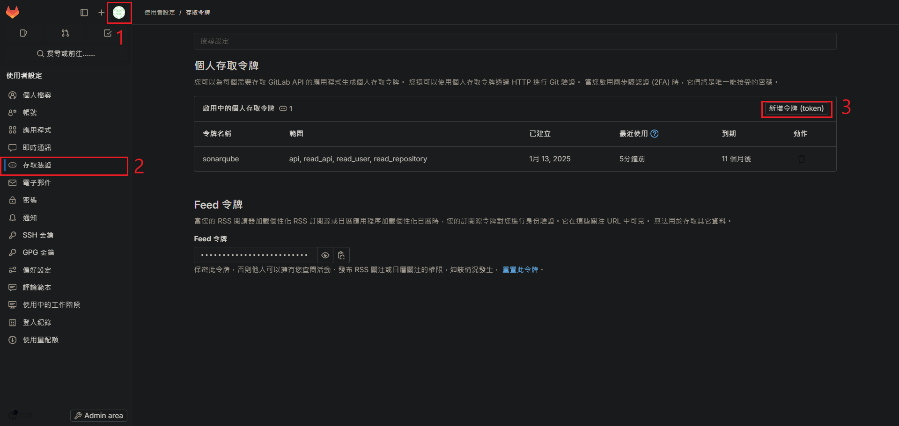
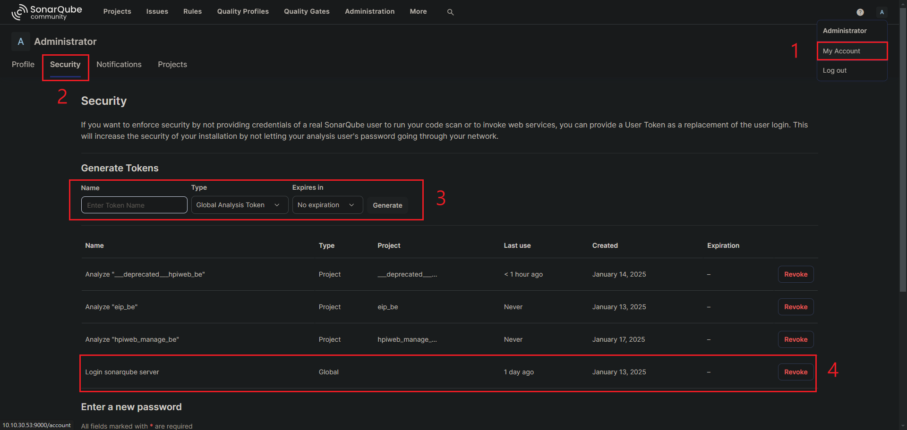
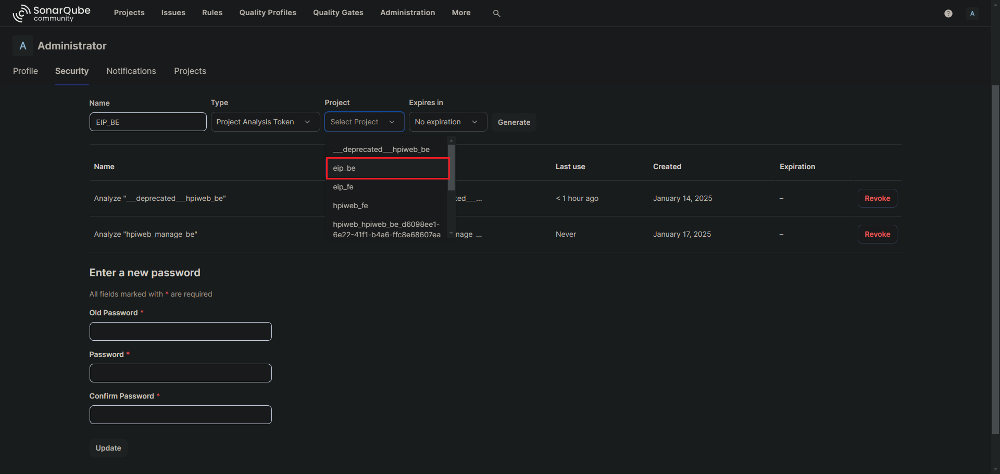
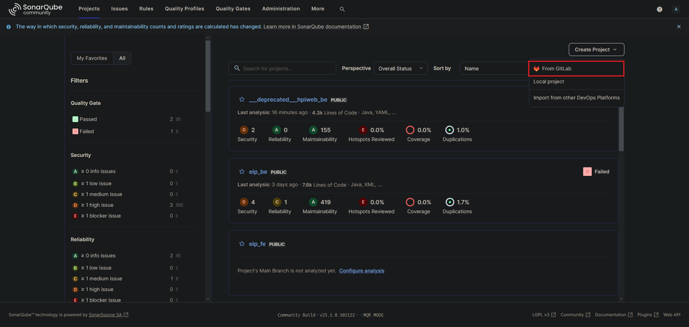

## 整合

這邊整合的是自建的 gitlab server。

1. 啟動 Sonarqube server，並可以進入。

2. 交換應用程式的 token

    * 在 gitlab server 生成一個 token，讓 sonarqube 可以載入專案

        

         

        權限勾選4個 api, read_api, read_user, read_repository。

    * 在 sonarqube 生成一個 token，讓 gitlab runner 在執行時，有權限可以執行登入 sonarqube server。

        

         

        以上是生成全域的登入token，或是依照專案訪問權限來生成token，以下範例。

        

         

2. 導入專案或是在 sonarqube 首頁建立專案。

    