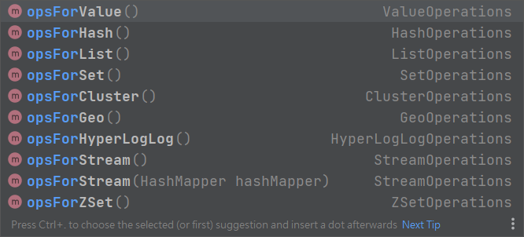

## Springboot 整合 redis
1. 導入依賴

    ```xml
    <dependency>
        <groupId>org.springframework.boot</groupId>
        <artifactId>spring-boot-starter-data-redis</artifactId>
    </dependency>
    ```

2. 開啟 redis-server

    ```sh
    redis-server
    ```
    
    如果打不開，需要先去 redis-cli 關閉舊連線

    ```sh
    # 打開 cli
    redis-cli

    # 關閉
    shutdown
    ```

3. 在 springboot 中 yml 中設置

    ```yml
    spring:
      redis:
        host: localhost
        port: 6379
    ```

4. 在程式碼中，將 `StringRedisTemplate` 或 `RedisTemplate` 注入後，就可以使用，前者放 String，後者放 Object。

    ```java
    @SpringBootTest
    class DemoApplicationTest {

        @Autowired
        private StringRedisTemplate stringRedisTemplate;

        @Test
        void set() {
            ValueOperations ops = stringRedisTemplate.opsForValue();
            ops.set("age", 32);
        }

        @Test
        void get() {
            ValueOperations ops = stringRedisTemplate.opsForValue();
            Object age = ops.get("age");
            System.out.println(age);
        }

        @Test
        void hset() {
            HashOperations ops = redisTemplate.opsForHash();
            ops.put("info", "a", "aa");
        }

        @Test
        void hget() {
            HashOperations ops = redisTemplate.opsForHash();
            Object val = ops.get("info", "a");
            System.out.println(val);
        }
    }
    ```

5. 需要哪種數據類型，就選擇哪一種API

    