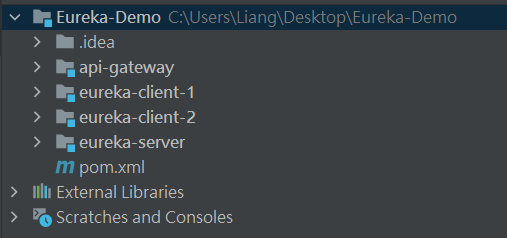
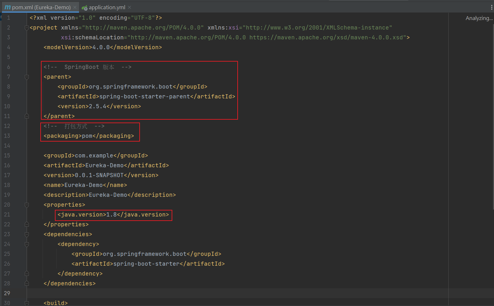
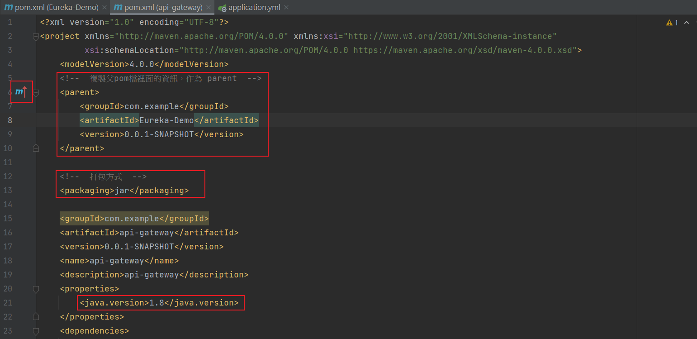

## 創建自定義Module

> https://blog.csdn.net/ningmeng666_c/article/details/120143676?spm=1001.2101.3001.6661.1&utm_medium=distribute.pc_relevant_t0.none-task-blog-2%7Edefault%7ECTRLIST%7ERate-1-120143676-blog-115396552.235%5Ev27%5Epc_relevant_recovery_v2&depth_1-utm_source=distribute.pc_relevant_t0.none-task-blog-2%7Edefault%7ECTRLIST%7ERate-1-120143676-blog-115396552.235%5Ev27%5Epc_relevant_recovery_v2&utm_relevant_index=1

 

  

## Maven Archetype 是什麼
> https://matthung0807.blogspot.com/2019/07/maven-archetype.html

 

 

## 舉例

 

以上圖為例，Eureka-Demo 為一個 Project，包含了3個服務

* api-gateway
* eureka-client-1
* eureka-client-2

步驟 : 

1. 建立 Project，名為 Eureka-Demo，將 src 底下的目錄刪去，用不到。

2. 建立 Module，名稱為 api-gateway、eureka-client-1、eureka-client-2

3. 先修改 Project 的 pom 檔案 (修改 Spring boot 版本、打包方式、Java版本)

    

    

4. 修改每個微服務的 pom 檔案 (修改 parent、打包方式、Java版本)，成功時，左方會有個 m 符號。

    

    下方 dependencies 記得加。

