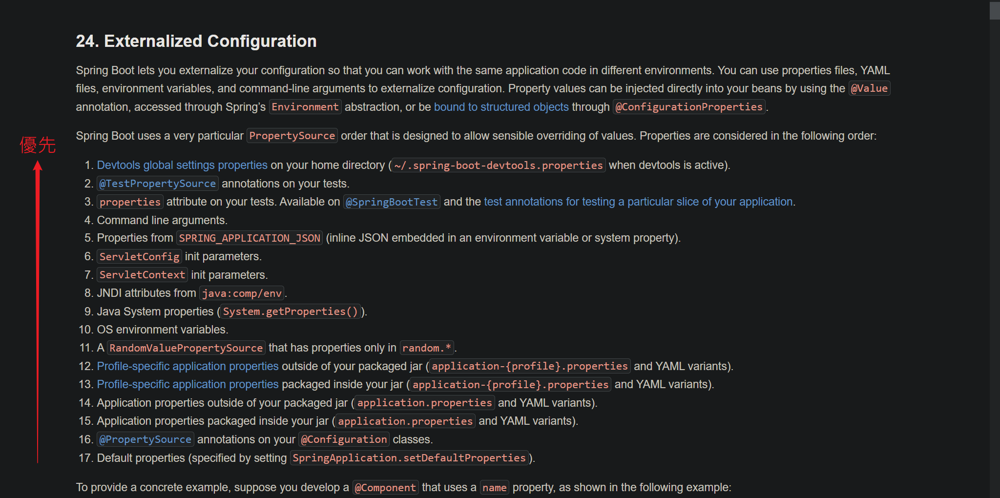

## 使用 IDEA IntelliJ 配置熱部署
* 前因後果 : 因為 springboot 的 server 是內嵌的，所以不能從外部去監控，應該要去 Spring IoC 容器中添加監控程式，而這個程式就是 `devtools`，負責監控是否程式碼有更動。

* 使用 Eclipse STS 版本就不用此配置，可直接使用，IDEA需要設置。

* 步驟: 注意第3點是2022版本才改到此位置

    1. 加入 `devtools` 依賴

        ```groovy
        // gradle
        dependencies {
            compileOnly(group: 'org.springframework.boot', name: 'spring-boot-devtools', version: '2.7.2')
        }
        ```
        ```xml
        <!-- maven 要多設定 plugin -->
        <dependency>
            <groupId>org.springframework.boot</groupId>
            <artifactId>spring-boot-devtools</artifactId>
            <optional>true</optional>
        </dependency>

        <build>
            <plugins>
                <plugin>
                    <groupId>org.springframework.boot</groupId>
                    <artifactId>spring-boot-maven-plugin</artifactId>
                    <configuration>
                        <fork>true</fork>
                        <addResources>true</addResources>
                    </configuration>
                </plugin>
            </plugins>
        </build>
        ```
    
    2. 勾選 File >> Settings >> Compiler >> Build project automatically

    3. 勾選 File >> Settings >> Advanced Settings >> `Allow auto-make to start even if developed application is currently running`

    4. 重開 IntelliJ，啟動 application，看到 `[restartedMain]` 表示成功。

    5. 以上是自動熱部屬，觸發條件是失去 IDEA 編輯器視窗焦點 5 秒後 (所以可以去點瀏覽器)

    6. 如需要手動熱部屬時，按下 ctrl + F9，Build Project。

<br/>

<br/>

## 關於 熱部屬
通常啟動 server 時，會做以下2個動作

1. 重啟(Restart) : 自定義開發代碼，包含類、頁面、配置文件，載入 `restart類加載器`

2. 重載(Reload) : Jar包，載入`base類加載器`

重點: 熱部屬只會做 `重啟(Restart)` 的動作，不加載Jar資源。

<br/>

<br/>

## 熱部屬的配置
可以修改那些檔案類型需要熱部屬，那些不用，以下是不觸發熱部屬的目錄
* /META-INF/maven
* /META-INF/resources
* /resources
* /static
* /public 
* /templates

```yml
spring: 
  devtools:
    restart:
      exclude: static/**,public/**,application.yml # 逗號後沒有空格
```

<br/>

<br/>

## 使用系統屬性關閉熱部屬 (重要)
一般使用 yml 屬性關閉熱部屬，生產環境絕對不可能會有使用熱部屬的情況(程式碼不會變動)
```yml
spring: 
  devtools:
    restart:
      exclude: static/**,public/**,application.yml # 逗號後沒有空格
      enabled: false # 關閉熱部屬
```

但有一種情況是當在 yml 檔案中設置關閉，但在較高層級的 yml 檔案又開啟，會造成管理上的不方便(雖然熱部屬開啟對生產環境無效)。

因此使用系統屬性，權限高過任何四級 yml 檔案
```java
@SpringBootApplication
public class DemoApplication {

    public static void main(String[] args) {

        // 設置系統屬性(屬性名稱與 properties key 相同)
        System.setProperty("spring.devtools.restart.enabled", "false");
        SpringApplication.run(DemoApplication.class, args);
    }
    
}
```

可以參考官網的屬性優先級別(有更新過，以前版本順序相反)，系統屬性排在第9

