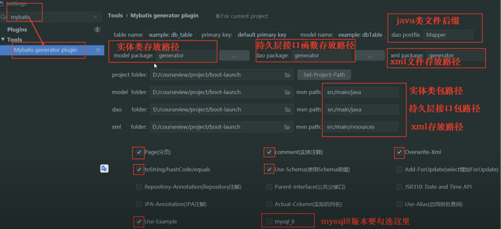
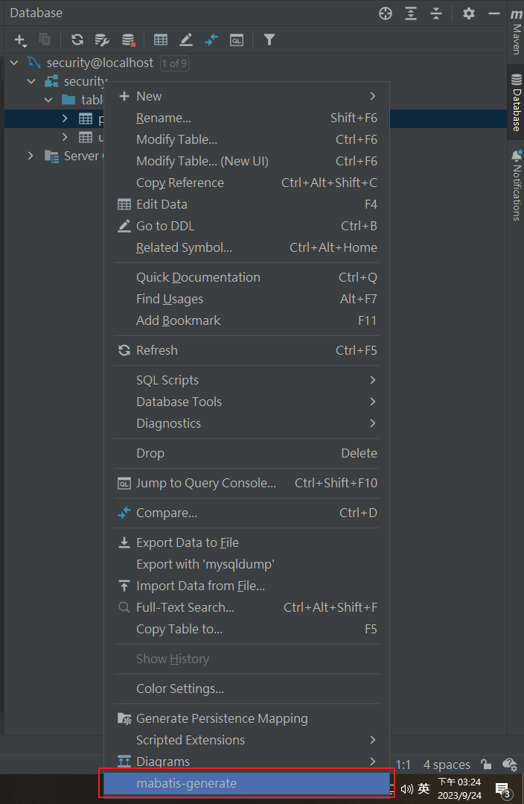
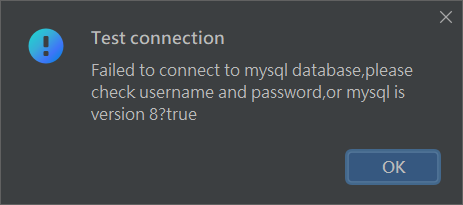
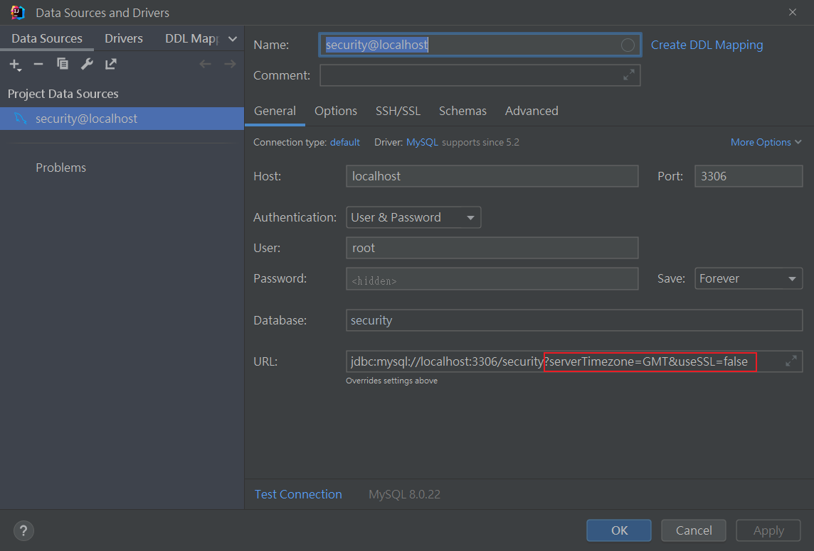
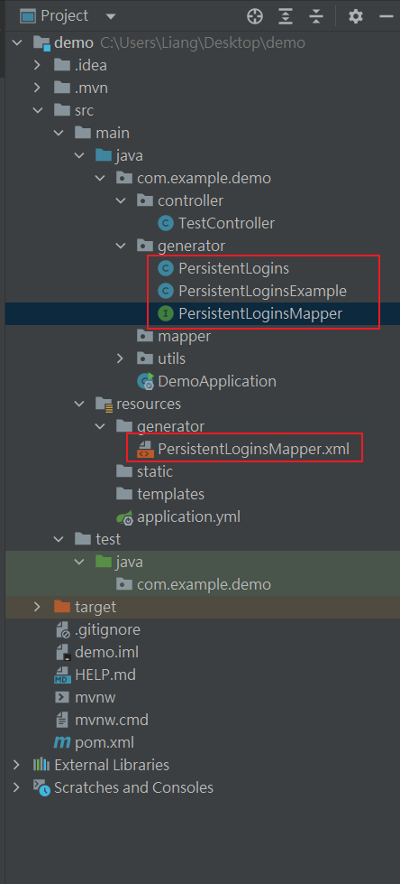
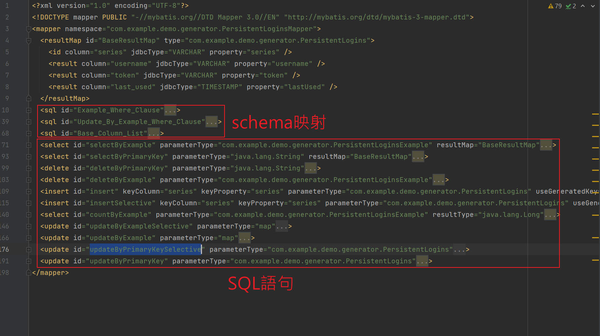
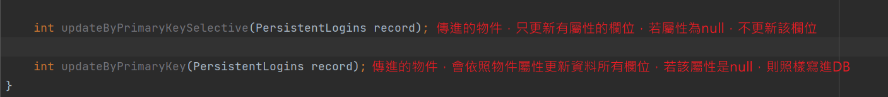
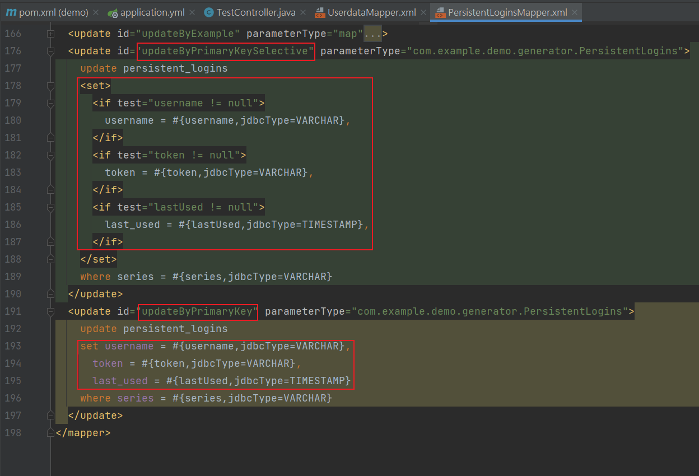
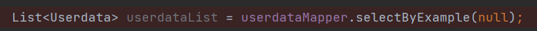

## 配置
1. 加入依賴

    ```xml
    <dependency>
        <groupId>org.mybatis.spring.boot</groupId>
        <artifactId>mybatis-spring-boot-starter</artifactId>
        <version>1.3.2</version>
    </dependency>
    ```

2. 加入配置

    ```yml
    mybatis:
        mapper-locations: classpath:generator/*.xml
    logging:
        level:
            com.example.demo: debug
    ```

3. 啟動類加上 MapperScan 註解，告訴spring掃描指定包下的Mapper接口。

    ```java
    @SpringBootApplication
    @EnableCaching
    @MapperScan(basePackages = {"com.example.demo.mapper"})
    public class DemoApplication {

        public static void main(String[] args) {
            SpringApplication.run(DemoApplication.class, args);
        }

    }
    ```


<br/>

<br/>

## 代碼自動生成
1. xml 配置文件，實現 Mybatis Generator 代碼生成配置。
2. 編碼實現。
3. 透過 IDEA 插件實現，最方便。

<br/>

<br/>


## IDEA 插件實現 Mybatis Generator

1. IDEA 打開 Settings >> Plugins，安裝 better-mybatis-generator

2. 安裝完成後進入設定

    

3. 連入資料庫，點選 mybatis-generator

    


4. 若產生 Mapper 有報錯

    


    這邊url需要加上 `?serverTimezone=GMT&useSSL=false`

    


5. 所以會生成4個檔案

    


6. xml 檔案中會預設幾種 SQL 語句，結構如下

    

    其中有 `Selective` 結尾的方法，是表示傳進此方法的物件，只有屬性有值，才會去更新該欄位。

    

    `Selective` 後綴的方法，會去判斷該屬性是否為 null

    


<br/>

<br/>

## 基礎查詢方法

1. `selectByExample(null)`，Example代表查詢條件，帶入null表示查全部。

    


2. 插入 `insertSelective` 和 `insert`

    ```java
    // 使用 insertSelective : 沒有值的屬性，相當於使用null，sql中建立時則會用默認值，若該欄位沒有默認值而且NOT NULL時就會報錯
    int count = userMapper.insertSelective(user);

    // 若使用 insert 則要將所有屬性都設定上
    int count = userMapper.insert(user);
    ```


3. 刪除 `deleteByExample`

    ```java
    // 設好 example 條件
    UserdataExample userdataExample = new UserdataExample();
    userdataExample.createCriteria().andUsernameEqualTo("user2");
    userdataExample.createCriteria().andPasswordEqualTo("ttest");

    // 刪除該條件的資料
    int count = userdataMapper.deleteByExample(userdataExample);
    ```

4. 更新 `updateByExample` 和 `updateByExampleSelective`，最好是用 Selective，不然屬性沒填都會改成 null。

    ```java
    // 更新後的資料
    Userdata newData = new Userdata();
    newData.setUsername("newUser");
    newData.setPassword("newPwd");
    // 條件
    UserdataExample userdataExample = new UserdataExample();
    userdataExample.createCriteria().andUsernameEqualTo("user2");
    // 執行更新
    int count = userdataMapper.updateByExampleSelective(newData, userdataExample);
    ```