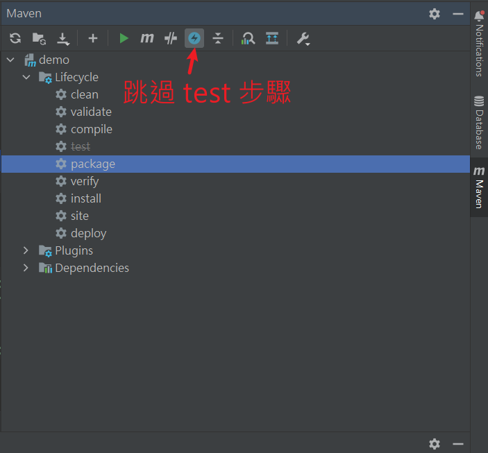
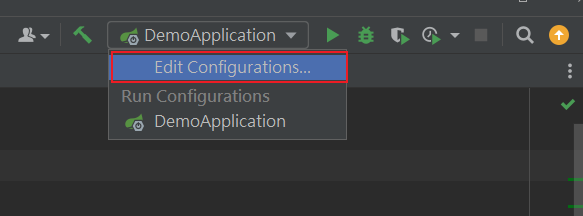
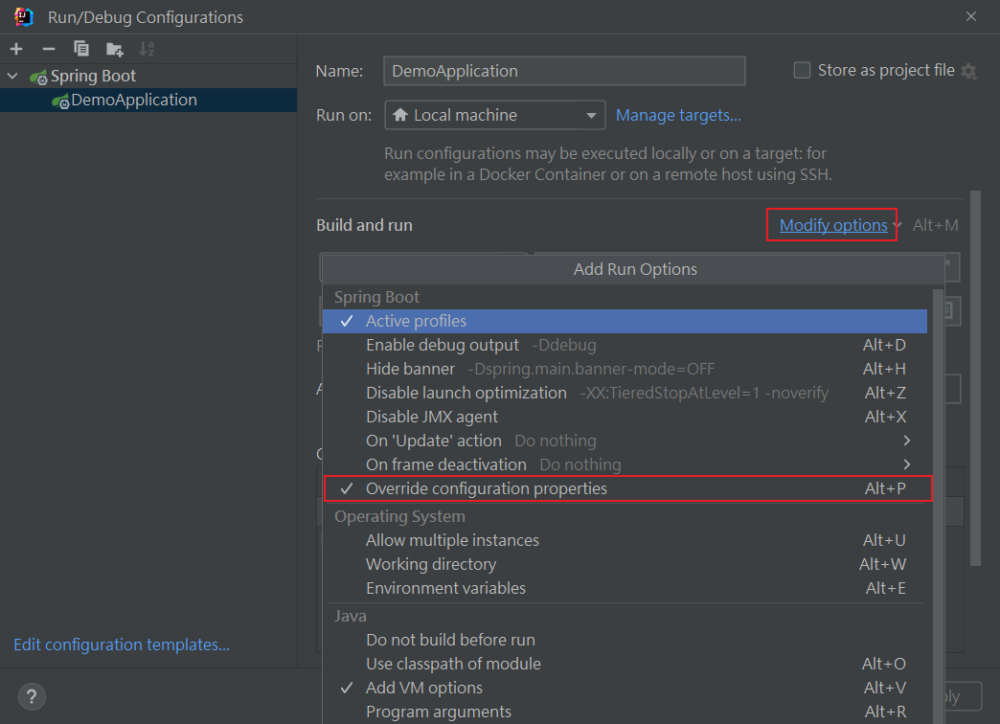
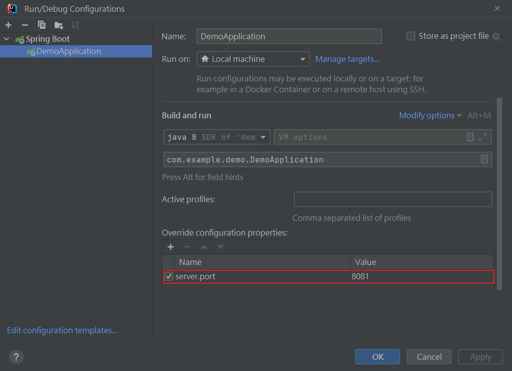

## Linux
1. 安裝 linux (Rocky Linux 8.7) 完成。
2. 安裝 vsftpd (very security ftp daemon)，預設連線使用 sftp，並用 linux user 帳號密碼登入。
    ```sh
    # 安裝
    yum -y install vsftpd

    # 備份配置文件
    cp /etc/vsftpd/vsftpd.conf /etc/vsftpd/vsftpd.conf.bak

    # 修改配置文件
    vim /etc/vsftpd/vsftpd.conf
    ```
    配置文件
    ```sh
    # 允許匿名用戶訪問
    anonymous_enable=YES
    # 允許匿名用戶建立目錄
    anon_mkdir_write_enable=YES
    # 允許匿名用戶上傳文件
    anon_upload_enable=YES
    # 允許匿名用戶執行其他寫入操作，如删除
    anon_other_write_enable=YES
    # 設置匿名用户根目錄
    anon_root=/opt
    ```
    設定完成後，開啟 vsftpd 服務
    ```sh
    systemctl restart vsftpd
    ```
    
3. 使用 FTP UI (使用`FileZilla`) 將 JDK 壓縮檔丟進 VM (下載: https://files-cdn.liferay.com/mirrors/download.oracle.com/otn-pub/java/jdk/8u121-b13/)

4. 選擇要安裝的路徑 `/opt/java/` 目錄下。

5. 安裝並修改全域變數

    ```sh
    # 安裝
    tar -zxvf jdk-8u121-linux-x64.tar.gz

    # 修改環境變數
    sudo vim /etc/profile
    ```
    加入以下 JAVA_HOME 等等

    ```sh
    #Java Env
    export JAVA_HOME=/opt/java/jdk1.8.0_121
    export CLASSPATH=.:$JAVA_HOME/lib/dt.jar:$JAVA_HOME/lib/tools.jar
    export PATH=$PATH:$JAVA_HOME/bin
    ```
    ```sh
    # 更新
    source /etc/profile

    # 檢查 
    java -version
    ```


<br/>

<br/>

## 在 linux 啟動 Springboot 服務

1. 使用 maven `package` 打包成 jar ，需要注意是否有以下依賴(springboot的和)

    ```xml
    <plugin>
        <groupId>org.springframework.boot</groupId>
        <artifactId>spring-boot-maven-plugin</artifactId>
    </plugin>
    ```

    打包可跳過 test 步驟

    

2. 啟動服務

    ```sh
    java -jar demo-0.0.1-SNAPSHOT.jar
    ```

3. 更改臨時屬性，只有此次啟動有效，臨時屬性的優先級會高於配置檔案。 `--` 後面使用 properties 屬性的寫法。

    ```properties
    server.port=8888
    ```

    ```sh
    java -jar demo-0.0.1-SNAPSHOT.jar --server.port=8888
    ```

4. 在 IDEA 中，使用`臨時屬性`

    
    
    


* 補充: 其實臨時屬性會在入口方法中作為參數。

    ```sh
    java -jar demo-0.0.1-SNAPSHOT.jar --server.port=8888 --a=b
    ```
    ```java
    public static void main(String[] args) {
        
        System.out.println(Arrays.toString(args));// [--server.port=8081, --a=b]

        SpringApplication.run(DemoApplication.class, args);
    }
    ```
    所以可以將入口方法改成以下，就等於限制`不能使用臨時屬性`(安全考量)
    
    ```java
    public static void main(String[] args) {
        SpringApplication.run(DemoApplication.class);//不放args，即不使用臨時屬性
    }
    ```