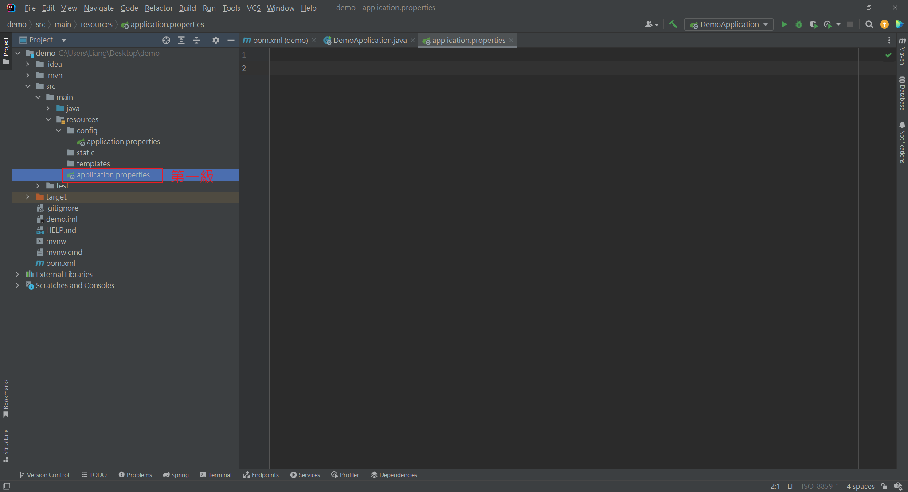
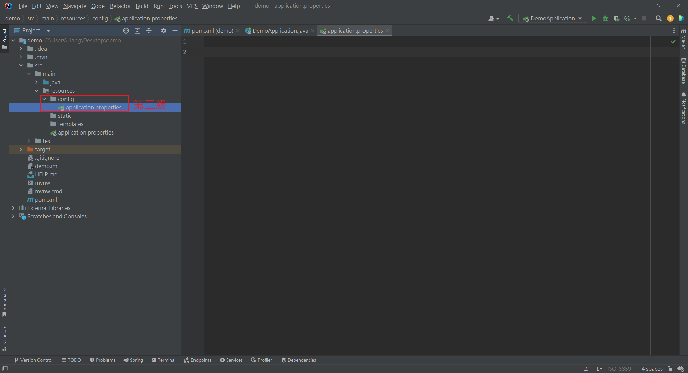
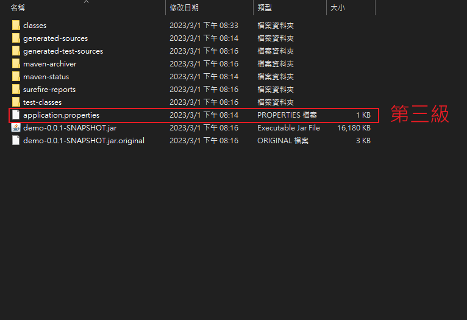
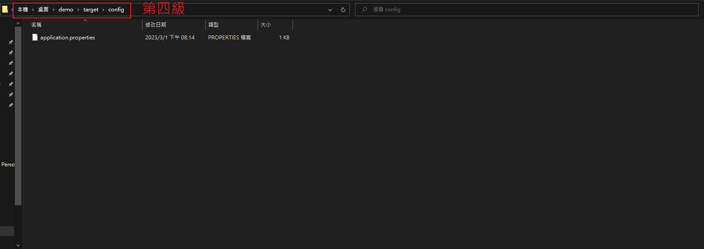

## 配置這麼多要去哪裡看


<br/>

yml屬性配置在第一個連結


<br/>

<br/>

## 配置觀念
* 有載入相對應的依賴包，才能使用相對應的屬性配置
* 如果 properties, yaml, yml 三個檔案同時存在，`properties`最優先，`yml`次之，`yaml`最後。

<br/>

<br/>

## 在 IntelliJ 新增配置檔案 (輸入屬性編輯器沒有autocompletion自動輸入提示)
如果遇到 IntelliJ 在配置檔中沒有開啟 auto complete，原因是因為 IntelliJ 不認為此檔案室配置檔，所以需要去設定成配置檔案。


<br/>

<br/>

## 靜態資源配置

* 靜態資源的訪問，默認是 `/resources/**`，如果有 `webapp/WEB-INF` 目錄，則使用此路徑作為根目錄。

* 源碼在 `WebMvcAutoConfiguration` 這個自動配置類中。

* 補充: 如果`API路徑(controller route)`與靜態資源相同，則會先去訪問`API路徑`(硬要測試的話)。


```yml
spring:
    mvc:
        # 使用路徑前綴
        static-path-pattern: /prefix/** #這樣訪問路徑即為/prefix/resources/**
    
    web: # <-- 舊版本沒有web階層
        resources:
            # 更改靜態資源路徑根目錄(所以根目錄為resources/rootPath)
            static-locations: classpath:/rootPath/
            # 禁用靜態資源路徑配置，效果就是所有的靜態資源都無法訪問
            add-mappings: true  #預設為true，禁用為false
            # 設置靜態資源緩存時間(11000秒)
            cache:
                period: 11000
```


有了Cache後，Status code 為304，並且Request Header會產生 If-Modified-List


<br>

<br/>

## Log  配置
```yml
logging:
    level:
        root: info  # 預設是info級別，可調整為debug, error
```

<br/>

<br/>

## 配置文件優先級別
因為有開發者、項目經理、生產環境等等因素，故配置文件分為`4級`，`級數大覆蓋級數小的屬性`。

1. 第一級(開發者使用)

    

2. 第二級(項目經理使用)

    

3. 第三級(生產環境維運人員，與jar包同目錄)

    

4. 第四級(生產環境維運管理，jar包同目錄下的config目錄)

    


* 總結: 先看路徑 `4 > 3 > 2 > 1`，再看副檔名 `properties > yml > yaml`

<br/>

<br/>

## 多環境開發的配置文件
要注意 : 若有相同屬性，`include` 後面載入的會蓋掉前面載入的
```yml
spring:
  profiles:
    active: dev         # 載入名為 application-dev.yml 檔案
    include: customer   # 載入其他的配置檔案
```

通常在開發的時候，會依照功能來建立多個文件，例如 db, redis

```yml
spring:
  profiles:
    active: dev
    include: devDB, debRedis, devMVC # 拆分功能，細化配置選項(若有同屬性，後面蓋前面)
```

<br/>

<br/>

## 多環境開發，使用 group 屬性

在 springboot 2.4 後面的版本，把 `include` 屬性刪除，因為若是要更改成 `active: prod` 環境，則 devDB, debRedis, devMVC 都必須一起更改挺麻煩的，所以有一個新的屬性，名為 `group`。

```yml
# springboot 2.4 ver
spring: 
  profiles: 
    active: dev
    group: 
      "dev": devDB,debRedis,devMVC
      "prod": prodDB,prodRedis,prodMVC
      "test": testDB,testRedis,testMVC
```

<br/>

<br/>

## Maven 設置多環境開發
1. 其實 maven 和 springboot 都有多環境的設置，但萬一，maven 和 springboot 都設置了多環境設置，那就會產生衝突。
2. 呈上，springboot 是依賴 maven 運行，因此應該以 maven (或 gradle) 為主，來做多環境的管理。

3. 舉例，這邊自行定義兩種 profiles (環境)，並自定義屬性 `profile.active`作為變數，讓 springboot 的 yml 配置檔案去調用。
    ```xml
    <!-- pom.xml -->

    <!-- 依賴 -->
    <dependencies>
        ...
    </dependencies>


    <!-- 配置多環境 -->
    <profiles>

        <!-- dev 環境 -->
        <profile>
            <id>env_dev</id>
            <properties>
                <profile.active>dev</profile.active>
            </properties>
            <!-- 預設使用此環境 -->
            <activation>
                <activeByDefault>true</activeByDefault>
            </activation>
        </profile>

        <!-- prod 環境 -->
        <profile>
            <id>env_prod</id>
            <properties>
                <profile.active>prod</profile.active>
            </properties>
        </profile>

    </profiles>
    ```

4. 因此 yml 在調用的時候，可以使用 `@@` 符號，來調用 pom.xml 中的變數。

    ```yml
    # springboot 2.4 ver
    spring: 
    profiles: 
      active: @profile.active@  # 會抓取 pom 中的變數，預設值為 dev
        group: 
          "dev": devDB,debRedis,devMVC
          "prod": prodDB,prodRedis,prodMVC
    ```
5. 這樣就可以避免 maven 與 springboot 中的配置產生衝突，一切以 maven 中的變數為主。

6. 驗證: 可以將專案 `maven clean package` 後，去觀察打包後的 yml 檔案是否有引用到 profile.active 變數。

<br/>

<br/>

## SpringBoot 延遲初始化
Springboot 2.2 版本引入，當設置為 true 時，Spring Boot 將推遲初始化 application context，直到第一次需要使用它為止。這可以加快啟動時間，尤其是對於較大的應用程序來說。

需要注意的是，當啟用延遲初始化時，應用程序在第一次訪問時可能會花費更長的時間來初始化。

建議只在開發環境中啟用，但在生產環境中需要禁用以確保應用程序正確初始化並能夠正常運行。

```yml
spring:
  main:
    lazy-initialization: true
```