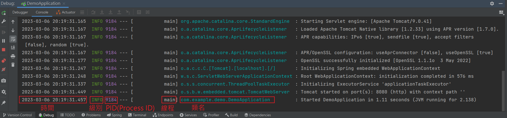

## 靜態方法紀錄資訊
Logger import 目錄 `import org.slf4j.Logger`
```java
@RestController
public class StudentController {

    // 制式化寫法
    private final static Logger log = LoggerFactory.getLogger(StudentController.class);

    @Autowired
    private StudentService studentService;

    @GetMapping("/student/{studentId}")
    public ResponseEntity<Student> read(@PathVariable Integer studentId) {

        // 使用 log 物件印出
        // 使用大括號填入變數
        log.info("取得 student {}", studentId);
        log.warn();
        log.error();

        Student student = studentService.getById(studentId);

        return ResponseEntity.status(HttpStatus).body(student);
    }
}
```
在字串中加入大括號 { }，可放入多個變數
```java
log.warn("Email: {} are registered by {} !", userRegisterRequest.getEmail(), userRegisterRequest.getUser());
```

<br/>

<br/>

## 設置某個 package 下的日誌級別
為了不要一直顯示 springboot 載入的一些過程(與業務邏輯無關的)，可以使用以下

```yml
# application-yml
logging:
  # 級別分組
  group: 
    ebank: com.example.controller,com.example.service,com.example.repository
    ems: com.ems
  # 設定組別級別
  level: 
    root: info
    ebank: warn
    ems: debug

```

<br/>

<br/>

## 日誌內容



<br/>

<br/>

## 日誌輸出格式

```yml
logging:
  pattern:
    console: "%date{yyyy-MM-dd HH:mm:ss} - %clr(%5level) [%15.15thread] %clr(%-40.40logger{39}){cyan} : %msg%n"
```

* `%date{}` : 日期格式
* `%level`  : 日誌級別
* `%thread` : 線程
* `%logger` : 類名
* `%msg` : 訊息
* `%n` : 換行
* `clr(){}` : 將小括號中的內容換顏色，大括號中指定顏色，如: red, green, cyan
* `%40logger` :  靠右對齊，最小寬度為 40，若不足 40 則左補空格，長度超出 40 則原樣輸出

* `%-40logger` : `-` 表示向左對齊

* `%30.50logger` : 最小寬度為 30，若長度不足 30 則左補空格靠右對齊；若長度大於 30 且不足 50 則靠左對齊；若長度大於 50 則將左邊多出的字符直接移除

* 補充 : PID 是 Java 底層重寫的，沒辦法格式化

<br/>

<br/>

## 日誌輸出檔案
會輸出檔名為 `server.log` 的文字檔案，通常會緩存到一定量，才會輸出 IO 到檔案中
```yml 
logging:
  file:
    name: server.log
  logback:
    rollingpolicy:
      max-file-size: 100KB  # 檔案最大大小
      file-name-pattern: server.%d{yyyy-MM-dd}.%i.log # 日誌檔名，%i為循環變量從0開始
```