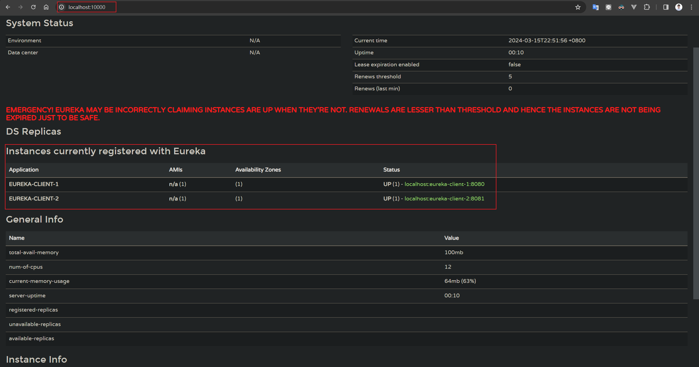
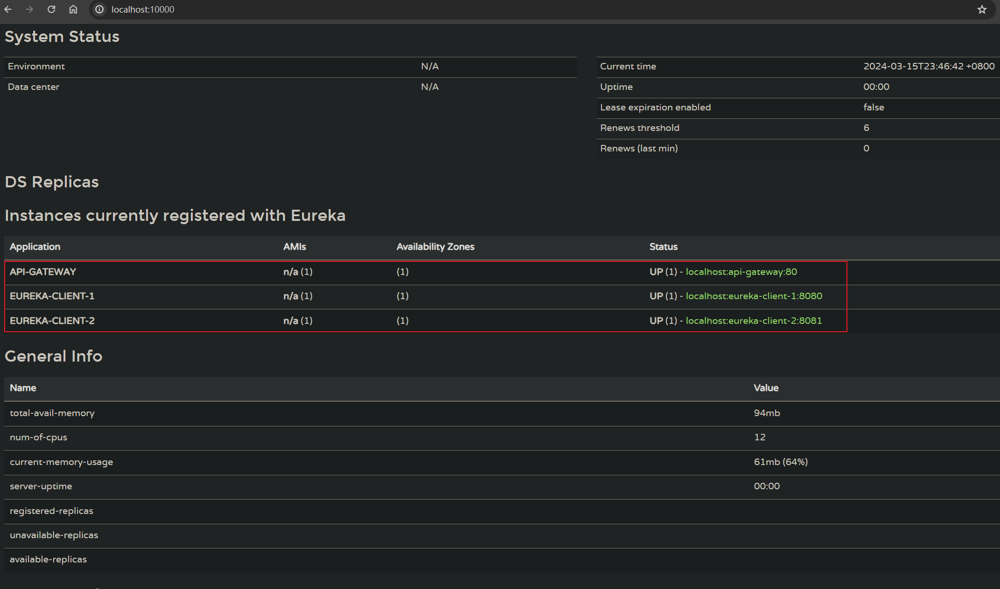
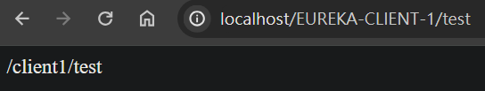
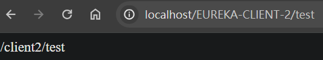

## Eureka 發現中心

1. Spring Cloud Netflix Eureka（簡稱Eureka），服務註冊及發現框架
2. 解決問題 : 
    
    * 主要用於在`分佈式系統中解決服務發現的問題`。在分佈式系統中，服務之間經常需要進行通信，但是這些服務的位置和 IP 地址可能會隨時改變，因此需要一種機制來發現和確定服務的位置。

    * 可支援 High Available。

3. Eureka 的主要目標是實現服務的自我發現和自我保護。當新的服務被部署或現有的服務發生變化時，Eureka 可以使其它服務和客戶端動態地發現這些變化，並且避免了硬編碼IP地址和端口的問題。這樣，服務之間的通信變得更加靈活和容易管理。

4. `Eureka Server` 為註冊及發現中心，其他向此 server 註冊的服務稱為 `Eureka Client`。

5. 發現中心架構

    

<br/>

<br/>

## Eureka Server
創建步驟如下

1. 導入依賴

    ```xml
    <dependency>
        <groupId>org.springframework.cloud</groupId>
        <artifactId>spring-cloud-starter-netflix-eureka-server</artifactId>
    </dependency>
    ```

2. 啟動註解

    ```java
    @EnableEurekaServer // 將此服務定義為 Eureka Server
    @SpringBootApplication
    public class EurekaApplication {

        public static void main(String[] args) {
            SpringApplication.run(EurekaApplication.class, args);
        }

    }
    ```

3. yml配置

    ```yml
    server:
        port: 10000 # Eureka Server 起的 port

    spring:
        application:
            name: eureka-server # 應用程式在註冊中心的名稱

    eureka:
        instance:
            hostname: localhost # Eureka Server 服務名稱。
        client:
            registerWithEureka: false # 是否把自己註冊到 Eureka Server，因為本身就是Eureka Server，所以設為false。
            fetchRegistry: false # 是否從 Eureka Server 取得註冊資訊，因為本身就是Eureka Server，所以設為false
            serviceUrl:
                defaultZone: http://${eureka.instance.hostname}:${server.port}/eureka/ # Eureka Server的IP
    ```

    注意，這邊 serviceUrl 是一個 Map，裡面的 defaultZone 被預設為 8761 port，defaultZone 寫成 default-zone 會改不了 port。


4. 可以在 Eureka 中選擇是否加入 Spring Security，並配置 filter 規則

    ```java
    @EnableWebSecurity
    class WebSecurityConfig extends WebSecurityConfigurerAdapter {

        @Override
        protected void configure(HttpSecurity http) throws Exception {
            http.csrf().ignoringAntMatchers("/eureka/**");
            super.configure(http);
        }
    }
    ```

<br/>

<br/>

## Eureka Client 
創建步驟如下
1. 導入依賴

    ```xml
    <dependency>
        <groupId>org.springframework.cloud</groupId>
        <artifactId>spring-cloud-starter-netflix-eureka-client</artifactId>
    </dependency>

    <dependency>
        <groupId>org.springframework.boot</groupId>
        <artifactId>spring-boot-starter-web</artifactId>
    </dependency>
    ```

2. 啟動註解

    ```java
    @EnableDiscoveryClient  // 將此服務定義為 Eureka Client
    @SpringBootApplication
    public class SpringCloudEurekaClientDemoApplication {

        public static void main(String[] args) {
            SpringApplication.run(SpringCloudEurekaClientDemoApplication.class, args);
        }

    }
    ```

3. yml配置

    ```yml
    # HTTP Server
    server:
        port: 8080   # 服務的 port

    # Spring properties
    spring:
        application:
            name: eureka-client-1 # 註冊在eureka的服務名稱

    # Discovery Server Access
    eureka:
        client:
            service-url:
                defaultZone: http://localhost:10000/eureka # Eureka Server IP
    
    ```
    如果有另一個服務

    ```yml
    ```yml
    # HTTP Server
    server:
        port: 8081   # 服務的 port

    # Spring properties
    spring:
        application:
            name: eureka-client-2 # 註冊在eureka的服務名稱

    # Discovery Server Access
    eureka:
        client:
            service-url:
                defaultZone: http://localhost:10000/eureka # Eureka Server IP
    ```

4. 在每個微服務中，寫一個 API 測試

    ```java
    // eureka-client-1 包中
    @RestController
    @RequestMapping("/client1")
    public class test {

        @GetMapping("/test")
        public String test() {
            return "/client1/test";
        }
    }
    ```

    ```java
    // eureka-client-2 包中
    @RestController
    @RequestMapping("/client2")
    public class test {

        @GetMapping("/test")
        public String test() {
            return "/client2/test";
        }
    }
    ```


5. 需要先啟動 Eureka Server，再啟動註冊的服務 (Eureka Client)，否則會報錯，可以連到 Eureka Server 去看當前的註冊服務有哪些。


6. 此時將 server 和 client 服務開啟，共有3個服務，此時進入到 `localhost:10000`，可以看到已經有2個註冊的服務

    

<br/>

<br/>

## 將 Gateway 註冊到 Eureka 配置

1. 加入依賴

    ```xml
    <dependency>
        <groupId>org.springframework.cloud</groupId>
        <artifactId>spring-cloud-starter-gateway</artifactId>
    </dependency>

    <dependency>
        <groupId>org.springframework.cloud</groupId>
        <artifactId>spring-cloud-starter-netflix-eureka-client</artifactId>
    </dependency>
    ```

2. 配置類加上 @EnableEurekaClient，注意，這邊加的和 eureka client 加的註解不同。

    ```java
    @SpringBootApplication
    @EnableEurekaClient
    public class ApiGatewayApplication {

        public static void main(String[] args) {
            SpringApplication.run(ApiGatewayApplication.class, args);
        }

    }
    ```

3. Gateway yml配置

    ```yml
    server:
        port: 80

    spring:
        application:
            name: api-gateway   # 註冊在 Eureka Server 的 ID (不能使用底線命名)
        cloud:
            gateway:
                discovery:
                    locator:
                        enabled: true # 開啟 Gateway 服務註冊中心服務發現
    eureka:
        client:
            serviceUrl:
                defaultZone: http://localhost:10000/eureka  # Eureka Server 位址
            enabled: true   # 開啟 Eureka Client
    ```

    注意 : 不用寫 routes，gateway 會自動導到註冊中心下的服務

4. 測試，需要啟4個服務: eureka server、api-gateway、eureka-client-1、eureka-client-2，新的 url 若可以連線，代表測試成功。

    ```
    原url: http://原服務位址：端口/{controller路徑}

    新url: http://網關位址：端口/{註冊中心登記名稱}/{controller路徑}

    # 即以下兩個URL，註冊中心的登記名稱會被自動轉成大寫
    # http://localhost/EUREKA-CLIENT-1/client1/test
    # http://localhost/EUREKA-CLIENT-2/client2/test

    # /client1/test 和 /client2/test 為 API endpoint
    ```

    測試結果: 

    

    <br/>

    

    <br/>

    

<br/>

<br/>

## 當一個服務是"集群"時，Gateway 可以使用負載均衡

架構中，有以下個服務

* 1個 eureka-server

* 1個 api-Gateway

* n個 eureka-client(同一個服務但多個節點，需要負載均衡)


此時的 api-gateway 配置需要改成以下 (多加上 routes 屬性)

```yml
server:
  port: 80

spring:
  application:
    name: api-gateway   # 註冊在 Eureka Server 的 ID (不能使用底線命名)
  cloud:
    gateway:
      discovery:
        locator:
          enabled: true # 開啟 Gateway 服務註冊中心服務發現
      routes:
        - id: eureka-client-1
          uri: lb://EUREKA-CLIENT-1     # lb表示不是寫死的路由，而是導到註冊中心獲取名為eureka-client-1的服務實例；此服務實例的名稱，即 eureka client 的 spring.application.name 屬性
          predicates:
            - Path=/user/**  # 請求路徑
          filters:
            - StripPrefix=1
        - id: eureka-client-2
          uri: lb://EUREKA-CLIENT-2
          predicates:
            - Path=/tool/**
          filters:
            - StripPrefix=1
eureka:
  client:
    serviceUrl:
      defaultZone: http://localhost:10000/eureka  # Eureka Server 位址
    enabled: true   # 開啟 Eureka Client
```

<br/>

當請求路徑為 `http://localhost/user/client1/test`，gateway 會去向 eureka server 取一個 EUREKA-CLIENT-1 服務實例，並將請求轉發到該實例；但此時，請求的路徑還是 `/user/client1/test`，所以需要加上一個 StripPrefix，去除 /user 前綴。

故 API 的訪問URL為

* http://localhost/user/client1/test
* http://localhost/tool/client2/test

而原本的 `http://localhost/EUREKA-CLIENT-1/client1/test` 也還在。

<br/>

<br/>

## Reference

> https://docs.spring.io/spring-cloud-netflix/docs/3.1.8-SNAPSHOT/reference/html/

> https://matthung0807.blogspot.com/2019/06/spring-cloud-spring-cloud-netflix-eureka.html

> https://blog.csdn.net/qq_39150356/article/details/114327998