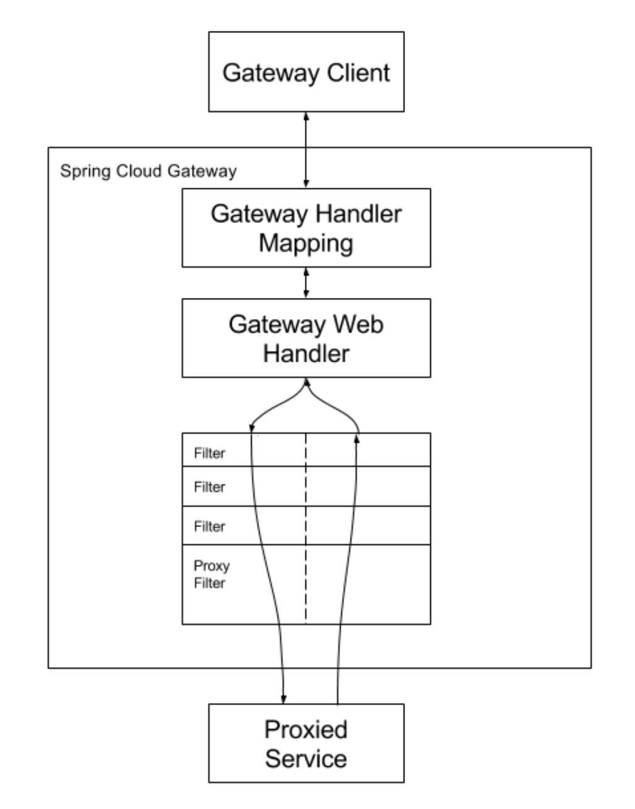

## Gateway 結構

1. 網關 = 路由轉發(Route) + 過濾器(Filter)

2. `路由`由四個部分組成

    * `Id`: 自定義的名稱
    * `URI`: 由外部向gateway請求時的URI
    * `Predicate`: 為 Java8 的 Predicate 接口，可以依照回傳的 true/false 來決定是否轉發，都是繼承 `AbstractRoutePredicateFactory`，例如 HeaderRoutePredicateFactory，在 yml 中的名稱就是 HeaderRoute。
    * `Filter`: 所有生效的 filter 都是 GatewayFilter 的實作；符合 Predicate 條件就會進入此 filter，並且在`filter前後`都可以加上程式。

3. 以下為 handler 和 filter chain 的關係。

    

4. 跨域請求問題:

    由於網關是代表整個微服務的域名，所以整個微服務中，`只需要在網關處理跨域問題，其他服務中可以不用處理`。