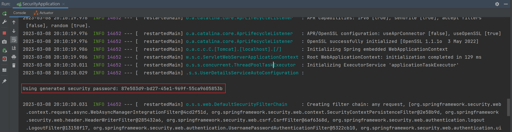
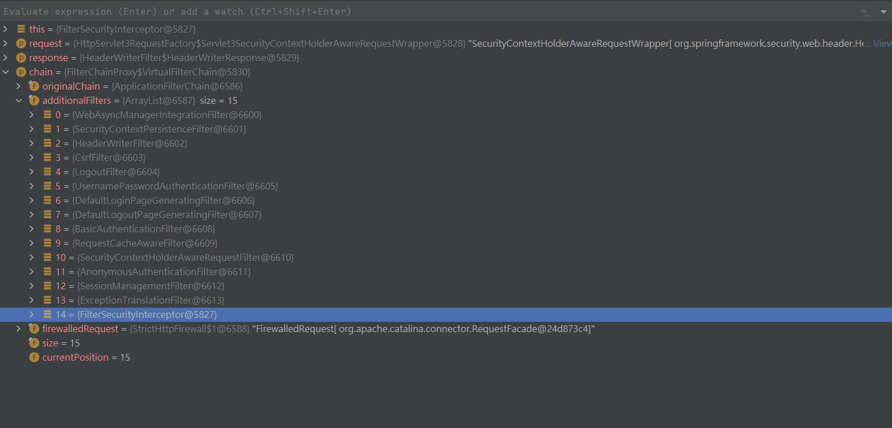

## Spring Secirity 觀念
1. 主要做兩件事情: `驗證` 和 `授權`。
2. 與 Shiro 這個安全框架相比，Spring Security 功能較齊全，但相反 Shiro 比較輕量。
3. 本質是一個過濾器鍊 (filter chain)

<br/>

<br/>

## 添加依賴
```xml
<dependencies>
    <!-- web -->
    <dependency>
        <groupId>org.springframework.boot</groupId>
        <artifactId>spring-boot-starter-web</artifactId>
    </dependency>

    <!-- security 主依賴 -->
    <dependency>
        <groupId>org.springframework.boot</groupId>
        <artifactId>spring-boot-starter-security</artifactId>
    </dependency>

    <!-- config 配置檔案若有報錯，需要加載此類 -->
    <dependency>
        <groupId>org.springframework.boot</groupId>
        <artifactId>spring-boot-configuration-processor</artifactId>
        <optional>true</optional>
    </dependency>

<dependencies>
```

<br/>

<br/>

## 登入密碼
每次啟動 Server 都會在 console 中隨機產生密碼，在訪問路徑的時候需要輸入帳號密碼

帳號: `user`

密碼: `隨機產生`



<br/>

<br/>

## Spring Security 過濾器種類
有很多，這邊舉例3種常見的: 

* FilterSecurityInterceptor: 為最後一個執行的 Filter，用來判斷前一個過濾器通過之後，才能繼續做下一個過濾器。

    


* ExceptionTranslationFilter: 用來處理驗證授權中拋出的異常。

* UsernamePasswordAuthenticationFilter: 針對 `/login` 的 POST 請求做攔截，驗證表單中 username, password，主要會做3件事

    1. 獲取用戶名和密碼：從HTTP請求中獲取用戶名和密碼，並將其封裝到一個UsernamePasswordAuthenticationToken物件中。
    2. 認證用戶信息：通過調用AuthenticationManager的authenticate方法來驗證用戶信息。如果驗證成功，則將Authentication對象設置到Spring Security上下文中。
    3. 身份驗證錯誤處理，如果驗證失敗，則可以通過配置authenticationFailureHandler來指定一個AuthenticationFailureHandler對象來處理身份驗證錯誤。
    4. 在最後會呼叫 `DaoAuthenticationProvider#retrieveUser()`，去呼叫 `UserDetailsService#loadUserByUsername()` 方法，就是一開始自訂的方法。

<br/>

<br/>

## 過濾器如何載入的?
* SpringBoot 會自動載入 Spring Security。

* 載入大致流程
    1. 執行 DelegatingFilterProxy `doFilter()`，從 IoC 容器中拿取 FilterChain，並初始化。
    2. 遞迴取所有 Filter，並加到 FilterChain 中。

<br/>

<br/>

## UserDetailsService 接口
當陪有任何配置時，帳號和密碼是 Spring Security 定義生成的，而在實際項目中的帳號密碼都是從 DB 查詢的，所以我們需要自定義驗證邏輯，因此需要 implements 此接口，Override 查詢 DB 的功能，並返回 `User` 物件 (User 是 Spring Security 定義的物件)。  

<br/>

<br/>

## PasswordEncoder 接口
用於密碼加密用，返回 `User` 物件中的密碼加密屬性。

<br/>

<br/>
