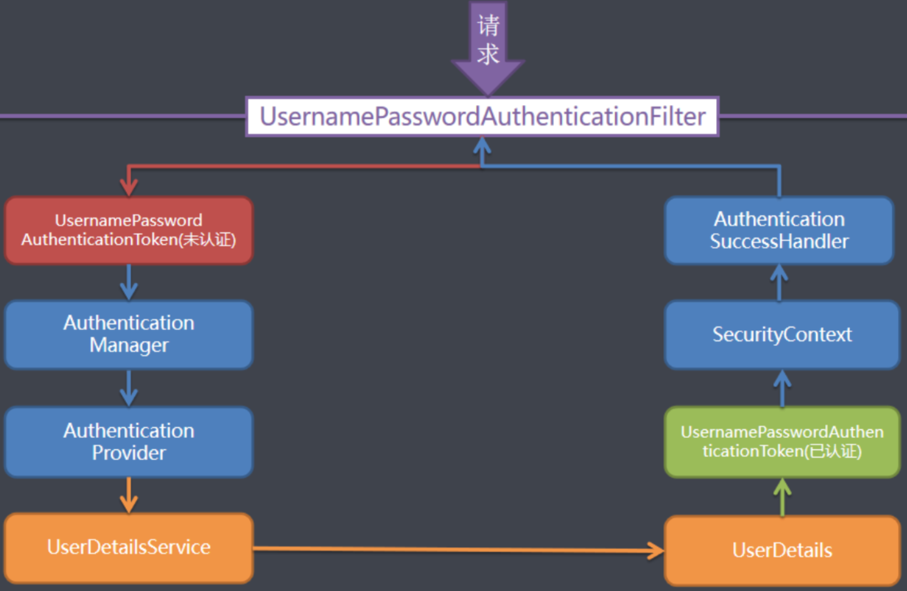

## Spring Secirity 觀念
1. 主要做兩件事情: `驗證` 和 `授權`。
2. 與 Shiro 這個安全框架相比，Spring Security 功能較齊全，但相反 Shiro 比較輕量。
3. 本質是一個過濾器鍊 (filter chain)

<br/>

<br/>

## 添加依賴
```xml
<dependencies>
    <!-- web -->
    <dependency>
        <groupId>org.springframework.boot</groupId>
        <artifactId>spring-boot-starter-web</artifactId>
    </dependency>

    <!-- security 主依賴 -->
    <dependency>
        <groupId>org.springframework.boot</groupId>
        <artifactId>spring-boot-starter-security</artifactId>
    </dependency>

    <!-- config 配置檔案若有報錯，需要加載此類 -->
    <dependency>
        <groupId>org.springframework.boot</groupId>
        <artifactId>spring-boot-configuration-processor</artifactId>
        <optional>true</optional>
    </dependency>

<dependencies>
```

<br/>

<br/>

## 登入密碼
每次啟動 Server 都會在 console 中隨機產生密碼，在訪問路徑的時候需要輸入帳號密碼

帳號: `user`

密碼: `隨機產生`


<br/>

<br/>

## Spring Security 過濾器種類
有很多，這邊舉例3種常見的: 

* FilterSecurityInterceptor: 為最後一個執行的 Filter，用來判斷前一個過濾器通過之後，才能繼續做下一個過濾器 (命名有 Interceptor 但其實是 Filter)。

    


* ExceptionTranslationFilter: 用來處理驗證授權中拋出的異常。

* UsernamePasswordAuthenticationFilter: 針對 `/login` 的 POST 請求做攔截，驗證表單中 username, password，步驟為:

    1. 獲取用戶名和密碼：從HTTP請求中獲取用戶名和密碼，並將其封裝到一個UsernamePasswordAuthenticationToken物件中。
    2. 認證用戶信息：通過調用AuthenticationManager的authenticate方法來驗證用戶信息。如果驗證成功，則將Authentication對象設置到Spring Security上下文中 (Authentication對象簡單來說就是封裝帳號密碼的物件)。
    3. 身份驗證錯誤處理，如果驗證失敗，則可以通過配置authenticationFailureHandler來指定一個AuthenticationFailureHandler對象來處理身份驗證錯誤。
    4. 在最後會呼叫 `DaoAuthenticationProvider#retrieveUser()`，去呼叫 `UserDetailsService#loadUserByUsername()` 方法，就是一開始自訂的方法。
    5. 最終返回 UserDetails 實作物件，並使用到 `SecurityContextHolder.getContext().setAuthentication()` 儲存該物件。
    6. 其他過濾器就可以使用 `SecurityContextHolder` 來獲取當前用戶的信息。

<br/>

<br/>

## 過濾器如何載入的?
* SpringBoot 會自動載入 Spring Security。

* 載入大致流程
    1. 執行 DelegatingFilterProxy `doFilter()`，從 IoC 容器中拿取 FilterChain，並初始化。
    2. 遞迴取所有 Filter，並加到 FilterChain 中。

<br/>

<br/>

## DelegatingFilterProxy 實作類

> 來源: https://blog.csdn.net/qq_35067322/article/details/107096668

* 原生 Servlet 的 filter chain。

    

* 在 Spring Security 中，我們還是希望能夠按照 Servlet 的標準來註冊到過濾器鏈中工作，但是同時也希望它能夠被 Spring IoC 管理，所以 Spring 提供了一個 `GenericFilterBean` 的實現類 `DelegatingFilterProxy`。

* 可以將原生的 Servlet Filter 或者 Spring Bean Filter 委託給DelegatingFilterProxy，然後在結合到 Servlet FilterChain 中。

* 所以當請求走到 DelegatingFilterProxy 時，此類會將請求轉發到 Spring Security 的 Filter Chain 中。

    

<br/>

<br/>

<br/>

<br/>

## UserDetailsService 接口
當陪有任何配置時，帳號和密碼是 Spring Security 定義生成的，而在實際項目中的帳號密碼都是從 DB 查詢的，所以我們需要自定義驗證邏輯，因此需要 implements 此接口，Override 查詢 DB 的功能，並返回 `User` 物件 (User 是實作 UserDetails 接口的物件)。  

<br/>

<br/>

## PasswordEncoder 接口
用於密碼加密用，返回 `User` 物件中的密碼加密屬性。

<br/>

<br/>

## SecurityContext 接口
1. 用於存儲和管理當前用戶安全信息的容器
2. SecurityContext物件通常包含兩個重要的组件：  

    * `Authentication`：用於表示用戶的身份認證信息，包括用戶名、密碼、角色等。在Spring Security中，Authentication是一個接口，具體實現可以是 `UsernamePasswordAuthenticationToken`、`RememberMeAuthenticationToken`等。

    * `Authorization`： 此類包含在 Authentication 類之中，用於表示用戶的授權信息，包括用戶有權訪問哪些資源、執行哪些操作等。在Spring Security中，授權信息通常由 `AccessDecisionManager` 組件來判斷和管理。

3. 獲取 SecurityContext 實作物件

    ```java
    // 返回當前線程的SecurityContext實例。如果當前線程沒有SecurityContext實例，則會創建一個新的實例並返回
    SecurityContext context = SecurityContextHolder.getContext();
    ```

4. 獲取當前用戶身分信息，即 Authentication 物件

    ```java
    Authentication authentication = SecurityContextHolder.getContext().getAuthentication();
    ```

<br/>

<br/>

## 當請求來時的順序

