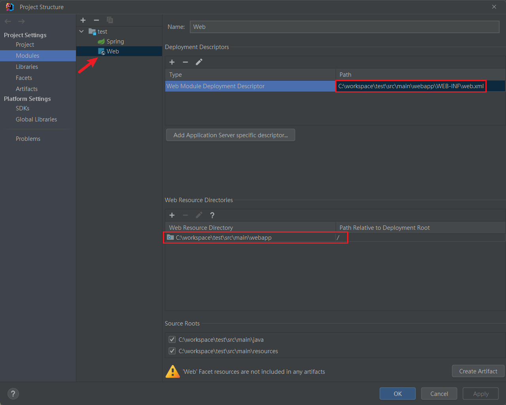
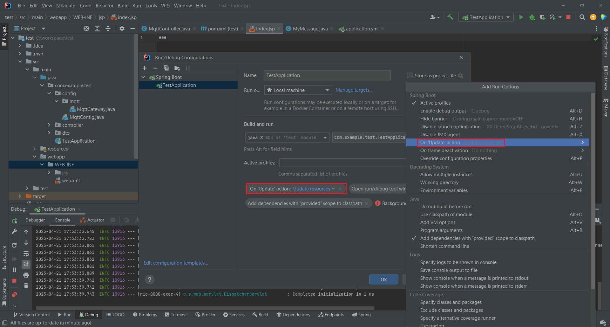

## 配置
1. 引入依賴

    ```xml
    <dependency>
        <groupId>org.apache.tomcat.embed</groupId>
        <artifactId>tomcat-embed-jasper</artifactId>
        <scope>provided</scope>
    </dependency>

    <dependency>
        <groupId>javax.servlet</groupId>
        <artifactId>jstl</artifactId>
    </dependency>
    ```

2. yml配置

    ```yml
    spring:
      mvc:
        view:
          prefix: /WEB-INF/jsp/  # 前綴
          suffix: .jsp  # 後綴
    ```

3. 新增 `webapp/WEB-INF/jsp` 目錄，並指定 `web.xml` 路徑為 `webapp/WEB-INF/`

    

4. #### IDEA 中，jsp 若需要設置熱部屬

    引入依賴

    ```xml
    <dependency>
        <groupId>org.springframework.boot</groupId>
        <artifactId>spring-boot-devtools</artifactId>
        <optional>true</optional>
    </dependency>
    ```

    啟動設定

    


<br/>

<br/>

## ${ctx} 取當前路徑
與 `${pageContext.request.contextPath}`寫法相同
```html
<c:set var="ctx" value="${pageContext.request.contextPath}" />
```