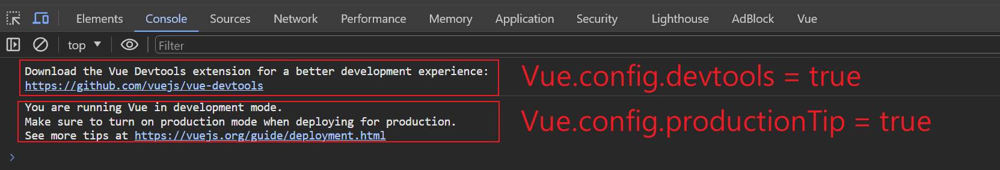

# 引入來源


## 官方提供2個版本下載

1. 開發版本 : 包含完整的警告和偵錯模式，檔案較大。

2. 生產版本 : 無警告版本，檔案較小。

> https://v2.cn.vuejs.org/v2/guide/installation.html#%E7%9B%B4%E6%8E%A5%E7%94%A8-lt-script-gt-%E5%BC%95%E5%85%A5


<br/>

<br/>

## 引入後全局配置

引入 Vue 後會發現，開發者版本，在瀏覽器 config 中，會有2個提示


```html
<!-- 引入本地 Vue -->
<script type="text/javascript" src="../js/vue.js"></script>

<!-- 全局配置，將提示關閉 -->
<script type="text/javascript">
    Vue.config.devtools = false
    Vue.config.productionTip = false
</script>
```

<br/>



<br/>

可以在設置中將其設為 false，提示就不會顯示，可參考官網 API 文件的`全局配置`。

> https://v2.cn.vuejs.org/v2/api/#%E5%85%A8%E5%B1%80%E9%85%8D%E7%BD%AE

