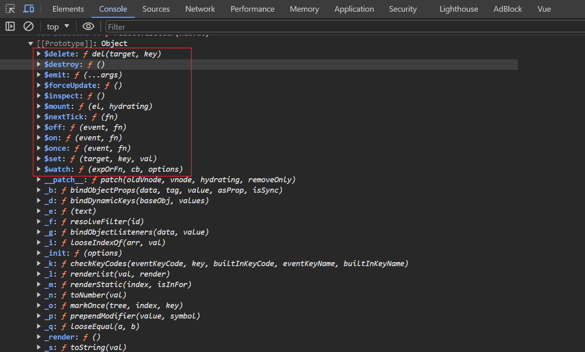
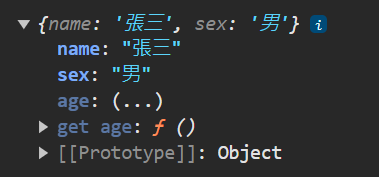

# 基本語法

## 創建vue實例

```html
<!-- 定義一個容器 -->
<div id="root">
    <h1>Hello {{name}}</h1>
</div>


<!-- 創建vue實例，並指定容器 -->
<script type="text/javascript">

    // 寫法1
    const x = new Vue({
        el: '#root', // 指定容器
        data: {      // 指定數據，只能供el指定的容器使用
            name: 'world!'
        }
    })

    // 寫法2，el使用原生js
    const x = new Vue({
        el: document.getElementById('root'),
    })

</script>
```

<br/>

重點: 

1. 建立實例時， `el 指定容器`，`data 指定數據`。

2. data 指定的數據，只能在指定的容器中使用，容器外不生效。

3. 使用 `{{  }}` 語法，抓出數據。

    * 可以使用 js 表達式，以下範例 

        ```js
        // 1
        {{ name.toUpperCase() }}

        // 2
        {{ Date.now() }}
        ```

4. `實例`和`容器`的關係只能是一對一，不能是一對多或多對一，否則無法解析。


<br/>

生成步驟

* 容器中的代碼，被稱為 `Vue模板`

1. 創建vue實例時，會先解析模板，例如將 `{{  }}` 替換成數據。

2. 解析完成後，將`容器`替換成`剛解析完生成的 html 頁面`。


<br/>

<br/>

## 模板語法

分為2類，`插值語法` 和 `指令語法`。

### 插值語法
使用 `{{  }}` 來將數據插入到模板中的語法，適用在`標籤體`。


```html
<!-- html -->
<div id='root'>
    <h1>hello {{name}}</h1>
</div>
```
```js
// js
new Vue({
    el: '#root',
    data: {
        name: 'world'
    }
})
```


### 指令語法
指令語法都是 `v-` 開頭，如 `v-bind`、`v-for`，適用在`解析標籤`(標籤屬性、標籤體內容、綁定事件)，功能可以涵蓋插值語法。

```html
<!-- html -->
<div id='root'>
    <a v-bind:href='url'>google連結</a>
</div>
```
```js
// js
new Vue({
    el: '#root',
    data: {
        url: 'http://google.com.tw'
    }
})
```

<br/>

重點:

* 當使用 `v-bind:`時，會把 href 中的值當作 `js表達式`去執行，而不是字串。

* 語法糖 : 可以省略 `v-bind` 語法，直接使用冒號替代(只有 v-bind 才能省略)。

    ```html
    <div id='root'>
        <a :href='url'>google連結</a>
    </div>
    ```

<br/>

根據官網，html 標籤屬性，應使用 v-bind 指令來附值。

> https://v2.cn.vuejs.org/v2/guide/syntax.html#Attribute

<br/>

<br/>

## 單向 / 雙向數據綁定

`單向數據綁定`

* 使用 `v-bind` 關鍵字

* 數據方向 : `Vue實例中data` 流向 `html頁面`

* 語法糖 : `v-bind:value`簡寫成`:value`。

    ```html
    <div>
        <p>單向數據綁定</p>
        <input type='text' v-bind:value='single'>
    </div>
    ```

    ```js
    new Vue({
        el: '#root',
        data: {
            single: '單向綁定數據'
        }
    })
    ```

<br/>

`雙向數據綁定`

* 使用 `v-model` 關鍵字

* 數據流向方向 :  `Vue實例中data` 流向 `html頁面`，或相反流向。

* 語法糖 : `v-model:value`可簡寫成`v-model`；由於 v-model 本身就是要抓取該元素的 value 值，所以可以簡寫成以下

    ```html
    <!-- 未簡寫 -->
    <div>
        雙向數據綁定: <input type='text' v-model:value='double'>
    </div>
    <!-- 簡寫，省略 :value -->
    <div>
        雙向數據綁定: <input type='text' v-model='double'>
    </div>
    ``


* 限制 : 只能使用在有`輸入類型`的表單類元素，如 : input、select、checkbox、radio、textarea，若是將 v-model 綁定在 h1 這種不是輸入類型的元素，會報錯。


    ```html
    <div>
        <p>單向數據綁定</p>
        <input type='text' v-model:value='double'>
    </div>
    ```

    ```js
    new Vue({
        el: '#root',
        data: {
            double: '雙向綁定數據'
        }
    })
    ```


<br/>

<br/>

## el 的兩種寫法

將vue實例印出，可以發現有許多`$`開頭的方法，是可以讓開發者使用的方法。
```js
const v = new Vue();
console.log(v)
```




### 第一種寫法
將指定的容器，在 new Vue 時，就指定
```js
const v = new Vue({
    el: '#root'
})
```

### 第二種寫法
使用 `$mount` 方法，延後指定容器，較靈活。
```js
const v = new Vue();
v.$mount('#root');
```

<br/>

<br/>

## data 的兩種寫法
`物件方式`和`函數方式` 兩種寫法；若使用組件時，必須使用函數方式。
```js
// data第一種寫法，物件方式
const v = new Vue({
    el: '#root',
    data: { 
        name: 'apple'
    }
})

// data第二種寫法，函數方式
const v = new Vue({
    el: '#root',
    data: function() {
        return {
            name: 'apple'
        }
    }
})
```

注意，`函數方式`寫法中，`不可以使用箭頭函數`。

```js
// 使用 function 寫法
const v = new Vue({
    el: '#root',
    data: function() {
        console.log(this); // 此處的 this 就是 Vue 實例物件，即變數v
        return {
            name: 'apple'
        }
    }
})

// 在物件中寫方法，可省略成以下
const v = new Vue({
    el: '#root',
    data() {
        return {name: 'apple'}
    }
})

```

以下會報錯

```js
// 使用 箭頭函數 會報錯
const v = new Vue({
    el: '#root',
    data: () => {
        console.log(this); // 此處的 this 是 window
        return {
            name: 'apple'
        }
    }
})
```

`重點` : 由 Vue 管理(調用)的函數，一定不要寫成箭頭函數，否則 `this` 就不再是 `Vue實例` 了。

<br/>

<br/>

## Object.defineProperty 方法

Vue2 響應式，是用此Javascript方法(原生)，來實作的。

Vue3 響應式，就不是用此方法，而是改用 Proxy。

靜態方法 Object.defineProperty() 方法有幾個重要的用途：
1. 新增屬性或修改現有屬性的特性
2. 實現屬性的資料保護(writable、configurable配置)
3. 隱藏屬性

`Object.defineProperty (物件, 屬性, 參數)`

```js
let person = {
    name: '張三',
    sex: '男'
}

Object.defineProperty(person, 'age', {
    value: 18            // 屬性age的值
    writable: false,     // 預設false，屬性是否可被修改
    configurable: false, // 預設false，屬性是否可被刪除
    enumerable: false,   // 預設false，可否被列舉(針對這個 object 去跑迴圈的時候，是否可以被找得到)
})

console.log(person);    // 會印出 {name: '張三', sex: '男', age: 18}
```

此靜態方法還有另外一個配置選項，`get()`，解決痛點如下

```js
// 這邊的需求是，number變化時，person.age也要跟著改
let number = 19;

let person = {
    name: '張三',
    sex: '男',
    age: number
}
```

此時產生的問題，當 number 被修改時，`person.age` 並不會自動更改，還需再賦值一次。

解決方式如下，使用 Object.defineProperty()

```js
let number = 19;

let person = {
    name: '張三',
    sex: '男',
}

Object.defineProperty(person, 'age', {

    // 當person.age屬性被讀取時，get函數(getter)就會被調用，且返回值就是age的值
    get: function() {
        return number;
    }
});
```

結果顯示如下，age屬性會顯示`...`，需要點開



<br/>

除了上述 getter，還有 setter

```js
Object.defineProperty(person, 'age', {

    get() {
        return number;
    },

    // 當person.age屬性被修改時，set函數(setter)就會被調用，且會收到修改的值
    set(value) {
        this.age = value
    }
});
```
