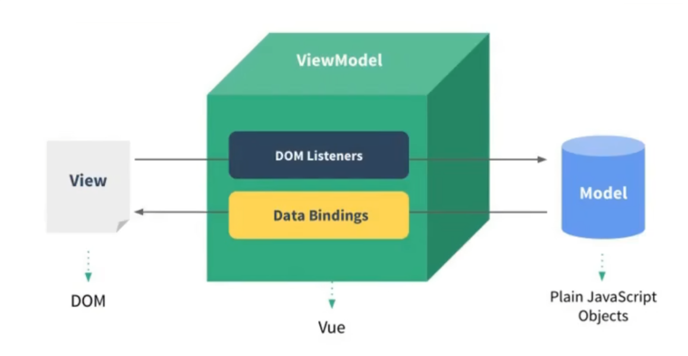
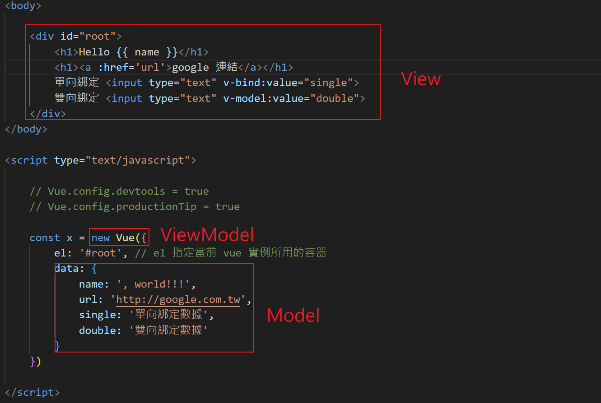
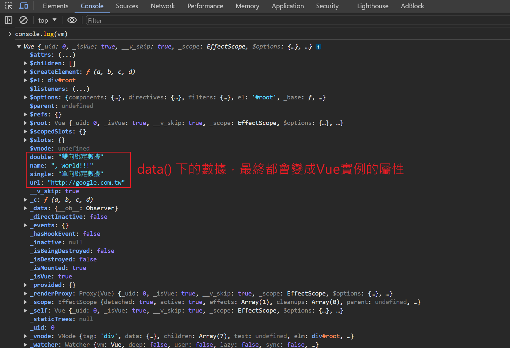
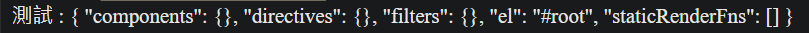

# MVVM

* Vue 參考了 MVVM 模型，但並沒有完全遵循此模型。

* 以下為 MVVM 模型

    1. M (Model，模型) : 對應 data 中的數據。

    2. V (View，視圖) : 模板。

    3. VM (ViewModel，視圖模型) : Vue 實例物件。

    

    * Data Bindings 表示，數據(JS物件)透過綁定的方式，呈現給 View 來顯示，無論 Model 中數據如何變化，都會動態顯示在 View。

    * DOM Listeners 表示，透過監聽 View 中的變化，將數據回傳給 Model，繼續做邏輯處理。


* 使用程式碼來看MVVM

    

    <br/>

    * 既然已知 Vue 實例就是 ViewModel，所以之後程式碼的寫法，都用vm作為變數名稱

        ```js
        // Vue實例的變數名稱，一律使用 vm 命名
        const vm = new Vue({
            el: '#root',
            data() {
                return {}
            }
        })
        ```


* data中所有的屬性，最終都出現在 Vue實例中

    

    <br/>

    除此之外，Vue實例還有許多屬性、方法，都可以直接使用在`插值語法{{ }}`中

    例如:

    ```html
    <div id="root">
        測試 : {{ $options }}
    </div>
    ```

    <br/>

    