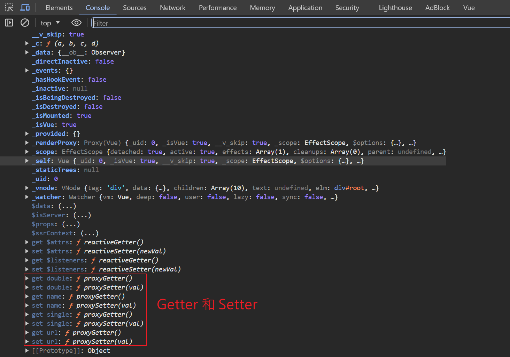
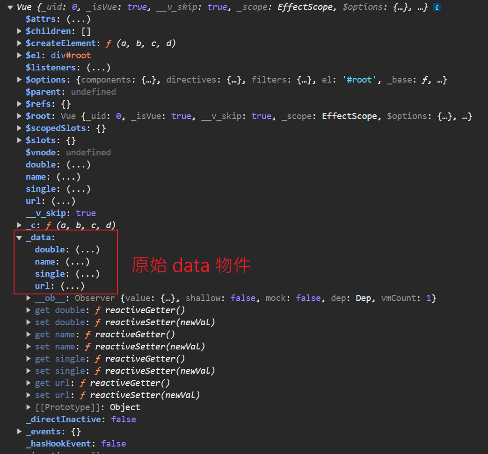

# 數據代理

## 介紹

定義 : 通過一個物件代理對另一個物件中屬性的操作(讀/寫)。

舉例 : 假如有2個物件 obj1 和 obj2，obj1 有一個 x 屬性，obj2 可以去讀取、修改 obj1.x 屬性，這時 obj2 為 obj1 的代理。


代碼 : 

```js
let obj1 = {x: 100}
let obj2 = {y: 200}

Object.defineProperty(obj2, 'x', {
    get() {
        return obj1.x;
    },

    set(value) {
        obj1.x = value;
    }
})
```

<br/>

<br/>

## Vue 中的數據代理

在 Vue 中，數據代理指 Vue 實例中的 data 物件中的屬性被代理到 Vue 實例上，以便可以`直接透過 Vue 實例存取這些屬性，而無需使用 data 物件`。 

若在 data 中放入數據，這些數據就會代理到 Vue 實例上，印出 Vue 實例，可以看到有數據的 Getter 和 Setter。




<br/>

當 Vue 實例(vm) 在建立時，會將 data 物件，存入到 vm 的 `_data` 屬性中，此代理是透過 `Object.defineProperty` 方法去實作的。



<br/>

結論 : 

1. 數據代理指的是使用 `vue物件` 來代理 `data物件` 中屬性的操作(讀/寫)。

2. 數據代理的好處 : 更加方便的操作 data 中的數據。

3. 基本原理 : 

    * 通過 `Object.defineProperty()` 把 data 物件中所有的屬性添加到 vm 中。

    * 為每一個添加到 vm 的屬性，都指定一個 getter 和 setter。

    * 在 getter 和 setter 內部去操作(讀/寫) data 中對應的屬性。

4. 重點 : 只是代理，而非拷貝，是將 data() 的屬性透過 Object.defineProperty 映射到 Vue 實例上，方便直接訪問。