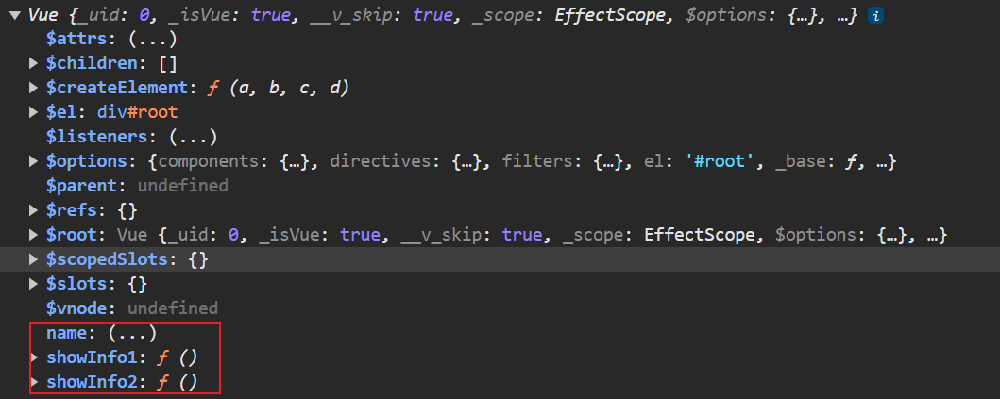
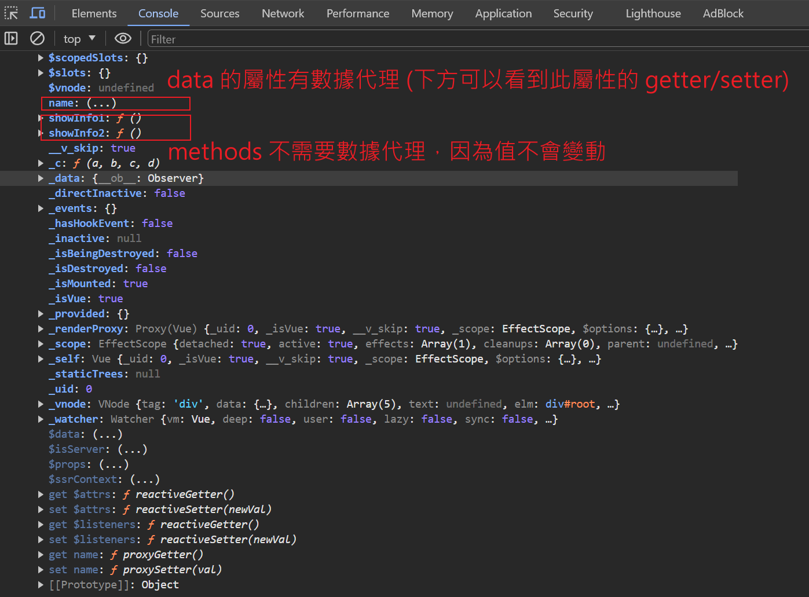

# 事件處理

## 事件 指令語法(不傳參數)

在創建 Vue 實例中，直接加入 methods 屬性，模板中使用 `v-on:` 指令語法，可使用 `@`作為簡寫。

```html
<!-- 容器 -->
<div id="root">
        <h2>歡迎來到{{name}}</h2>
        <!-- 寫法1 -->
        <button v-on:click="showInfo">點我提示訊息</button>
        <!-- 寫法2 @為簡寫 -->
        <button @click="showInfo">點我提示訊息</button>
    </div>

<!-- js -->
<script type="text/javascript">
    Vue.config.productionTip = false;

    const vm = new Vue({
        el: '#root',
        data: {
            name: 'apple'
        },
        methods: {
            showInfo(event) {
                console.log(event.target); // 觸發事件的綁定目標，即 <button>點我提示訊息</button>
                console.log(this);         // 這邊的this為vm
                alert('Hello')
            }
        },
    })

</script>
```

<br/>

<br/>

## 事件 指令語法(傳參數)
使用小括號，即可傳參；若要傳 event 事件，使用 `$event`，$event 順序前後沒有差別。

```html
<!-- 容器 -->
<div id="root">
        <h2>歡迎來到{{name}}</h2>
        <!-- 寫法1，只傳參數 -->
        <button @click="showInfo1(123)">點我提示訊息1</button>
        <!-- 寫法2 傳參數、event -->
        <button @click="showInfo2($event, 123)">點我提示訊息2</button>
    </div>

<!-- js -->
<script type="text/javascript">
    Vue.config.productionTip = false;

    const vm = new Vue({
        el: '#root',
        data: {
            name: 'apple'
        },
        methods: {
            showInfo1(value) {
                console.log(value); // 123
            },

            showInfo2(event, value) {
                console.log(event.target.innerText); // 點我提示訊息1
                console.log(value);                  // 123
            }
        },
    })

</script>
```

<br/>

<br/>

## 事件方法 觀念

其實 methods 中寫的方法，最終和 data 相同，都會出現在 vm 中。



<br/>

其中不一樣的地方是，`methods 不需要做數據代理`。



<br/>

<br/>

### 結論
1. 使用 `v-on:xxx` 或 `@xxx` 綁定事件，其中 xxx 是事件名稱。

2. 事件的回調需要配置在 methods 物件中，最終都會在 vm 中。

3. methods 中配置的函數，`不要使用箭頭函數`，否則 this 就不是 vm 了，而是 window。

4. methods 中配置的函數，都是被 Vue 所管理的函數，this 的指向是 `vm` 或`組件實例物件`。

5. `@click="demo"` 和 `@click="demo($event)"` 效果一致，但後者可以傳參。