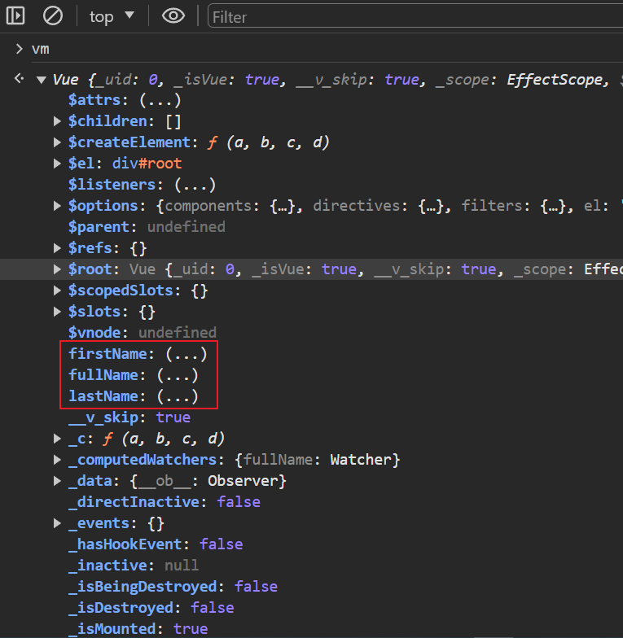

# computed 計算屬性用法

## 概述

* 計算屬性會根據它們所依賴的響應式資料的變化而自動更新。可以用來處理各種資料變換和邏輯計算。

* 什麼是`計算屬性`?

    * 定義 : 計算屬性需要通過`已有的屬性`計算得出，即從 `vm._data` 中的屬性值加工計算，非 vm 實例管理的區域變數無法使用；而計算屬性在 vm._data 中是找不到的。

    * 如何使用 : 計算屬性最終會被放在 vm 實例中，即 vm.fullName。

        ```html
        <!-- 直接用差值語法 -->
        {{ fullName }}
        ```
        ```js
        // 直接從 vm 調用
        console.log(vm.fullName)
        ```

    * 舉例，computed 中的 fullName 就是計算屬性

        ```js
        const vm = new Vue({
            el: '#root',
            data: {
                firstName: '張',
                lastName: '三'
            },
            computed: {
                fullName: {
                    get() {
                        // 此處的 this 原本是 fullName，被vue調整成指向 vm實例
                        return this.firstName + this.lastName
                    },
                    set(value) { // value 為修改後的值
                        this.firstName = value.slice(0,1)
                        this.lastName = value.slice(1) // 取字串第二位到最後
                    }
                }
            }
        })
        ```
    
    * get() 的重點

        1. 作用 : 當 fullName 被讀取時，get()就會被調用，返回值就做為 fullName 的值。

        2. 什麼時候調用 : 有2個時候
        
            1. 初次讀取 fullName 時，非初次讀取會從cache中調用。
            
            2. 當所依賴的數據發生變化時。

        3. 底層一樣使用 Object.defineProperty() 實作。
    
    * set() 的重點

        1. 什麼時候調用 : 當 fullName 屬性被修改時。

        2. 如果確定計算屬性只可讀不可改，可以不用寫 setter。

* `data中的屬性`和`計算屬性`，都會被放在 vm 實例中。

    

    <br/>

    如果要區別上述兩個屬性誰是`計算屬性`，可以看到 vm._data 中，存在的就是一般屬性，不存在的就是計算屬性。
    
* methods 和 computed 比較

    * methods 沒有緩存機制，每次在模板中解析時都會被調用。

    * computed 只有在初次讀取時和依賴數據發生變化時，這兩種情況會`調用get()函數`，重複使用時會走緩存。

        * 舉例，模板中使用了4次fullName

            ```html
            {{ fullName }}  <!-- 只有第一次解析時會調用get() -->
            {{ fullName }}  <!-- 走緩存 -->
            {{ fullName }}  <!-- 走緩存 -->
            {{ fullName }}  <!-- 走緩存 -->
            ```

<br/>

<br/>

## 重要觀念

* 當 Vue 實例中的數據發生改變時(雙向綁定會產生數據改變)，Vue實例都會去重新解析一次模板，刷新新數據。

* 呈上，當數據發生改變時，除了`差值語法`中有用到的數據會重新刷新之外，差值語法中的 methods 函數也會再調用一次(因為Vue不知道是否新數據會影響到函數)

    * 舉例

        ```html
        <!-- 當 firstName 數據修改時 -->

        <!-- firstName會更新 -->
        {{ firstName }}

        <!-- fullName函數會再執行一次 -->
        {{ fullName() }}
        ```
        ```js
        const vm = new Vue({
            el: '#root',
            data: {
                firstName: '張',
                lastName: '三'
            },

            methods: {
                fullName() {
                    return this.firstName + this.lastName // 張三
                }
            }
        })
        ```

<br/>

<br/>

## 舉例-Vue風格

當使用 `{{  }}` 差值語法時，都會使用`簡單的JS表達式`，意思是 {{  }} 裡面不應該出現大量的複雜語法。

官方網站強烈建議的風格
> https://v2.cn.vuejs.org/v2/style-guide/#%E6%A8%A1%E6%9D%BF%E4%B8%AD%E7%AE%80%E5%8D%95%E7%9A%84%E8%A1%A8%E8%BE%BE%E5%BC%8F%E5%BC%BA%E7%83%88%E6%8E%A8%E8%8D%90

故，解決以上寫法，可使用 computed 屬性來計算數據值。


以下需求: 動態顯示 fullName (即 firstName + lastName 字串)

```js
const vm = new Vue({
    el: '#root',
    data: {
        firstName: '張',
        lastName: '三'
    },

    // 解法1:使用method屬性
    methods: {
        fullName() {
            return this.firstName + this.lastName // 張三
        }
    },

    // 解法2:使用computed屬性
    computed: {
        fullName: {
            get() {
                return this.firstName + this.lastName
            }
        }
    }
})
```

<br/>

<br/>

## 計算屬性 - 簡寫

簡寫的條件 : 計算屬性`只有 get，沒有 set`，也就是不需修改值的情況，可以使用簡寫。

```js
const vm = new Vue({
    el: '#root',
    data: {
        firstName: '張',
        lastName: '三'
    },
    computed: {
        // 完整寫法
        // fullName: {
        //     get() {
        //         return this.firstName + this.lastName
        //     },
        //     set(value) {
        //         this.firstName = value.slice(0,1)
        //         this.lastName = value.slice(1)
        //     }
        // }

        // 簡寫
        // 直接寫 getter 在函數內
        fullName() {
            return this.firstName + this.lastName
        }

    }
})
```

注意 : `computed 計算後的是屬性，而非方法`，不要以為程式碼寫成 fullName() 就以為是方法。

所以在差值語法中:

```html
<!-- 錯誤寫法 -->
{{ fullName() }}

<!-- 正確寫法 -->
{{ fullName }}
```