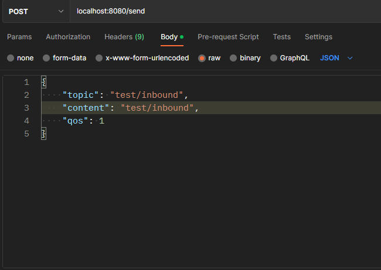
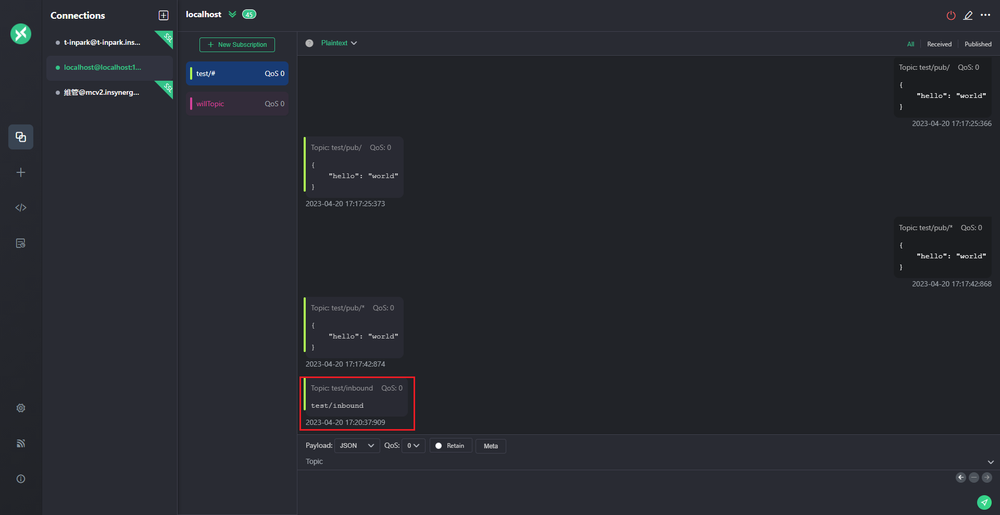
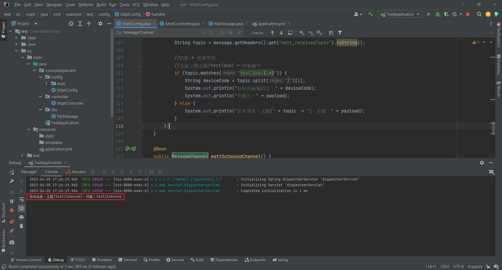
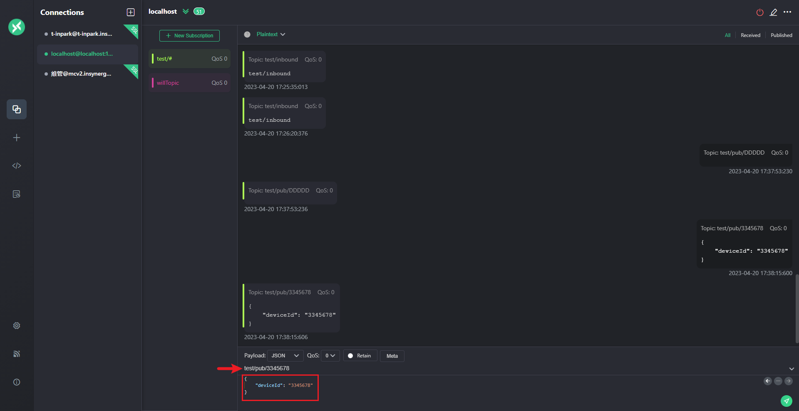
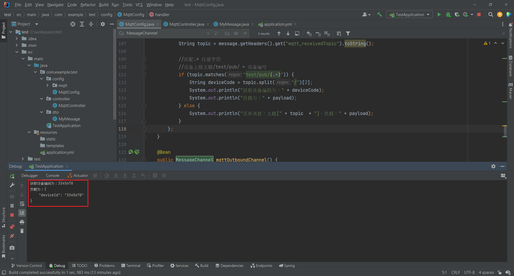
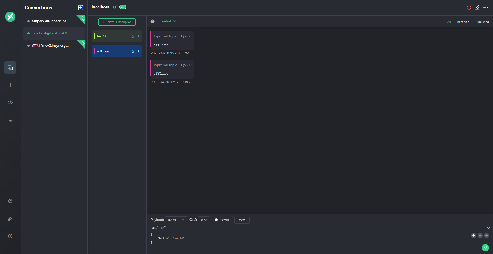

## MQTT(Message Queuing Telemetry Transport) 訊息序列遙測傳輸


> 來源1: https://ithelp.ithome.com.tw/articles/10224407

> 來源2: https://swf.com.tw/?p=1002

1. 為一種輕量級協議，相對於HTTP省略許多 header 資料，所以需要的網路頻寬與硬體資源是相對低的。

2. MQTT有四個主要的元素(發布者和訂閱者可以是同一個)
   
   * 發布者(Publisher)
   
   * 訂閱者(Subscriber)
   
   * 主題(Topic)
   
   * 轉訊站(Broker)

3. 連接 Broker 的 Publisher 和 Subscriber 統稱為 Client，連接時會有一組 ClientID 來區分每個裝置。

<br/>

<br/>

## 發布流程

1. 發布者(Publisher) 向 轉訊站(Broker) 發布一個 主題(Topic)。

2. Broker 而後專發給所有 Subscriber。

3. 目前的 Subscriber和Broker之間可以進行雙向溝通。

<br/>

<br/>

## 封包格式
一個 MQTT 封包，由3種部分組成: `Header`、`topic`、`payload`。

不同於HTTP的標頭採用文字描述，MQTT的標頭採用數字編碼，整個長度只佔2位元組，等同兩個字元，後面跟著訊息的主題（topic）和內容（payload）


> 圖片來源: https://swf.com.tw/?p=1002

<br/>

<br/>

## Topic 格式
1. 以 `/` 作為階層保留字
2. `+`, `#` 也作為保留字
3. 總長度不能超過65536個字元
4. 大小寫敏感
5. 開頭不需要加上 `/`
   
   ```
   device/GATEWAY_ID/DEVICE_ID
   ```


<br/>

<br/>

## Qos級別

定義了傳輸品質，有分三個級別

1. `Qos 0` :  
   
   * 最多傳送一次，不保證送達，Publisher 傳訊給 Broker 後直接轉傳給 Subscriber，不會回傳確認封包
   
   * 缺點是資料可能會遺失

2. `Qos 1` : 
   
   * 至少傳送一次，Publisher 傳訊給 Broker 後，Broker會回應 PUBACK 訊息給Publisher，確認收到訊息，Publisher沒有收到PUBACK回應，就會再次發送Publish。
   
   * 缺點是若沒收到 PUBACK，可能會讓 Publisher 收到重複訊息。

3. `Qos 2` :
   
   * Publisher 傳訊給 Broker 後，Broker會回應訊息給 Publisher，確認收到要發布的訊息，Publisher 收到回應時，傳送PUBREL (釋放發布訊息)，Broker收到PUBREL，將訊息發布給 Subscriber，並向Publisher回報。
   
   * 缺點是佔用頻寬與傳送時間較多


<br/>

<br/>

## broker 安裝
1. 下載並安裝 Eclipse Mosquitto
2. 開啟/關閉 mosquitto，或是可以透過 windows -> 服務 -> 右鍵手動開關

   ```sh
   # windows使用系統管理員開啟
   # 開啟
   net start mosquitto
   # 關閉
   net stop mosquitto
   ```

<br/>

<br/>

## broker 設定

> 配置設定 https://officeguide.cc/mqtt-broker-server-mosquitto-installation-tutorial-examples/

1. 建立 pwfile.txt 檔案

   使用原本的 pwfile.example 檔案去改，帳號密碼使用冒號區隔
   
   ```txt
   username:password
   ```

2. 將 pwfile.txt 檔案中的密碼 hash 
   
   使用 mosquitto_passwd.exe 管理帳/密檔案的工具

   ```sh
   mosquitto_passwd.exe -U pwfile.txt
   ```

3. 設定 mosquitto.conf 配置檔

   ```sh
   # 個別設置每個偵聽器物件的安全性
   per_listener_settings true
   # 不允許匿名登入
   allow_anonymous false
   # 帳號密碼位置
   password_file C:\Program Files\mosquitto\pwfile.txt
   ```
   設定 port 號
   
   ```sh
   # 僅允許本機使用未加密連線
   listener 1883 localhost

   # SSL 加密連線設定
   listener 8883
   certfile /etc/letsencrypt/live/mqtt.example.com/cert.pem
   cafile /etc/letsencrypt/live/mqtt.example.com/chain.pem
   keyfile /etc/letsencrypt/live/mqtt.example.com/privkey.pem
   ```

<br/>

<br/>

## Springboot 設定
1. 加入 maven 依賴

   ```xml
   <dependency>
      <groupId>org.springframework.integration</groupId>
      <artifactId>spring-integration-mqtt</artifactId>
   </dependency>
   ```

2. application.yml 配置

   ```yml
   mqtt:
      username: username
      password: password
      serverURIs: tcp://127.0.0.1:1883
      qos: 1
      client:
         id: test
      topic: topic/test # default topic
   ```

3. MqttConfig 配置   

   ```java
   package com.example.test.config;

   import org.eclipse.paho.client.mqttv3.MqttConnectOptions;
   import org.springframework.beans.factory.annotation.Value;
   import org.springframework.context.annotation.Bean;
   import org.springframework.context.annotation.Configuration;
   import org.springframework.integration.annotation.ServiceActivator;
   import org.springframework.integration.channel.DirectChannel;
   import org.springframework.integration.core.MessageProducer;
   import org.springframework.integration.mqtt.core.DefaultMqttPahoClientFactory;
   import org.springframework.integration.mqtt.core.MqttPahoClientFactory;
   import org.springframework.integration.mqtt.inbound.MqttPahoMessageDrivenChannelAdapter;
   import org.springframework.integration.mqtt.outbound.MqttPahoMessageHandler;
   import org.springframework.integration.mqtt.support.DefaultPahoMessageConverter;
   import org.springframework.messaging.MessageChannel;
   import org.springframework.messaging.MessageHandler;

   @Configuration
   public class MqttConfig {

      public static final String CHANNEL_NAME_OUT = "mqttOutboundChannel";

      public static final String CHANNEL_NAME_IN = "mqttInputChannel";

      // broker 帳號
      @Value("${mqtt.username}")
      private String username;
      // broker 密碼
      @Value("${mqtt.password}")
      private String password;
      // broker URI
      @Value("${mqtt.serverURIs}")
      private String hostUrl;
      // broker clientID 
      @Value("${mqtt.client.id}")
      private String clientId;
      // default topic
      @Value("${mqtt.topic}")
      private String defaultTopic;
      // qos
      @Value("${mqtt.qos}")
      private int qos;

      // 客戶端(這邊指springboot application)與服務器之間的連接意外中斷，服務器將發布客戶端的"遺囑"消息
      private static final byte[] WILL_DATA;

      static {
         WILL_DATA = "offline".getBytes();
      }

      /** 創建MqttPahoClientFactory，設置Springboot連線到Broker的屬性，如需使用SSL，也在這裡設置 */
      @Bean
      public MqttPahoClientFactory mqttClientFactory() {
         DefaultMqttPahoClientFactory factory = new DefaultMqttPahoClientFactory();
         MqttConnectOptions options = new MqttConnectOptions();

         // 設置連接的用戶名
         if (!username.trim().equals("")) {
               options.setUserName(username);
         }
         // 設置連接的密碼
         options.setPassword(password.toCharArray());
         // 設置代理端的URL地址，可以是複數
         options.setServerURIs(new String[]{hostUrl});
         // 設置Timeout 單位為秒
         options.setConnectionTimeout(10);
         // 設置會話心跳時間 單位為秒，客戶端(Springboot application)會每隔1.5*20秒向Broker發送心跳
         // 但這個方法並沒有重連的機制
         options.setKeepAliveInterval(20);
         // 設置"遺囑"消息的話題，若客戶端(Springboot application)與Broker之間的連接意外中斷，Broker將發布客戶端的"遺囑"消息
         // willTopic 為主題名稱
         options.setWill("willTopic", WILL_DATA, 2, false);
         factory.setConnectionOptions(options);
         return factory;
      }


      /** 入站channel */
      @Bean
      public MessageChannel mqttInputChannel() {
         return new DirectChannel();
      }

      /** 接收從 broker 訂閱的 mqtt */
      @Bean
      public MessageProducer inbound() {
         // Paho客戶端消息驅動通道適配器，主要用來訂閱主題
         // MqttPahoMessageDrivenChannelAdapter adapter = new MqttPahoMessageDrivenChannelAdapter("consumerClient-paho",
         MqttPahoMessageDrivenChannelAdapter adapter = new MqttPahoMessageDrivenChannelAdapter(
               clientId + "-consume",
               mqttClientFactory(),
               "test/pub/#"  // 從Broker訂閱主題，可以訂閱複數(重點)
         );
         adapter.setCompletionTimeout(5000);

         // Paho消息轉換器
         DefaultPahoMessageConverter defaultPahoMessageConverter = new DefaultPahoMessageConverter();
         // 按字節接收消息
         // defaultPahoMessageConverter.setPayloadAsBytes(true);
         adapter.setConverter(defaultPahoMessageConverter);
         adapter.setQos(qos); // 设置QoS
         adapter.setOutputChannel(mqttInputChannel());
         return adapter;
      }

      @Bean
      // ServiceActivator註解表明：當前方法用於處理MQTT消息，inputChannel參數指定了用於消費消息的channel
      @ServiceActivator(inputChannel = CHANNEL_NAME_IN)
      public MessageHandler handler() {
         return message -> {
               String payload = message.getPayload().toString();

               // byte[] bytes = (byte[]) message.getPayload(); // 收到的消息是byte格式
               String topic = message.getHeaders().get("mqtt_receivedTopic").toString();

               // 匹配.* 任意字符
               // 設備上報主題 /test/ + 設備編號
               // 測試: 在broker上發送消息時，會在springboot server端打印出以下資訊
               if (topic.matches("test/pub/(.*)")) {
                  String deviceCode = topic.split("/")[2];
                  System.out.println("獲取設備編碼為：" + deviceCode);
                  System.out.println("Payload：" + payload);
               } else {
                  System.out.println("丟棄消息：主題[" + topic  + "]，Payload：" + payload);
               }
         };
      }

      /** 出站channel */
      @Bean
      public MessageChannel mqttOutboundChannel() {
         return new DirectChannel();
      }

      /** application 發送 mqtt 到 broker */
      @Bean
      @ServiceActivator(inputChannel = CHANNEL_NAME_OUT)
      public MessageHandler outbound() {

         // 發送消息和消費消息Channel可以使用相同MqttPahoClientFactory
         MqttPahoMessageHandler messageHandler = new MqttPahoMessageHandler(clientId + "-produce", mqttClientFactory());
         // 如果設置成true，即異步，發送消息時將不會阻塞
         messageHandler.setAsync(true);
         messageHandler.setDefaultTopic(defaultTopic);
         // 設置默認QoS
         messageHandler.setDefaultQos(qos);

         // Paho消息轉換器
         DefaultPahoMessageConverter defaultPahoMessageConverter = new DefaultPahoMessageConverter();

         // defaultPahoMessageConverter.setPayloadAsBytes(true); // 發送默認按byte類型發送消息
         messageHandler.setConverter(defaultPahoMessageConverter);
         return messageHandler;
      }

   }
   ```

4. Postman + Mosquitto + MQTTX 測試

   測試 outbound : 
   
   Postman -> Springboot `outbound`(Publisher) -> Broker -> Springboot `inbound` (如果有訂閱test/inbound主題的話)
   
   

   

   


   <br/>

   <br/>

   測試 inbound : 

   Broker -> Springboot `inbound`

   

   


   <br/>

   <br/>

   測試 斷線時會發出的的WILL_TOPIC : 

   

   

<br/>

<br/>

## MQTT配置

> https://blog.csdn.net/beibei3321/article/details/124187758