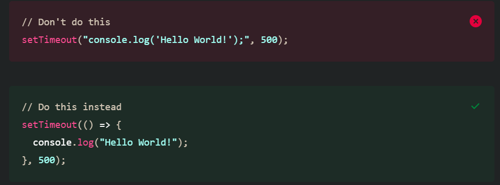

## 使用 Micro Focus WebInspect 做弱點掃描

* 判斷方式是針對 HTTP response 去判斷是否有安全性問題，所以本掃描是針對 response 的行為，無法針對程式碼面的問題。
* 掃描軟體會搜集前端頁面(html, jsp, js) 中的公開 api 路徑進行掃描，所以像是 infactory-backend和ICA這兩包的API盡量不要寫在前端，不然會被發現。若不想被掃可以將路徑隱藏至後端或是關閉該功能的權限。

* 從Client端獲取的參數，包含sessionStorage, localStorage, Cookies，都必須再寫檢核，不能直接使用，弱掃軟體會在這些參數中加其他字串，需將這些字串擋掉。


<br/>

<br/>

## 注入類
使用 input 方式注入攻擊字串的方式有以下幾種: 

1. XSS

    解法: 前端部分需是針對`反射型xss`和`DOM型xss`，防範方式是將字串做 Html Encode(避免被解析成Html)、使用HttpOnly cookie、validate dom 物件中是否有攻擊字串；
    後端是針對`儲存型xss`，在 Filter 中加入Regex判斷，過濾所有parameters 和Cookie，若有攻擊字串，則返回狀態碼400。

2. SQL Injection ( 11299 ) / NoSQL Injection: MongoDB ( 11687 )

    攻擊會猜後端使用的是 Sql 還是 no Sql，所以兩個都要擋。
    處理方式: 在 Filter 中加入Regex判斷，過濾所有parameters 和Cookie，若有攻擊字串，則返回狀態碼400。


3. Server-Side Script Injection ( 11301 ) 

    JS 中禁用函數`eval()`， 而寫法要注意的函數 `setTimeout()`， `setInterval()`，原因是`setTimeout()` 若使用下圖第一種寫法還是會調用`eval()`，會被注入攻擊參數。

    
    
    不可直接使用 Client 端的 Raw data，例如: Cookie, localStorage, sessionStorage。


4. Server-Side Request Forgery ( 11717 )  : 攻擊目標為後端其他的微服務Server，非啟動本應用程式的Server(像隔山打牛)。

    解法: 不能直接從前端呼叫後端微服務Server，需要呼叫應用程式Server，再呼叫一次，這樣就可以通過本應用程式Server中的Filter去過濾攻擊字串；後端的API串接還是需要帶上token，以免直接完全給出權限。

4. 以下是使用 filter 作為檢查字串的方式。

    ```java
    // filter類
    public class InjectionFilter extends GenericFilterBean {

        @Override
        public void doFilter(ServletRequest request, ServletResponse response, FilterChain chain) throws IOException, ServletException {
            HttpServletRequest req = (HttpServletRequest)request;
            HttpServletResponse resp = (HttpServletResponse)response;

            // Server-Side Script Injection ( 11301 ), xss, sqlinjection
            // request static files 的時候，cookie 中挾帶 script
            if (!isCookieOk(req, resp)) {
                resp.setStatus(HttpServletResponse.SC_BAD_REQUEST);
                response.setContentType("text/html; charset=UTF-8");
                response.getWriter().print("StatusCode=400，cookie含有攻擊字串");
                log.info("StatusCode=400，cookie含有攻擊字串");
                return ;
            }

            if (!isParametersOk(req, resp)) {
                resp.setStatus(HttpServletResponse.SC_BAD_REQUEST);
                response.setContentType("text/html; charset=UTF-8");
                response.getWriter().print("StatusCode=400，params含有攻擊字串");
                log.info("StatusCode=400，parameters含有攻擊字串");
                return ;
            }

            chain.doFilter(request, response);
        }

        // 檢查Cookie
        private boolean isCookieOk(HttpServletRequest request, HttpServletResponse response) {
            Cookie[] cookies = request.getCookies();
            if (cookies != null && cookies.length > 0) {
                for (Cookie cookie : cookies) {
                    try {
                        String value = URLDecoder.decode(cookie.getValue(), "utf-8").toLowerCase();
                        if (judgeInjectStr(value)) {
                            log.error("cookie中含有攻擊字串: {}", cookie.getName());
                            return false;
                        }
                    } catch (RuntimeException | IOException e) {
                        // 若無法 decode cookie
                        return false;
                    }
                }
            }
            return true;
        }

        /** 檢查參數 */
        private boolean isParametersOk(HttpServletRequest request, HttpServletResponse response) throws IOException {
            Enumeration<String> names = request.getParameterNames();
            while (names.hasMoreElements()) {
                String name = names.nextElement();
                String[] values = request.getParameterValues(name);
                for (String value : values) {
                    if (judgeInjectStr(value.toLowerCase(Locale.getDefault()))) {
                        log.error("params含有攻擊字串: {}", value);
                        return false;
                    }
                }
            }
            return true;
        }

        /** 判斷引數是否含有攻擊串 */
        public boolean judgeInjectStr(String value) {
            if (value == null || "".equals(value)) {
                return false;
            }
            return StringValidUtils.isXss(value) || StringValidUtils.isSqlInjection(value);
        }
    }
    ```
    ```java
    // 工具類
    public class StringValidUtils {

        private static final String XSS_REGEXPS = ".*(<|>|script|=|==|--|!=|\\(\\))+.*";

        private static final String SQL_TYPES =
                "TABLE|TABLESPACE|PROCEDURE|FUNCTION|TRIGGER|KEY|VIEW|MATERIALIZED VIEW|LIBRARY" +
                        "DATABASE LINK|DBLINK|INDEX|CONSTRAINT|TRIGGER|USER|SCHEMA|DATABASE|PLUGGABLE DATABASE|BUCKET|" +
                        "CLUSTER|COMMENT|SYNONYM|TYPE|JAVA|SESSION|ROLE|PACKAGE|PACKAGE BODY|OPERATOR" +
                        "SEQUENCE|RESTORE POINT|PFILE|CLASS|CURSOR|OBJECT|RULE|USER|DATASET|DATASTORE|" +
                        "COLUMN|FIELD|OPERATOR";

        private static final String[] SQL_REGEXPS = {
                "(?i)(.*)(\\b)+(OR|AND)(\\s)+(true|false)(\\s)*(.*)",
                "(?i)(.*)(\\b)+(OR|AND)(\\s)+(\\w)(\\s)*(\\=)(\\s)*(\\w)(\\s)*(.*)",
                "(?i)(.*)(\\b)+(OR|AND)(\\s)+(equals|not equals)(\\s)+(true|false)(\\s)*(.*)",
                "(?i)(.*)(\\b)+(OR|AND)(\\s)+([0-9A-Za-z_'][0-9A-Za-z\\d_']*)(\\s)*(\\=)(\\s)*([0-9A-Za-z_'][0-9A-Za-z\\d_']*)(\\s)*(.*)",
                "(?i)(.*)(\\b)+(OR|AND)(\\s)+([0-9A-Za-z_'][0-9A-Za-z\\d_']*)(\\s)*(\\!\\=)(\\s)*([0-9A-Za-z_'][0-9A-Za-z\\d_']*)(\\s)*(.*)",
                "(?i)(.*)(\\b)+(OR|AND)(\\s)+([0-9A-Za-z_'][0-9A-Za-z\\d_']*)(\\s)*(\\<\\>)(\\s)*([0-9A-Za-z_'][0-9A-Za-z\\d_']*)(\\s)*(.*)",
                "(?i)(.*)(\\b)+SELECT(\\b)+\\s.*(\\b)(.*)",
                "(?i)(.*)(\\b)+INSERT(\\b)+\\s.*(\\b)+INTO(\\b)+\\s.*(.*)",
                "(?i)(.*)(\\b)+UPDATE(\\b)+\\s.*(.*)",
                "(?i)(.*)(\\b)+DELETE(\\b)+\\s.*(\\b)+FROM(\\b)+\\s.*(.*)",
                "(?i)(.*)(\\b)+UPSERT(\\b)+\\s.*(.*)",
                "(?i)(.*)(\\b)+SAVEPOINT(\\b)+\\s.*(.*)",
                "(?i)(.*)(\\b)+CALL(\\b)+\\s.*(.*)",
                "(?i)(.*)(\\b)+ROLLBACK(\\b)+\\s.*(.*)",
                "(?i)(.*)(\\b)+KILL(\\b)+\\s.*(.*)",
                "(?i)(.*)(\\b)+DROP(\\b)+\\s.*(.*)",
                "(?i)(.*)(\\b)+CREATE(\\b)+(\\s)*(" + SQL_TYPES + ")(\\b)+\\s.*(.*)",
                "(?i)(.*)(\\b)+ALTER(\\b)+(\\s)*(" + SQL_TYPES + ")(\\b)+\\s.*(.*)",
                "(?i)(.*)(\\b)+TRUNCATE(\\b)+(\\s)*(" + SQL_TYPES + ")(\\b)+\\s.*(.*)",
                "(?i)(.*)(\\b)+LOCK(\\b)+(\\s)*(" + SQL_TYPES + ")(\\b)+\\s.*(.*)",
                "(?i)(.*)(\\b)+UNLOCK(\\b)+(\\s)*(" + SQL_TYPES + ")(\\b)+\\s.*(.*)",
                "(?i)(.*)(\\b)+RELEASE(\\b)+(\\s)*(" + SQL_TYPES + ")(\\b)+\\s.*(.*)",
                "(?i)(.*)(\\b)+DESC(\\b)+(\\w)*\\s.*(.*)",
                "(?i)(.*)(\\b)+DESCRIBE(\\b)+(\\w)*\\s.*(.*)",
                "(.*)(/\\*|\\*/|;){1,}(.*)",
                "(.*)(-){2,}(.*)",
        };

        private static final List<Pattern> validationPatterns = buildPatterns();

        private static List<Pattern> buildPatterns() {
            List<Pattern> patterns = new ArrayList<Pattern>();
            for(String expression : SQL_REGEXPS){
                patterns.add(getPattern(expression));
            }
            return patterns;
        }

        private static Pattern getPattern(String regEx) {
            return Pattern.compile(regEx, Pattern.CASE_INSENSITIVE | Pattern.UNICODE_CASE);
        }

        private static boolean matches(Pattern pattern, String dataString) {
            Matcher matcher = pattern.matcher(dataString);
            return matcher.matches();
        }

        private static boolean isEmpty(CharSequence cs) {
            return cs == null || cs.length() == 0;
        }

        /**
        * 判斷字串是否含有 Sql injection
        * @param dataString
        * @return
        */
        public static boolean isSqlInjection(String dataString) {
            if(isEmpty(dataString)){
                return false;
            }
            for(Pattern pattern : validationPatterns){
                if(matches(pattern, dataString)){
                    return true;
                }
            }
            return false;
        }

        public static boolean isXss(String dataString) {
            return Pattern.matches(XSS_REGEXPS, dataString);
        }
    }
    ```

<br/>

<br/>

## SSL 憑證類
使用的 SSL 版本太舊，需使用 TLSv1.2 以上的版本

1. Insecure Transport: Weak SSL Cipher ( 11285 )
2. Insecure Transport: Weak SSL Protocol ( 11395 ) 
* 解法: 在 Apache 設定檔中 `httpd.conf` 或 `ssl.conf` 加上加密方式
    ```conf
    # 用來決定SSL在交換key演算法、認證演算法、加密演算法、MAC Digest演算法
    SSLCipherSuite ALL:!aNULL:!ADH:!eNULL:!LOW:!EXP:!NULL:!RC4:!RC2:!DES:!3DES:!SHA:!SHA256:!SHA384:!MD5+HIGH:+MEDIUM
    
    # -符號，代表不使用這些版本，+符號代表允許
    SSLProtocol ALL –SSLv2 -SSLv3 -TLSv1.0 -TLSv1.1
    ```

<br/>

<br/>

## Cookie 和 Session 類
1. Cookie Security: Cookie not Sent Over SSL ( 4720 ) 

    原因: SESSIONID 需要設 Secure 和 HttpOnly
    解法: InPark直接在 yml 設定屬性(依照springboot 版本決定是否拿掉servlet key)


2. Cache Management: Headers ( 11619 ) : header 中需加入 `Origin: Vary`

3. Cache Management: Session Cookies (11291)

    程式位置在 HttpMethodFilter，新增 response header

    ```java
    // filter
    @Override
    public void doFilter(ServletRequest request, ServletResponse response, FilterChain chain) throws IOException, ServletException {

        HttpServletResponse resp = (HttpServletResponse)response;

        // Cache Management: Session Cookies (11619)
        resp.setHeader("Vary", "Origin");

        // Cache Management: Session Cookies (11291)
        resp.setHeader("Cache-Control", "no-cache, no-store, max-age=0, private");

        chain.doFilter(request, response);
    }
    ```
